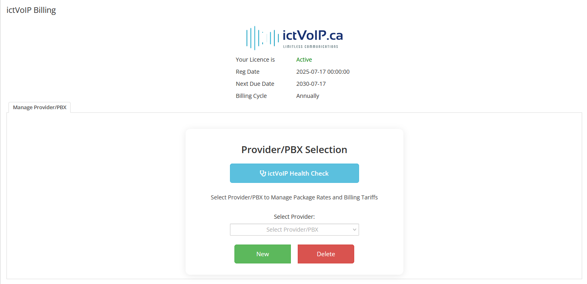

Admin Area
==========

**ictVoIP Billing Administration & Configuration**

The Admin Area provides comprehensive management tools for configuring and setting up the ictVoIP Billing system, including Provider management, Tariff configuration, Package Rates, and automated billing processes.

|

|

Overview
--------

The Admin Area is the central hub for managing all aspects of the ictVoIP Billing system. From initial installation to ongoing configuration and maintenance, this section provides step-by-step guidance for administrators.

Key Features
------------

* **System Installation**: Complete setup and configuration guide
* **Server Management**: PBX server integration and API setup
* **Provider Configuration**: VoIP provider setup and management
* **Tariff Management**: Rate configuration and pricing setup
* **Package Management**: Service package creation and configuration
* **Billing Automation**: Automated billing processes and management
* **Auto-Billing**: Automated payment processing and invoicing
* **CDR E.164 Validator**: Validate and fix phone number formatting in FusionPBX CDRs

.. toctree::
   :maxdepth: 2
   :caption: Installation & Setup

   admin/ictvoipbilling.rst

.. toctree::
   :maxdepth: 2
   :caption: Server Management

   admin/servers.rst

.. toctree::
   :maxdepth: 2
   :caption: Configuration

   admin/providers.rst
   admin/tariffs.rst
   admin/packages.rst

.. toctree::
   :maxdepth: 2
   :caption: Billing Management

   admin/billing_management.rst
   admin/autobill.rst

.. toctree::
   :maxdepth: 2
   :caption: CDR E.164 Validator

   admin/cdr-e164-validator.rst
  
