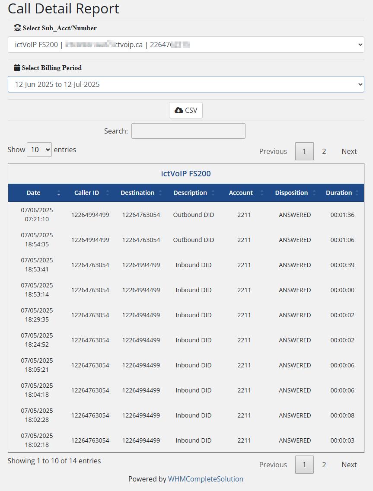

Automated Billing (Autobill)
============================

**CDR Processing & Automated Billing Configuration**

The Autobill system processes call detail records (CDRs) and generates automated billing for VoIP services. This automated process ensures accurate and timely billing for all VoIP usage.

|

|

Overview
--------

Autobill is a critical component that processes CDRs from your PBX servers and generates billing records in WHMCS. The system runs as a scheduled CRON job and integrates seamlessly with WHMCS billing cycles.

**Key Features:**
* Automated CDR processing
* Real-time billing generation
* Multi-server support
* Flexible scheduling
* Debug and testing capabilities

CRON Configuration
-----------------

**Scheduling Requirements:**

The Autobill script must run before your WHMCS daily CRON job to ensure proper billing processing.

**Recommended Schedule:**

.. code-block:: text

   WHMCS Daily CRON: 1:00 AM
   Autobill CRON: 12:55 AM (5 minutes before)
   
   Alternative Schedule:
   WHMCS Daily CRON: 2:00 AM
   Autobill CRON: 12:45 AM (75 minutes before)

**CRON Entry Format:**

Replace `MYMODULE` with your installed server module:

.. code-block:: bash

   # Standard CRON format
   55 00 * * * GET https://www.mywhmcsserver.com/modules/servers/MYMODULE/autobill.php?runfrom=cron
   
   # Alternative format with more time
   45 00 * * * GET https://www.mywhmcsserver.com/modules/servers/MYMODULE/autobill.php?runfrom=cron

**CRON Parameters:**

* **55 00** - Time (12:55 AM)
* **\* \* \*** - Daily execution
* **GET** - HTTP method
* **runfrom=cron** - Execution parameter

**Server Module Examples:**

* **FusionPBX:** `fusionpbx/autobill.php`
* **Vodia:** `vodia/autobill.php`
* **Custom:** `custom/autobill.php`

Manual Testing
-------------

**Browser Testing:**

Test your Autobill installation by accessing the script directly in your browser:

.. code-block:: text

   URL: https://www.mywhmcsserver.com/modules/servers/MYMODULE/autobill.php
   Method: GET
   Authentication: Required

**Test Configuration:**

Before testing, ensure proper configuration:

1. **Set Test Date** - Configure client's next due date to current date
2. **Enable Debug** - Activate debug mode for detailed output
3. **Check Permissions** - Verify script access permissions
4. **Review Logs** - Monitor execution logs

**Test Process:**

1. **Access Script** - Open autobill URL in browser
2. **Monitor Output** - Watch for processing results
3. **Review Results** - Check billing calculations
4. **Verify Billing** - Confirm invoice generation

Debug Configuration
------------------

**Enable Debug Mode:**

Activate debug mode to view detailed processing information:

1. Navigate to **ictVoIP Billing** → **Billing Management**
2. Enable **CDR Autobill Debug**
3. Run manual autobill execution
4. Review debug output

**Debug Information:**

Debug mode provides detailed information including:
* CDR processing status
* Rate calculations
* Billing summaries
* Error messages
* Processing timestamps

**Debug Output Example:**

.. code-block:: text

   [DEBUG] Starting Autobill Process
   [DEBUG] Processing Server: FusionPBX-01
   [DEBUG] Found 150 CDR records
   [DEBUG] Applied rates to 145 records
   [DEBUG] Generated billing for 5 clients
   [DEBUG] Process completed successfully

Billing Integration
------------------

**WHMCS Integration:**

Autobill integrates with WHMCS billing cycles:

* **Invoice Generation** - Creates invoices for processed CDRs
* **Billing Date Management** - Updates next due dates
* **Product Billing** - Processes monthly/annual billing
* **Invoice Delivery** - Sends invoices to clients

**Billing Cycle Process:**

1. **Autobill Execution** - Process CDRs and calculate charges
2. **WHMCS Daily CRON** - Generate invoices and update billing dates
3. **Invoice Delivery** - Send invoices to clients
4. **Payment Processing** - Handle payment collection

**Important Notes:**

* Autobill does not increment product next billing dates
* WHMCS daily CRON handles billing date updates
* Monthly invoices are generated after Autobill processing
* Billing dates are updated during WHMCS daily CRON execution

Performance Optimization
-----------------------

**Processing Time Considerations:**

* **Small Installations** - 5 minutes before WHMCS CRON
* **Medium Installations** - 15 minutes before WHMCS CRON
* **Large Installations** - 30+ minutes before WHMCS CRON

**Factors Affecting Processing Time:**

* **Number of Servers** - More servers = longer processing
* **CDR Volume** - Higher call volume = longer processing
* **Server Performance** - CPU and memory limitations
* **Network Latency** - API response times

**Optimization Tips:**

* **Monitor Processing Time** - Track execution duration
* **Adjust Scheduling** - Increase time buffer if needed
* **Server Optimization** - Improve server performance
* **CDR Cleanup** - Regular CDR database maintenance

Error Handling
-------------

**Common Errors:**

* **Connection Timeout** - Server unavailable
* **Authentication Failed** - Invalid credentials
* **Permission Denied** - File access issues
* **Database Errors** - CDR processing issues

**Error Resolution:**

1. **Check Server Status** - Verify PBX server availability
2. **Review Credentials** - Confirm API authentication
3. **Check Permissions** - Verify file and database access
4. **Monitor Logs** - Review error logs for details

**Log Monitoring:**

Monitor autobill logs for issues:

.. code-block:: bash

   # Check autobill logs
   tail -f /var/log/autobill.log
   
   # Check WHMCS logs
   tail -f /var/log/whmcs.log
   
   # Check system logs
   tail -f /var/log/syslog

Security Considerations
----------------------

**Access Control:**

* **HTTPS Required** - Always use secure connections
* **Authentication** - Implement proper access controls
* **IP Restrictions** - Limit access to trusted IPs
* **Log Monitoring** - Monitor access attempts

**Best Practices:**

* **Secure Credentials** - Use strong API passwords
* **Regular Updates** - Keep scripts updated
* **Backup Configuration** - Maintain backup copies
* **Audit Logs** - Review access logs regularly

Troubleshooting
--------------

**Common Issues:**

* **Script Not Executing** - Check CRON configuration
* **No CDRs Processed** - Verify server connectivity
* **Billing Errors** - Check rate configuration
* **Performance Issues** - Monitor processing time

**Debug Steps:**

1. **Check CRON Status** - Verify CRON job execution
2. **Test Manual Execution** - Run script manually
3. **Review Error Logs** - Check for error messages
4. **Verify Configuration** - Confirm settings

**Support Information:**

For autobill issues, provide:
* CRON configuration
* Error messages and logs
* Server module details
* Processing time information

Next Steps
----------

After configuring autobill:

1. **Test Execution** - Run manual tests
2. **Monitor Performance** - Track processing times
3. **Review Billing** - Verify invoice generation
4. **Production Deployment** - Enable automated execution

