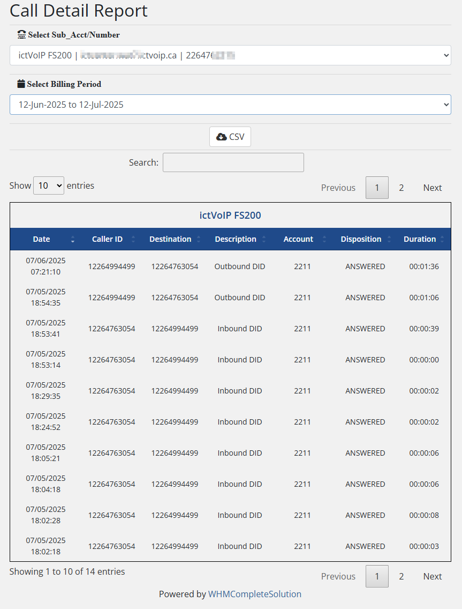

Automated Billing (Autobill)
============================

**CDR Processing & Automated Billing Configuration**

The Autobill system processes call detail records (CDRs) and generates automated billing for VoIP services. This automated process ensures accurate and timely billing for all VoIP usage.

|

|

Overview
--------

Autobill is a critical component that processes CDRs from your PBX servers and generates billing records in WHMCS. The system runs as a scheduled CRON job and integrates seamlessly with WHMCS billing cycles.

**Key Features:**

* Automated CDR processing
* Real-time billing generation
* Multi-server support
* Flexible scheduling
* Debug and testing capabilities
* Special Number Billing support

In **ictVoIP Billing v1.4.0**, Autobill remains the engine that turns
rated CDRs into billable usage, but the **recommended** approach for
FusionPBX is to use the enhanced **Autobill v2** script
(``autobill_v2.php``). Autobill v2 provides a modern browser-based UI
with real-time statistics, progress indicators, and color-coded debug
output while using the same underlying billing logic as the original
``autobill.php`` script.

Other supported server modules (for example, Vodia or custom
integrations) continue to ship with their own ``autobill.php``-style
scripts, which are typically used only for headless CRON execution.

CRON Configuration
-----------------

**Scheduling Requirements:**

The Autobill script must run before your WHMCS daily CRON job to ensure proper billing processing.

.. important::
   **AlmaLinux 9 / systemd Timezone Configuration**
   
   On AlmaLinux 9 / systemd-based systems, cron jobs may default to UTC even when:
   
   * Server time is correct
   * PHP-FPM timezone is correct
   * WHMCS timezone is correctly configured
   
   WHMCS automation relies on the execution time of cron.php, not just internal settings.
   
   **Solutions:**
   
   1. **Per-CRON Timezone (Recommended):** Specify ``TZ=`` explicitly in each WHMCS cron job to avoid automation running early or late after server migrations.
   2. **System-Wide PHP INI:** Update the system PHP INI configuration to set ``date.timezone`` system-wide if this option is available on your hosting environment.

**Recommended Schedule:**

.. code-block:: text

   WHMCS Daily CRON: 1:00 AM
   Autobill CRON: 12:55 AM (5 minutes before)
   
   Alternative Schedule:
   WHMCS Daily CRON: 2:00 AM
   Autobill CRON: 12:45 AM (75 minutes before)

**CRON Entry Format:**

Replace `MYMODULE` with your installed server module and `America/Toronto` with your timezone:

.. code-block:: bash

   # Standard CRON format (with timezone for AlmaLinux 9 / systemd)
   55 00 * * * TZ=America/Toronto GET https://www.mywhmcsserver.com/modules/servers/MYMODULE/autobill_v2.php?runfrom=cron
   
   # Alternative format with more time
   45 00 * * * TZ=America/Toronto GET https://www.mywhmcsserver.com/modules/servers/MYMODULE/autobill_v2.php?runfrom=cron
   
   # PHP CLI format (alternative)
   55 00 * * * TZ=America/Toronto /usr/bin/php -q /home/USERNAME/public_html/whmcs/modules/servers/MYMODULE/autobill_v2.php runfrom=cron

**CRON Parameters:**

* **TZ=America/Toronto** - Explicit timezone (required for AlmaLinux 9 / systemd)
* **55 00** - Time (12:55 AM in specified timezone)
* **\* \* \*** - Daily execution
* **GET** - HTTP method (or /usr/bin/php -q for CLI)
* **runfrom=cron** - Execution parameter

**Server Module Examples:**

* **FusionPBX (recommended):** ``fusionpbx/autobill_v2.php runfrom=cron``
* **Vodia:** ``vodia/autobill.php``
* **Custom:** ``custom/autobill.php``

For FusionPBX deployments, you should normally point your CRON at the
enhanced **Autobill v2** script. The scheduling principles remain the
same; v2 adds a richer UI and statistics without changing how charges
are calculated.

Manual Testing
-------------

**Browser Testing:**

Test your Autobill installation by accessing the script directly in your browser:

.. code-block:: text

   # FusionPBX (Autobill v2)
   URL: https://www.mywhmcsserver.com/modules/servers/fusionpbx/autobill_v2.php?runfrom=cron
   Method: GET
   Authentication: Required

   # Other modules (generic example)
   URL: https://www.mywhmcsserver.com/modules/servers/MYMODULE/autobill_v2.php?runfrom=cron
   Method: GET
   Authentication: Required

**Test Configuration:**

Before testing, ensure proper configuration:

1. **Set Test Date** - Configure client's next due date to current date
2. **Enable Debug** - Activate debug mode for detailed output
3. **Check Permissions** - Verify script access permissions
4. **Review Logs** - Monitor execution logs

**Test Process:**

1. **Access Script** - Open autobill URL in browser
2. **Monitor Output** - Watch for processing results
3. **Review Results** - Check billing calculations
4. **Verify Billing** - Confirm invoice generation

Debug Configuration
------------------

**Enable Debug Mode:**

Activate debug mode to view detailed processing information:

1. Navigate to **ictVoIP Billing** → **Billing Management**
2. Enable **CDR Autobill Debug**
3. Run manual autobill execution
4. Review debug output

**Debug Information:**

Debug mode provides detailed information including:
* CDR processing status
* Rate calculations
* Billing summaries
* Error messages
* Processing timestamps

**Debug Output Example:**

.. code-block:: text

   [DEBUG] Starting Autobill Process
   [DEBUG] Processing Server: FusionPBX-01
   [DEBUG] Found 150 CDR records
   [DEBUG] Applied rates to 145 records
   [DEBUG] Generated billing for 5 clients
   [DEBUG] Process completed successfully

Billing Integration
------------------

**WHMCS Integration:**

Autobill integrates with WHMCS billing cycles:

* **Invoice Generation** - Creates invoices for processed CDRs
* **Billing Date Management** - Updates next due dates
* **Product Billing** - Processes monthly/annual billing
* **Invoice Delivery** - Sends invoices to clients

**Billing Cycle Process:**

1. **Autobill Execution** - Process CDRs and calculate charges
2. **WHMCS Daily CRON** - Generate invoices and update billing dates
3. **Invoice Delivery** - Send invoices to clients
4. **Payment Processing** - Handle payment collection

**Important Notes:**

* Autobill does not increment product next billing dates
* WHMCS daily CRON handles billing date updates
* Monthly invoices are generated after Autobill processing
* Billing dates are updated during WHMCS daily CRON execution

Performance Optimization
-----------------------

.. versionadded:: 1.4.0-Beta.11
   Tariff lookup performance optimization (159x faster)

**Processing Time Considerations:**

* **Small Installations** - 5 minutes before WHMCS CRON
* **Medium Installations** - 15 minutes before WHMCS CRON
* **Large Installations** - 30+ minutes before WHMCS CRON

**Factors Affecting Processing Time:**

* **Number of Servers** - More servers = longer processing
* **CDR Volume** - Higher call volume = longer processing
* **Server Performance** - CPU and memory limitations
* **Network Latency** - API response times
* **Tariff Table Size** - Larger tariff tables require more lookups

**Tariff Lookup Optimization (v1.4.0-Beta.11+):**

The FusionPBX module includes an optimized tariff lookup system that dramatically improves processing speed for large CDR volumes:

* **In-Memory Cache** - Tariff tables under 500,000 entries are loaded into memory once
* **Zero DB Queries Per CDR** - After initial cache load, lookups are pure in-memory operations
* **Automatic Strategy Selection** - System chooses optimal approach based on table size
* **Verified Results** - Billing amounts remain identical to previous versions

**Performance Benchmarks:**

.. list-table::
   :widths: 30 35 35
   :header-rows: 1

   * - Metric
     - Before (v1.4.0-Beta.10)
     - After (v1.4.0-Beta.11)
   * - Processing Time (2,400 CDRs)
     - 636 seconds (~10.6 min)
     - 4 seconds
   * - DB Queries per CDR
     - Up to 10 (recursive)
     - 0 (cached lookup)
   * - Memory Usage
     - Low
     - ~50MB for 322K tariff entries

**PHP Memory Requirements:**

For optimal tariff cache performance, ensure your PHP configuration meets these requirements:

.. code-block:: ini

   ; Recommended PHP settings for large tariff tables
   memory_limit = 8096M
   max_execution_time = 300

**Optimization Tips:**

* **Monitor Processing Time** - Track execution duration
* **Adjust Scheduling** - Increase time buffer if needed
* **Server Optimization** - Improve server performance
* **CDR Cleanup** - Regular CDR database maintenance
* **Memory Allocation** - Ensure sufficient PHP memory for tariff caching

Special Number Billing
----------------------

Autobill supports Special Number Billing for products configured with custom rate rules. When enabled, special rate patterns are processed before standard tariff billing.

**How It Works:**

1. CDRs are checked against special rate patterns first
2. Matching CDRs are billed using the configured special rate rules
3. Non-matching CDRs are skipped (not billed) when special rates are enabled
4. Special rate calls are grouped by pattern on invoices

**Invoice Display:**

.. code-block:: text

   Special Rate Calls (29/12/2025 to 29/01/2026)
   [OUTBOUND] 1300* (flat_per_call): 4 calls, 11 min, $1.40
   [OUTBOUND] 1800* (flat_per_call): 1 calls, 5.7 min, $0.35

For detailed configuration, see :doc:`/modules/fusionpbx/configuration` under "Special Number Billing".

Error Handling
-------------

**Common Errors:**

* **Connection Timeout** - Server unavailable
* **Authentication Failed** - Invalid credentials
* **Permission Denied** - File access issues
* **Database Errors** - CDR processing issues

**Error Resolution:**

1. **Check Server Status** - Verify PBX server availability
2. **Review Credentials** - Confirm API authentication
3. **Check Permissions** - Verify file and database access
4. **Monitor Logs** - Review error logs for details

**Log Monitoring:**

Monitor autobill logs for issues:

.. code-block:: bash

   # Check autobill logs
   tail -f /var/log/autobill.log
   
   # Check WHMCS logs
   tail -f /var/log/whmcs.log
   
   # Check system logs
   tail -f /var/log/syslog

Security Considerations
----------------------

**Access Control:**

* **HTTPS Required** - Always use secure connections
* **Authentication** - Implement proper access controls
* **IP Restrictions** - Limit access to trusted IPs
* **Log Monitoring** - Monitor access attempts

**Best Practices:**

* **Secure Credentials** - Use strong API passwords
* **Regular Updates** - Keep scripts updated
* **Backup Configuration** - Maintain backup copies
* **Audit Logs** - Review access logs regularly

Troubleshooting
--------------

**Common Issues:**

* **Script Not Executing** - Check CRON configuration
* **No CDRs Processed** - Verify server connectivity
* **Billing Errors** - Check rate configuration
* **Performance Issues** - Monitor processing time

**Debug Steps:**

1. **Check CRON Status** - Verify CRON job execution
2. **Test Manual Execution** - Run script manually
3. **Review Error Logs** - Check for error messages
4. **Verify Configuration** - Confirm settings

**Support Information:**

For autobill issues, provide:
* CRON configuration
* Error messages and logs
* Server module details
* Processing time information

Next Steps
----------

After configuring autobill:

1. **Test Execution** - Run manual tests
2. **Monitor Performance** - Track processing times
3. **Review Billing** - Verify invoice generation
4. **Production Deployment** - Enable automated execution

