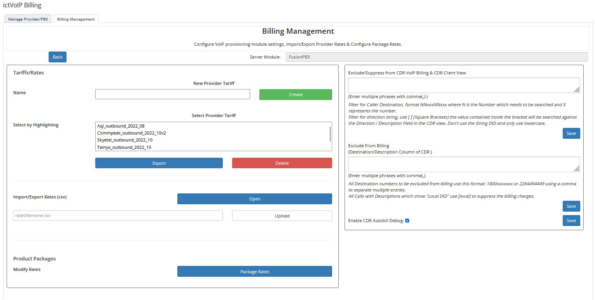
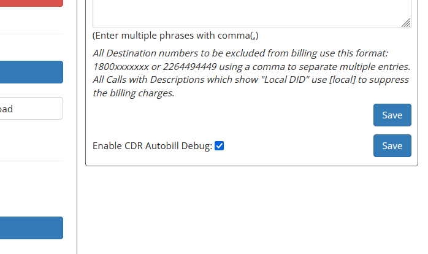

Billing Management
==================

**CDR Processing & Billing Configuration**

The Billing Management dashboard provides comprehensive tools for managing CDR processing, rate configuration, filtering, and automated billing processes. This central hub controls all aspects of the billing system.

|

|

Overview
--------

The Billing Management system handles call detail record (CDR) processing, rate application, filtering, and automated billing. It provides tools for configuring billing rules, managing exclusions, and monitoring billing processes.

**Key Features:**
* CDR processing and filtering
* Rate management and export
* Automated billing configuration
* Debug and testing tools
* Comprehensive filtering options

Tariff Management
----------------

**Tariff Importing**

Import provider rate cards and configure pricing structures. For detailed information, see: `Tariffs <../admin/tariffs.html>`_

**Tariff Exporting**

Export existing tariffs to CSV format for review or modification:

1. Select the tariff name from the dashboard
2. Click **Export** to download the CSV file
3. Review and modify rates as needed
4. Re-import the updated tariff

.. warning::
   When re-importing exported tariffs, do not include the "status" column in your CSV file.

Package Management
-----------------

**Package Configuration**

Configure VoIP service packages with specific rates and features. For detailed information, see: `Package Rates <../admin/packages.html>`_

**Package Features:**
* Rate structure configuration
* Free minute allocation
* Custom rate application
* Global markup management

Autobill Debug
-------------

**Debug Configuration**

Enable CDR Autobill Debug to test and monitor the billing process:

|

|

**Debug Process:**

1. **Enable Debug Mode** - Activate debug logging
2. **Set Test Date** - Configure client's next due date to current date
3. **Run Manual Test** - Execute autobill process manually
4. **Review Output** - Analyze billing calculations and results

**Debug Output:**

The debug process displays detailed information including:
* CDR processing results
* Rate calculations
* Billing summaries
* Error messages and warnings

.. warning::
   When running CRON via browser, processing can be very slow. Please be patient during execution.

**Manual Testing:**

Test your installation by accessing the autobill script directly in your browser:

.. code-block:: text

   URL: https://your-domain.com/modules/addons/ictvoipbilling/crons/autobill.php
   Method: GET or POST
   Authentication: Required

For detailed CRON configuration, see: `Autobill CRON <../admin/autobill.html>`_

CDR Filtering
-------------

**Filter Configuration**

Configure CDR filtering to exclude or suppress specific call types and destinations. Filtering is applied per provider and affects both billing and display.

**Filter Types:**

1. **Exclude/Suppress** - Remove CDR records from billing and display
2. **Exclude from Billing** - Remove from billing but keep in display
3. **Custom Filters** - Specific filtering rules

Exclude/Suppress Filtering
-------------------------

**Purpose:**
* **Exclude** - Remove filtered CDR records from billing
* **Suppress** - Hide CDR records from client view

**Common Exclusions:**

**Internal System Calls:**
Exclude internal PBX system calls and features:

.. code-block:: text

   Filter Pattern: *xx,#xx,4443,4747,201,202,203,999,555
   
   Examples:
   *97 - Voicemail access
   *71 - Call forwarding
   *72 - Call forwarding activation
   #72 - Call forwarding deactivation
   4443 - System announcements
   4747 - System features

**Extension Calls:**
Exclude direct extension-to-extension calls within the same tenant:

.. code-block:: text

   Filter Pattern: 201,202,203,204,205
   
   This excludes calls between extensions 201-205 from billing

**System Features:**
Exclude PBX system features and announcements:

.. code-block:: text

   Filter Pattern: 999,555,4443,4747
   
   Examples:
   999 - Emergency system
   555 - Test numbers
   4443 - System announcements
   4747 - Feature codes

Exclude from Billing
-------------------

**Purpose:**
Remove specific calls from billing while keeping them visible in CDR reports.

**Toll Free Numbers:**

Exclude North American toll-free numbers from billing:

.. code-block:: text

   Filter Pattern: 844xxxxxxx,888xxxxxxx,877xxxxxxx,866xxxxxxx,800xxxxxxx,1800xxxxxxx,1844xxxxxxx,1866xxxxxxx,1877xxxxxxx,1888xxxxxxx
   
   Examples:
   1-800-555-1234
   1-888-555-5678
   1-877-555-9012

**Emergency Numbers:**

Exclude emergency service numbers:

.. code-block:: text

   Filter Pattern: 911,112,999,000
   
   Examples:
   911 - North American emergency
   112 - European emergency
   999 - UK emergency
   000 - Australian emergency

**Local Services:**

Exclude local service numbers and features:

.. code-block:: text

   Filter Pattern: [local],[inbound]
   
   Examples:
   Local DID numbers
   Inbound call records
   Voicemail access
   Ring group calls

**Custom Exclusions:**

Create custom exclusion patterns for specific needs:

.. code-block:: text

   Filter Pattern: 2264763054,8884163054,18884163054
   
   This excludes specific numbers from billing

Filter Configuration Best Practices
---------------------------------

**Pattern Design:**

* **Use Wildcards** - `xxxxxxx` for variable digits
* **Include Variations** - Account for different formats
* **Test Patterns** - Verify filter accuracy
* **Document Rules** - Maintain filter documentation

**Common Patterns:**

.. code-block:: text

   # Toll Free Numbers
   8xx,1-8xx,1-800,1-888,1-877,1-866
   
   # Emergency Numbers
   911,112,999,000,119,110
   
   # System Features
   *xx,#xx,4443,4747
   
   # Local Services
   [local],[inbound],[voicemail]

**Testing Filters:**

1. **Enable Debug Mode** - Activate detailed logging
2. **Run Test CDRs** - Process sample call records
3. **Review Results** - Verify filter accuracy
4. **Adjust Patterns** - Refine filter rules

**Vendor Compatibility:**

.. note::
   Filter patterns depend on each vendor's PBX CDR output format. While we maintain consistency across platforms, test filters before applying to production.

**CDR Column Dependencies:**

Filters are applied to specific CDR columns:
* **Direction** - Call direction (inbound/outbound)
* **Description** - Call description or feature
* **Destination** - Called number
* **Source** - Calling number

Troubleshooting
--------------

**Common Filter Issues:**

* **Over-filtering** - Too many calls excluded
* **Under-filtering** - Unwanted calls still billed
* **Pattern Errors** - Incorrect filter syntax
* **Vendor Differences** - PBX-specific formatting

**Debug Steps:**

1. **Review CDR Output** - Check raw CDR data
2. **Test Filter Patterns** - Verify pattern matching
3. **Check Column Values** - Confirm column content
4. **Monitor Billing Results** - Review billing output

**Support Information:**

For filtering issues, provide:
* CDR sample data
* Filter patterns used
* Expected vs actual results
* PBX vendor and version

Next Steps
----------

After configuring billing management:

1. **Test Configuration** - Run debug tests
2. **Monitor Results** - Review billing output
3. **Adjust Filters** - Refine filtering rules
4. **Production Deployment** - Enable automated billing
