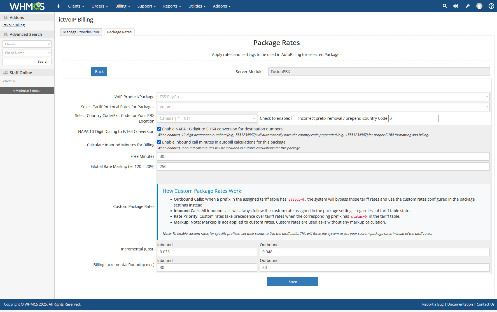

CDR E.164 Validator
==================

*Figure: The ictVoIP Billing CDR E.164 Validator for FusionPBX, showing validation results and detailed tooltips for dialplan fixes.*

**ictVoIP Billing Administration & Configuration**

The CDR E.164 Validator is a powerful tool integrated with the ictVoIP Billing system that validates Call Detail Records (CDRs) from FusionPBX to ensure proper E.164 international phone number formatting. This tool helps identify and fix CDR formatting issues that can affect billing accuracy and call routing.

|

Overview
--------

The CDR E.164 Validator provides comprehensive validation of CDR data to ensure proper E.164 international phone number formatting. From initial setup to ongoing validation and troubleshooting, this section provides step-by-step guidance for administrators.

**Key Features:**
* Live CDR validation from FusionPBX
* International country code support
* Smart issue detection with visual indicators
* Extension recognition: Inbound calls routed to local extensions are recognized as valid and not flagged for E.164 issues
* Copy-paste dialplan commands
* Direction-aware recommendations
* Auto-population of tenant from product
* Debug mode for troubleshooting

*Figure: The ictVoIP Billing CDR E.164 Validator for FusionPBX, showing all valid results.*

What is E.164?
--------------

E.164 is the international standard for phone number formatting that includes:

* **Country Code**: 1 for North America, 44 for UK, 49 for Germany, etc.
* **National Number**: The local phone number without country code
* **Total Length**: 7-15 digits maximum

**Example**: ``+1-555-123-4567`` (E.164 format) vs ``555-123-4567`` (missing country code)

Installation & Setup
-------------------

**System Requirements:**

* WHMCS with ictVoIP Billing addon installed
* FusionPBX server module configured
* Access to FusionPBX CDR class
* Proper database permissions

**Access Configuration:**

1. Navigate to your WHMCS admin panel
2. Go to **Addons** → **ictVoIP Billing**
3. Click on **CDR E.164 Validator**

**Database Integration:**

The validator integrates with the following database tables:

.. code-block:: text

   mod_ictvoipbilling_country_codes - Country code definitions
   mod_ictvoipbilling_extended_rates - Product tariff configuration
   mod_ictvoipbilling_extended_rates_tariff - Country code assignments
   tblhosting - Product domain/tenant information

Country Code Detection
---------------------

Country codes are not set directly in the product configuration.

To determine the expected country code for validation:

1. Go to **ictVoIP Billing Management** in the admin area.
2. Click on **Packages**.
3. View the assigned product and check the associated **Country Code** in the Package Rates section.

*Figure: The Country Code is set in the Package Rates configuration for the assigned product/package. This is the code the validator expects for E.164 compliance.*

Configuration
-------------

**Product-Level Configuration:**

Country codes are automatically detected from your package's configuration (see above).

1. Go to **ictVoIP Billing Management** → **Packages**
2. Select the relevant package
3. Check the **Country Code** in the Package Rates section
4. Save configuration if changes are made

**International Support:**

The validator supports all international country codes and will:

* Validate against the package's configured country code
* Flag numbers with wrong country codes
* Provide appropriate dialplan fixes

Usage Guide
-----------

**Step 1: Select Parameters**

* **Client**: Choose the client whose CDRs you want to validate
* **Product**: Select the VoIP product (auto-populates tenant)
* **Server**: Choose the FusionPBX server
* **Tenant**: Domain/tenant (auto-populated from product selection)
* **Extension**: Optional filter for specific extension
* **Debug Mode**: Enable for detailed technical information

**Step 2: Run Validation**

Click **"Run Validation"** to fetch and analyze CDRs from FusionPBX.

**Step 3: Review Results**

The tool displays two tables:

* **All CDRs**: Complete list with validation status
* **Invalid CDRs**: Only problematic records requiring attention

Understanding the Results
------------------------

**Color-Coded Rows:**

* **🟢 Green**: Valid CDRs (no issues)
* **🔵 Blue**: Inbound calls with issues
* **🟠 Orange**: Outbound calls with issues
* **🔴 Red**: Invalid CDRs
* **'Extension'**: Destination is a local extension (valid for inbound calls)

**Issue Indicators:**

✅ **Valid**
~~~~~~~~~~~

Number is correctly formatted with proper country code, or (for inbound) is a local extension.

⚠️ **Wrong Country**
~~~~~~~~~~~~~~~~~~~

Number has a country code, but it's not the expected one for your package. (Not shown for inbound caller IDs; inbound calls can originate from any country.)

**Example**: Package configured for UK (44) but number has US country code (1)

**Fix**: Hover for dialplan command to add correct country code

❌ **Invalid**
~~~~~~~~~~~~~

Number doesn't follow E.164 format (missing country code, too short, etc.).

**Example**: ``5551234567`` (missing country code)

**Fix**: Hover for dialplan command to add country code

'Extension'
~~~~~~~~~~~

For inbound calls, if the destination is a local extension (e.g., 3-5 digits), it is recognized as valid and not flagged for E.164 issues.

FusionPBX Integration
---------------------

**Automatic Tenant Detection:**

The tool automatically detects the tenant (domain) from your product's hosting configuration, eliminating manual entry errors.

**Direction-Aware Recommendations:**

* **Inbound Calls**: Uses ``effective_caller_id_number`` variable
* **Outbound Calls**: Uses ``destination_number`` variable

**Copy-Paste Dialplan Commands:**

Each issue includes a **"Copy Command"** button that provides the exact FusionPBX dialplan action needed:

.. code-block:: bash

   set effective_caller_id_number=1\${caller_id_number}
   set destination_number=1\${destination_number}

Troubleshooting
--------------

**Common Issues:**

* **"No CDRs Found"** - Verify tenant/domain is correct, check FusionPBX server connectivity
* **"Could not find cdr_class.php"** - Verify FusionPBX server module is installed, check file permissions
* **Tooltip Not Working** - Ensure JavaScript is enabled, check for browser console errors

**Debug Mode:**

Enable **Debug Mode** to see:

* Raw CDR data from FusionPBX
* Country code detection process
* Request parameters sent to CDR class

Technical Details
----------------

**CDR Class Integration:**

The tool integrates with the FusionPBX CDR class to:

* Fetch live CDR data
* Filter by tenant and extension
* Process call direction information

**Validation Logic:**

1. **Country Code Detection**: Matches number against all country codes
2. **Priority Matching**: Prioritizes common countries (US, UK, etc.)
3. **Length Validation**: Ensures 7-15 digit total length
4. **Package Code Comparison**: Flags mismatched country codes (except for inbound caller IDs)
5. **Extension Detection**: For inbound calls, if the destination is a local extension (3-5 digits), it is treated as valid and not checked for E.164 compliance
6. **Inbound Caller ID**: Inbound caller IDs from outside the product country are not flagged as 'Wrong Country' (inbound calls can originate from any country)

Benefits
--------

**For Billing Accuracy:**

* Ensures proper E.164 formatting for accurate rate lookup
* Prevents billing errors from malformed numbers
* Validates international call routing

**For System Administrators:**

* Quick identification of CDR formatting issues
* Ready-to-use FusionPBX dialplan fixes
* Comprehensive validation across all country codes

**For Support Teams:**

* Clear visual indicators of issues
* Detailed explanations for non-technical users
* Copy-paste solutions for immediate implementation

Best Practices
-------------

**Configuration Best Practices:**

* Set appropriate country codes for each package
* Regularly validate CDRs for new clients
* Use debug mode for initial setup verification
* Monitor for patterns in formatting issues

**Maintenance Best Practices:**

* Run validation after FusionPBX configuration changes
* Check CDRs when adding new country codes
* Validate before major billing runs
* Document any custom dialplan changes

Next Steps
----------

After setting up the CDR E.164 Validator:

1. **Configure Package Country Codes**: Ensure all VoIP packages have proper country codes set
2. **Validate Existing CDRs**: Run validation on existing clients to identify issues
3. **Implement Dialplan Fixes**: Use the provided commands to fix FusionPBX dialplans
4. **Monitor Regularly**: Set up regular validation checks for new CDRs
5. **Train Support Team**: Ensure support staff understand the validation indicators

Version History
--------------

**Version 1.0:**

* Initial release
* Live CDR validation from FusionPBX
* International country code support
* Copy-paste dialplan commands
* Direction-aware recommendations
* Auto-population of tenant from product
* Debug mode for troubleshooting

---

*This tool is specifically designed for use with the ictVoIP Billing system and FusionPBX integration.*
