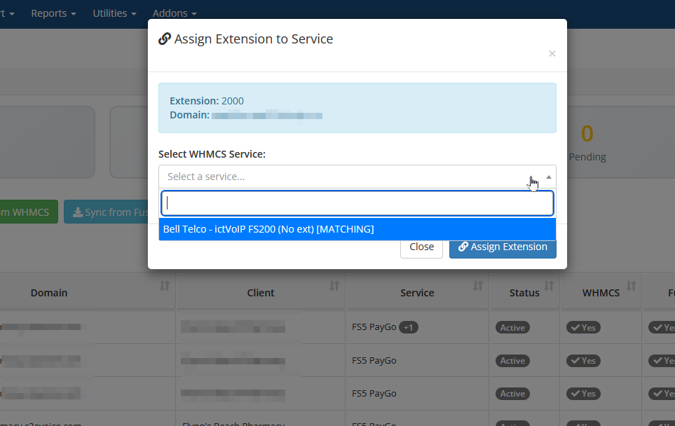
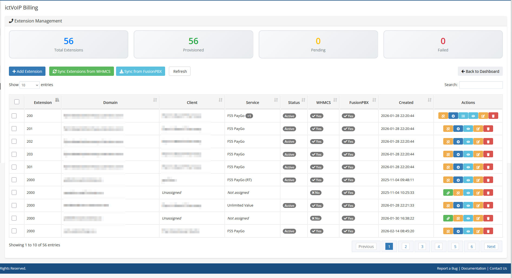
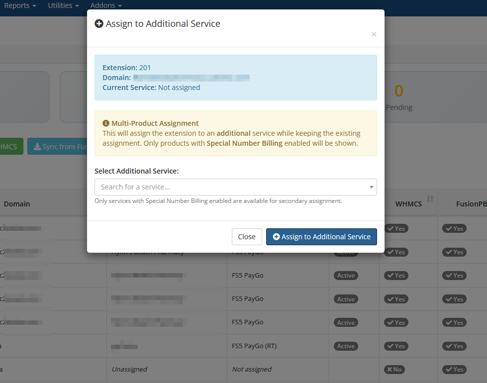
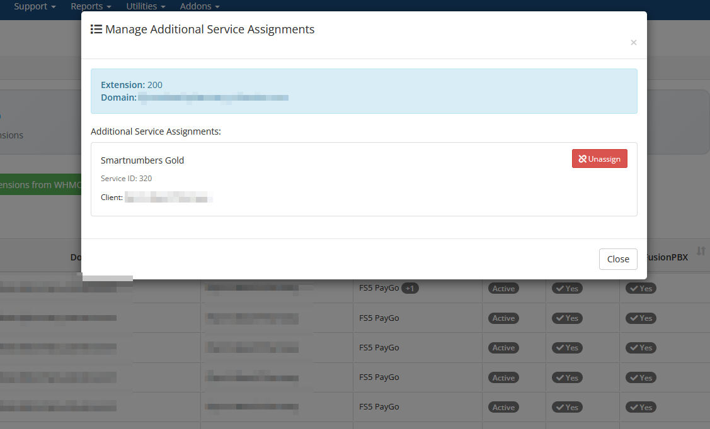

Client Services Admin Area
===========================

Overview
--------

Within the WHMCS **Admin Area**, the ictVoIP Billing addon provides a
**Client Services** section for each provider/PBX. This is an
administrator-facing dashboard that allows you to manage FusionPBX
hosts and client VoIP services without leaving WHMCS.

|

.. image:: ../_static/images/admin/client-services_main.png
   :width: 800px
   :align: center
   :alt: Client services
|

Core Tools
----------

From the Client Services admin area you can:

Core Tools Index
~~~~~~~~~~~~~~~~

- :ref:`Manage Tenant Domains <client_services_manage_tenant_domains>`
- :ref:`Provision Extensions <client_services_provision_extensions>`
- :ref:`Configure Gateways <client_services_configure_gateways>`
- :ref:`Manage ACLs <client_services_manage_acls>`
- :ref:`Manage Destination Routes <client_services_manage_destination_routes>`
- :ref:`Service Directory <client_services_service_directory>`
- :ref:`Quick Create Tenant <client_services_quick_create_tenant>`
- :ref:`View Logs <client_services_view_logs>`
- :ref:`Settings (Server Provisioning Settings) <client_services_settings_server_provisioning>`

Typical workflow: choose a provider/PBX at the top of the screen, then
use the tabs and actions in the Client Services view to locate tenants
and services, run provisioning actions, and review recent activity.

.. _client_services_manage_tenant_domains:

* **Manage Tenant Domains** – Create, import, synchronize, and update
  FusionPBX tenant domains for the selected provider, including
  capacity limits and descriptions, while keeping related WHMCS
  services aligned. Use this when onboarding new customers or bringing
  existing FusionPBX tenants under billing and automation control.
|

.. image:: ../_static/images/admin/client-services_tenant.png
   :width: 800px
   :align: center
   :alt: Client services
|

Typical workflow: search for or select an existing tenant, review its
limits and description, then edit or sync details as needed. Use the
"add" or "import" actions when onboarding a new customer or bringing
an existing FusionPBX tenant under management.

.. _client_services_provision_extensions:

* **Provision Extensions** – Add, view, and manage extensions for each
  tenant, provision them to FusionPBX, and link or unlink extensions to
  WHMCS services for billing and lifecycle control. Use this to keep
  the number and assignment of extensions in sync with purchased
  packages.
|

.. image:: ../_static/images/admin/client-services_ext.png
   :width: 800px
   :align: center
   :alt: Client services
|

Typical workflow: filter by tenant, review the list of extensions,
create or edit extensions as required, then ensure each extension is
linked to the correct WHMCS service so billing stays in sync with
provisioned resources.

Extension Management Enhancements
~~~~~~~~~~~~~~~~~~~~~~~~~~~~~~~~~~

**Searchable Dropdowns (Select2 Integration)**

All client and service selection dropdowns in extension management now
feature real-time search filtering powered by Select2. This
significantly improves usability when working with large client
databases (2K+ clients).

|

|

**Features:**

- **Real-time Search** – Type to instantly filter clients and services
- **Clear Buttons** – Quickly reset selections
- **Proper Modal Handling** – Search works correctly within modal dialogs
- **WHMCS Theme Styling** – Matches the admin interface design

**Available in:**

- Assign Extension modal
- Add Extension modal
- Bulk Assign Extensions modal
- Sync Extensions modal
- Assign to Additional Service modal

**Service Column Enhancement**

The Service column now displays the actual WHMCS product name (e.g.,
"VoIP Extension Service", "Smartnumbers Gold") instead of the tenant
domain, making it easier to identify which billing package each
extension is assigned to.

|

|

**Multi-Product Extension Assignment (Smartnumbers Support)**

Extensions can now be assigned to multiple WHMCS products
simultaneously, designed specifically for Smartnumbers and Special
Number Billing use cases where the same extensions need to appear on
both a regular VoIP product and a Special Number Billing product.

|

|

**Key Features:**

- **Primary + Secondary Assignments** – Extensions have one primary
  service and unlimited secondary assignments
- **Visual Indicators** – Service column shows badges (+1, +2) for
  secondary assignments with product name tooltips
- **Assign to Additional Service** – Blue + button to assign extensions
  to additional Special Number Billing services
- **Manage Additional Services** – Blue list icon button to view and
  unassign secondary services
- **Automatic Filtering** – Service dropdown shows only products with
  Special Number Billing enabled (configoption3 = 'on')
- **Client-based Filtering** – Shows all Special Billing services for
  the same client
- **Real-time Updates** – DataTable refreshes automatically after
  assign/unassign operations

|

|

**Typical workflow for multi-product assignment:**

1. Locate an extension already assigned to a primary service
2. Click the blue + button to open "Assign to Additional Service" modal
3. Select a Special Number Billing service from the filtered dropdown
4. Click Assign to create the secondary assignment
5. The Service column updates to show a +1 badge with tooltip
6. Click the blue list icon to manage or unassign secondary services

**Validation:**

- Prevents duplicate assignments to the same service
- Validates service has Special Number Billing enabled
- Provides clear error messages for admin context
- Backward compatible with existing single-product assignments

.. _client_services_configure_gateways:

Configure Gateways
~~~~~~~~~~~~~~~~~~

Use gateway templates and provider-scoped settings to configure and 
sync SIP gateways for tenants, keeping provider trunks and PBX routing 
aligned with billing. Use this when deploying or adjusting connectivity 
to upstream carriers.

|

.. image:: ../_static/images/admin/client-services_gateway.png
   :width: 800px
   :align: center
   :alt: Client services
|

Typical workflow: select the provider and tenant, choose an
appropriate gateway template, adjust any tenant-specific parameters
(such as credentials or hostnames), then apply and sync the gateway to
FusionPBX.

.. _client_services_manage_acls:

Manage ACLs
~~~~~~~~~~~

Review and adjust provider-side access control lists that determine 
which source IP addresses are allowed to reach the PBX or provider 
services. Use this when adding or modifying PBX/provider ACL entries 
that relate to your WHMCS or management hosts.

|

.. image:: ../_static/images/admin/client-services_acl.png
   :width: 800px
   :align: center
   :alt: Client services
|

Typical workflow: review the current list of provider/PBX ACL
addresses, compare it against your WHMCS and management hosts, then
add or remove entries so the provider-side ACLs reflect your intended
access policy.

.. _client_services_manage_destination_routes:

Manage Destination Routes
~~~~~~~~~~~~~~~~~~~~~~~~~

View and manage destination routing information (such as inbound 
numbers/DIDs and associated tenants) to keep PBX routing and billing 
destinations in sync. Use this when assigning new DIDs to tenants or 
auditing existing inbound routing.

|

.. image:: ../_static/images/admin/client-services_routes.png
   :width: 800px
   :align: center
   :alt: Client services
|

Typical workflow: search for an inbound number or DID, confirm which
tenant it is attached to, then update the routing or assignment when
numbers are moved between tenants or new DIDs are activated.

.. _client_services_service_directory:

Service Directory
~~~~~~~~~~~~~~~~~

Browse and filter client services associated with the provider/PBX, 
helping you quickly locate which tenants, extensions, and gateways 
belong to which WHMCS services. Use this as a lookup tool when 
troubleshooting or answering customer questions.

|

.. image:: ../_static/images/admin/client-services_descovery.png
   :width: 800px
   :align: center
   :alt: Client services
|

Typical workflow: start from a WHMCS client or service you are
investigating, use the directory filters to locate it, then drill into
the associated tenant, extensions, or gateways to continue
troubleshooting.

.. _client_services_quick_create_tenant:

Quick Create Tenant
~~~~~~~~~~~~~~~~~~~

Use guided forms to rapidly create new FusionPBX tenants (domains) and 
optionally bind them to WHMCS services and main DIDs in a single 
workflow. Use this for fast, standardized onboarding of new client sites.

|

.. image:: ../_static/images/admin/client-services_create_tenant.png
   :width: 800px
   :align: center
   :alt: Client services
|

Typical workflow: select the provider/PBX, enter the new tenant domain
and main DID, choose or confirm the related WHMCS service, then submit
the form to create and link the tenant in a single step.

.. _client_services_view_logs:

View Logs
~~~~~~~~~

Inspect recent provisioning and sync logs for tenants, extensions, 
gateways, and API interactions to assist with troubleshooting and audit 
trails. Use this whenever a provisioning action does not behave as 
expected.

|

.. image:: ../_static/images/admin/client-services_logs.png
   :width: 800px
   :align: center
   :alt: Client services
|

Typical workflow: when a provisioning or sync task does not behave as
expected, open the logs view, filter by provider, tenant, or time
range, and review recent actions and error messages before making
changes or re-running the action.

.. _client_services_settings_server_provisioning:

Settings (Server Provisioning Settings)
~~~~~~~~~~~~~~~~~~~~~~~~~~~~~~~~~~~~~~~~

Load and save WHMCS server credentials (including optional access hash) 
for FusionPBX hosts, and run credential and IP whitelist tests before 
enabling automated provisioning. Use this when first connecting a PBX 
server or when rotating credentials or tightening whitelists. See also 
:doc:`/admin/servers` and :doc:`/getting_started/security`.

|

.. image:: ../_static/images/admin/client-services_settings.png
   :width: 800px
   :align: center
   :alt: Client services
|

Typical workflow: select the PBX server, load the stored credentials,
update passwords or access hashes if they have changed, then run the
credential and whitelist tests to verify connectivity before enabling
or resuming automated provisioning.

Dashboard Statistics
--------------------

The top of the Client Services admin dashboard includes **real-time
provisioning statistics** for the selected provider (for example,
counts of tenants, extensions, pending or failed provisioning items,
_gateways, and inbound DIDs). These figures help you quickly spot
_growth trends and problem areas, such as an unexpected spike in failed
_provisioning jobs or a sudden increase in pending actions that may
_require attention.
|

.. image:: ../_static/images/admin/client-services_main.png
   :width: 800px
   :align: center
   :alt: Client services
|

For details on how Client Services interacts with PBX servers and
providers, see also :doc:`/admin/servers`, :doc:`/admin/providers`, and
:doc:`/applications/provision`.
