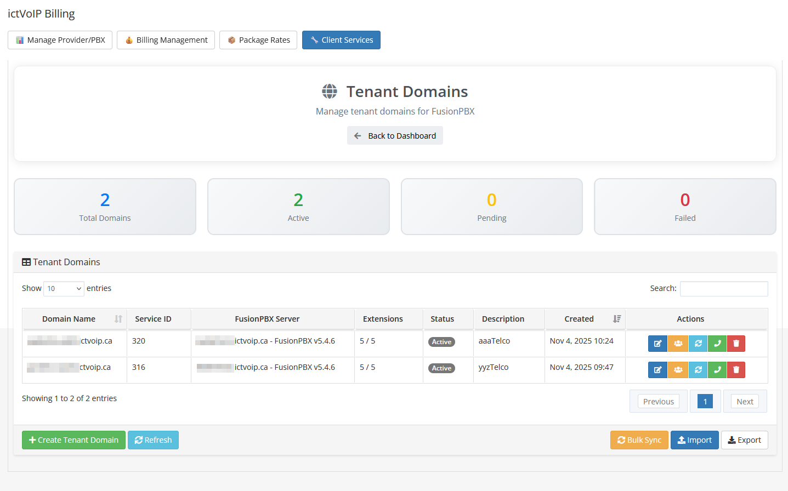
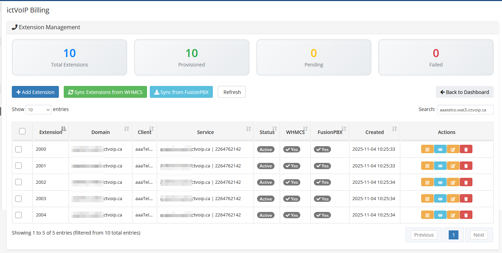
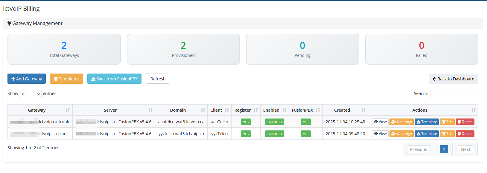
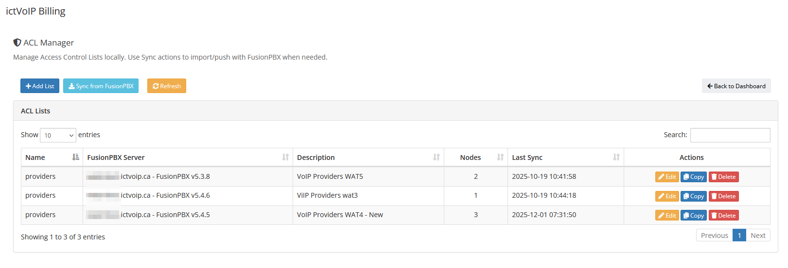
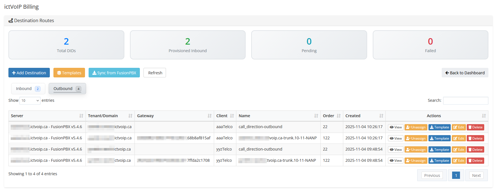
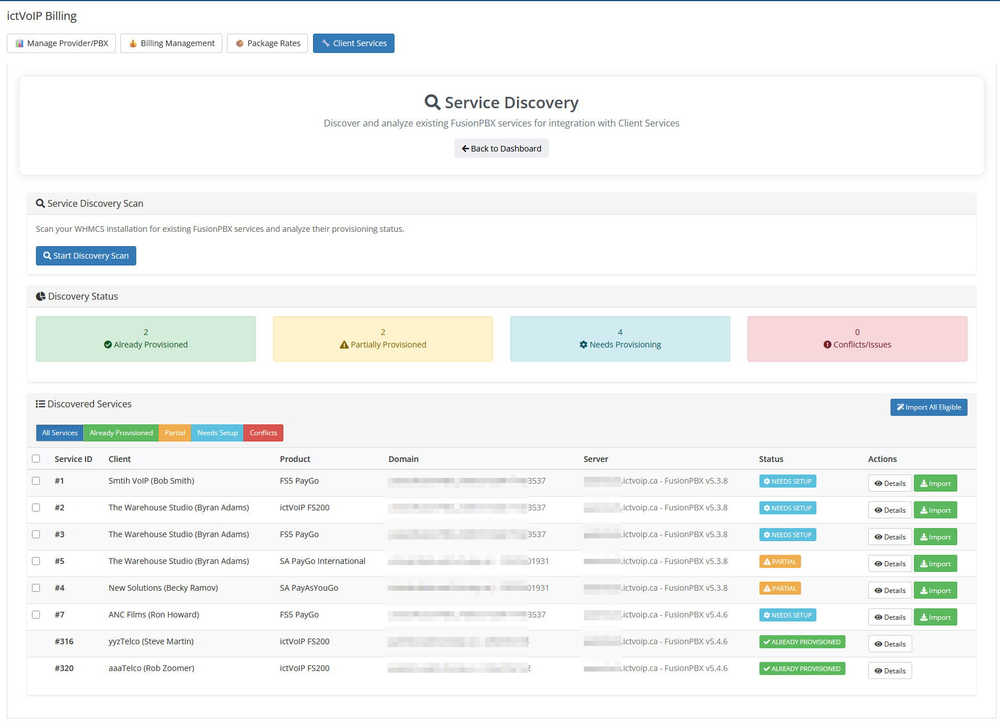
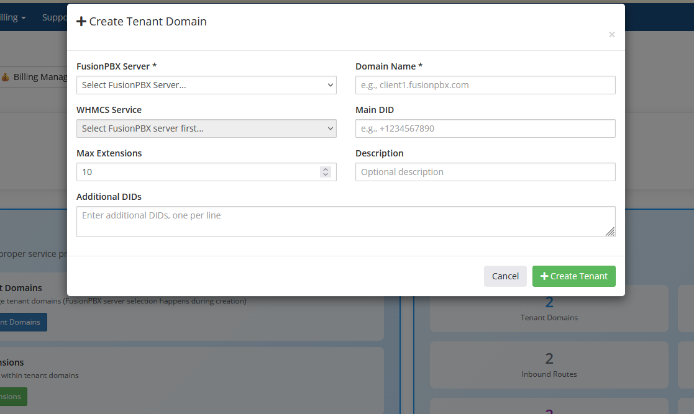
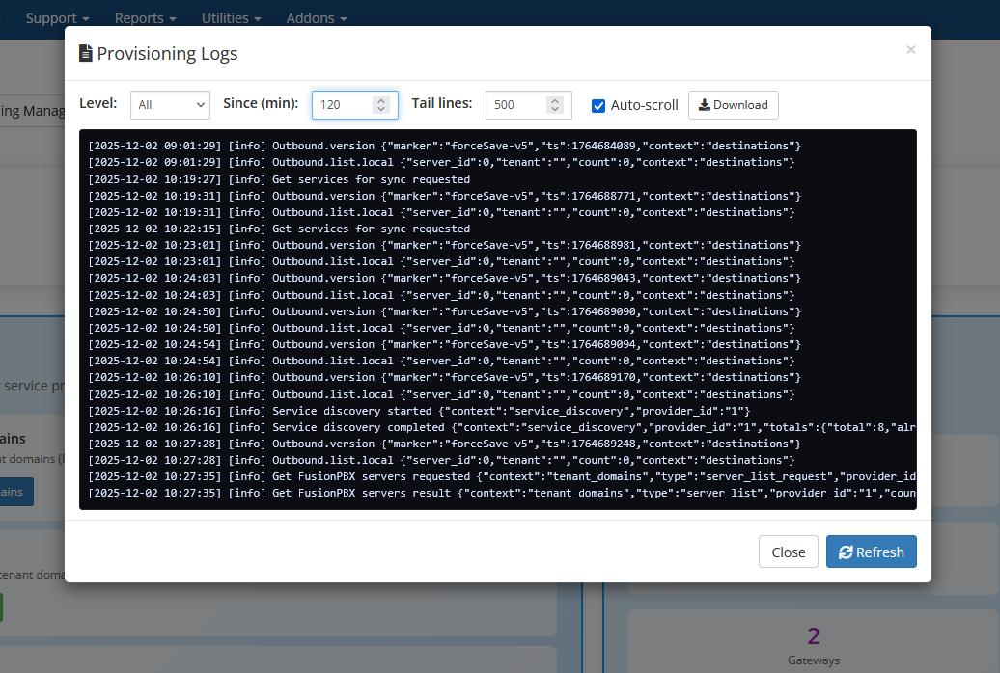
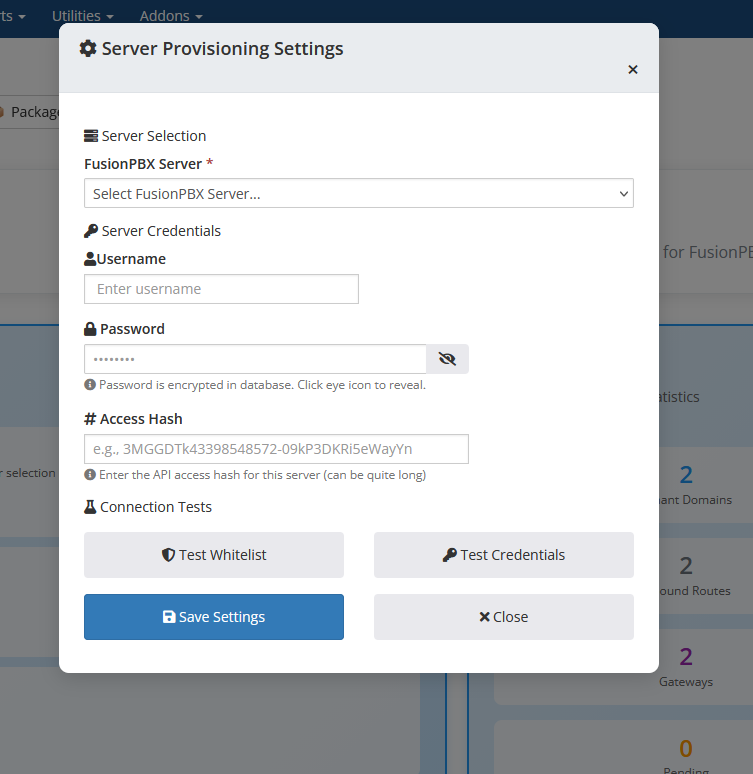

Client Services Admin Area
===========================

Overview
--------

Within the WHMCS **Admin Area**, the ictVoIP Billing addon provides a
**Client Services** section for each provider/PBX. This is an
administrator-facing dashboard that allows you to manage FusionPBX
hosts and client VoIP services without leaving WHMCS.

Core Tools
----------

From the Client Services admin area you can:
|

.. image:: ../_static/images/admin/client-services_main.png
   :width: 800px
   :align: center
   :alt: Client services
|

Typical workflow: choose a provider/PBX at the top of the screen, then
use the tabs and actions in the Client Services view to locate tenants
and services, run provisioning actions, and review recent activity.

* **Manage Tenant Domains** – Create, import, synchronize, and update
  FusionPBX tenant domains for the selected provider, including
  capacity limits and descriptions, while keeping related WHMCS
  services aligned. Use this when onboarding new customers or bringing
  existing FusionPBX tenants under billing and automation control.
|

|

Typical workflow: search for or select an existing tenant, review its
limits and description, then edit or sync details as needed. Use the
"add" or "import" actions when onboarding a new customer or bringing
an existing FusionPBX tenant under management.

* **Provision Extensions** – Add, view, and manage extensions for each
  tenant, provision them to FusionPBX, and link or unlink extensions to
  WHMCS services for billing and lifecycle control. Use this to keep
  the number and assignment of extensions in sync with purchased
  packages.
|

|

Typical workflow: filter by tenant, review the list of extensions,
create or edit extensions as required, then ensure each extension is
linked to the correct WHMCS service so billing stays in sync with
provisioned resources.

* **Configure Gateways** – Use gateway templates and provider-scoped
  settings to configure and sync SIP gateways for tenants, keeping
  provider trunks and PBX routing aligned with billing. Use this when
  deploying or adjusting connectivity to upstream carriers.
|

|

Typical workflow: select the provider and tenant, choose an
appropriate gateway template, adjust any tenant-specific parameters
(such as credentials or hostnames), then apply and sync the gateway to
FusionPBX.

* **Manage ACLs** – Review and adjust provider-side access control
  lists that determine which source IP addresses are allowed to reach
  the PBX or provider services. Use this when adding or modifying
  PBX/provider ACL entries that relate to your WHMCS or management
  hosts.
|

|

Typical workflow: review the current list of provider/PBX ACL
addresses, compare it against your WHMCS and management hosts, then
add or remove entries so the provider-side ACLs reflect your intended
access policy.

* **Manage Destination Routes** – View and manage destination routing
  information (such as inbound numbers/DIDs and associated tenants) to
  keep PBX routing and billing destinations in sync. Use this when
  assigning new DIDs to tenants or auditing existing inbound routing.
|

|

Typical workflow: search for an inbound number or DID, confirm which
tenant it is attached to, then update the routing or assignment when
numbers are moved between tenants or new DIDs are activated.

* **Service Directory** – Browse and filter client services associated
  with the provider/PBX, helping you quickly locate which tenants,
  extensions, and gateways belong to which WHMCS services. Use this as
  a lookup tool when troubleshooting or answering customer questions.
|

|

Typical workflow: start from a WHMCS client or service you are
investigating, use the directory filters to locate it, then drill into
the associated tenant, extensions, or gateways to continue
troubleshooting.

* **Quick Create Tenant** – Use guided forms to rapidly create new
  FusionPBX tenants (domains) and optionally bind them to WHMCS
  services and main DIDs in a single workflow. Use this for fast,
  standardized onboarding of new client sites.
|

|

Typical workflow: select the provider/PBX, enter the new tenant domain
and main DID, choose or confirm the related WHMCS service, then submit
the form to create and link the tenant in a single step.

* **View Logs** – Inspect recent provisioning and sync logs for
  tenants, extensions, gateways, and API interactions to assist with
  troubleshooting and audit trails. Use this whenever a provisioning
  action does not behave as expected.
|

|

Typical workflow: when a provisioning or sync task does not behave as
expected, open the logs view, filter by provider, tenant, or time
range, and review recent actions and error messages before making
changes or re-running the action.

* **Settings (Server Provisioning Settings)** – Load and save WHMCS
  server credentials (including optional access hash) for FusionPBX
  hosts, and run credential and IP whitelist tests before enabling
  automated provisioning. Use this when first connecting a PBX server
  or when rotating credentials or tightening whitelists. See also
  :doc:`/admin/servers` and :doc:`/getting_started/security`.
|

|

Typical workflow: select the PBX server, load the stored credentials,
update passwords or access hashes if they have changed, then run the
credential and whitelist tests to verify connectivity before enabling
or resuming automated provisioning.

Dashboard Statistics
--------------------

The top of the Client Services admin dashboard includes **real-time
provisioning statistics** for the selected provider (for example,
counts of tenants, extensions, pending or failed provisioning items,
_gateways, and inbound DIDs). These figures help you quickly spot
_growth trends and problem areas, such as an unexpected spike in failed
_provisioning jobs or a sudden increase in pending actions that may
_require attention.
|

.. image:: ../_static/images/admin/client-services_main.png
   :width: 800px
   :align: center
   :alt: Client services
|

For details on how Client Services interacts with PBX servers and
providers, see also :doc:`/admin/servers`, :doc:`/admin/providers`, and
:doc:`/applications/provision`.
