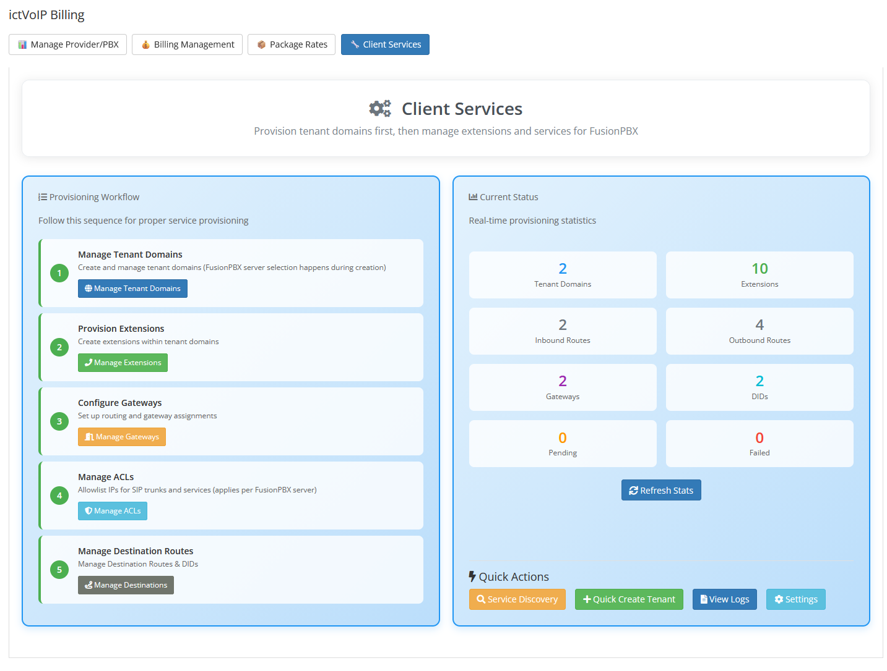

Client Services Admin Area
===========================

Overview
--------

Within the WHMCS **Admin Area**, the ictVoIP Billing addon provides a
**Client Services** section for each provider/PBX. This is an
administrator-facing dashboard that allows you to manage FusionPBX
hosts and client VoIP services without leaving WHMCS.

Core Tools
----------

From the Client Services admin area you can:

|

|

* **Manage Tenant Domains** – Create, import, synchronize, and update
  FusionPBX tenant domains for the selected provider, including
  capacity limits and descriptions, while keeping related WHMCS
  services aligned. Use this when onboarding new customers or bringing
  existing FusionPBX tenants under billing and automation control.
* **Provision Extensions** – Add, view, and manage extensions for each
  tenant, provision them to FusionPBX, and link or unlink extensions to
  WHMCS services for billing and lifecycle control. Use this to keep
  the number and assignment of extensions in sync with purchased
  packages.
* **Configure Gateways** – Use gateway templates and provider-scoped
  settings to configure and sync SIP gateways for tenants, keeping
  provider trunks and PBX routing aligned with billing. Use this when
  deploying or adjusting connectivity to upstream carriers.
* **Manage ACLs** – Review and adjust access control lists used by the
  FusionPBX integration so that API access and management actions are
  limited to the correct IP ranges and security contexts. Use this when
  adding new management hosts or tightening security around the APIs.
* **Manage Destination Routes** – View and manage destination routing
  information (such as inbound numbers/DIDs and associated tenants) to
  keep PBX routing and billing destinations in sync. Use this when
  assigning new DIDs to tenants or auditing existing inbound routing.
* **Service Directory** – Browse and filter client services associated
  with the provider/PBX, helping you quickly locate which tenants,
  extensions, and gateways belong to which WHMCS services. Use this as
  a lookup tool when troubleshooting or answering customer questions.
* **Quick Create Tenant** – Use guided forms to rapidly create new
  FusionPBX tenants (domains) and optionally bind them to WHMCS
  services and main DIDs in a single workflow. Use this for fast,
  standardized onboarding of new client sites.
* **View Logs** – Inspect recent provisioning and sync logs for
  tenants, extensions, gateways, and API interactions to assist with
  troubleshooting and audit trails. Use this whenever a provisioning
  action does not behave as expected.
* **Settings (Server Provisioning Settings)** – Load and save WHMCS
  server credentials (including optional access hash) for FusionPBX
  hosts, and run credential and IP whitelist tests before enabling
  automated provisioning. Use this when first connecting a PBX server
  or when rotating credentials or tightening whitelists. See also
  :doc:`/admin/servers` and :doc:`/getting_started/security`.

Dashboard Statistics
--------------------

The top of the Client Services admin dashboard includes **real-time
provisioning statistics** for the selected provider (for example,
counts of tenants, extensions, pending or failed provisioning items,
_gateways, and inbound DIDs). These figures help you quickly spot
_growth trends and problem areas, such as an unexpected spike in failed
_provisioning jobs or a sudden increase in pending actions that may
_require attention.

For details on how Client Services interacts with PBX servers and
providers, see also :doc:`/admin/servers`, :doc:`/admin/providers`, and
:doc:`/applications/provision`.
