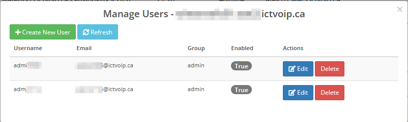

Client Services Admin Area
===========================

Overview
--------

Within the WHMCS **Admin Area**, the ictVoIP Billing addon provides a
**Client Services** section for each provider/PBX. This is an
administrator-facing dashboard that allows you to manage FusionPBX
hosts and client VoIP services without leaving WHMCS.

|

.. image:: ../_static/images/admin/client-services_main.png
   :width: 800px
   :align: center
   :alt: Client services
|

Core Tools
----------

From the Client Services admin area you can:

Core Tools Index
~~~~~~~~~~~~~~~~

- :ref:`Manage Tenant Domains <client_services_manage_tenant_domains>`
- :ref:`Manage Tenant Users & API Keys <client_services_manage_tenant_users>`
- :ref:`Provision Extensions <client_services_provision_extensions>`
- :ref:`Configure Gateways <client_services_configure_gateways>`
- :ref:`Manage ACLs <client_services_manage_acls>`
- :ref:`Manage Destination Routes <client_services_manage_destination_routes>`
- :ref:`Manage Outbound Routes <client_services_manage_outbound_routes>`
- :ref:`Quick Create Tenant <client_services_quick_create_tenant>`
- :ref:`View Logs <client_services_view_logs>`
- :ref:`Settings (Server Provisioning Settings) <client_services_settings_server_provisioning>`
- :ref:`Dry-Run Provisioning <client_services_dry_run>`
- :ref:`Template Management <client_services_template_management>`

Typical workflow: choose a provider/PBX at the top of the screen, then
use the tabs and actions in the Client Services view to locate tenants
and services, run provisioning actions, and review recent activity.

.. _client_services_manage_tenant_domains:

* **Manage Tenant Domains** – Create, import, synchronize, and update
  FusionPBX tenant domains for the selected provider, including
  capacity limits and descriptions, while keeping related WHMCS
  services aligned. Use this when onboarding new customers or bringing
  existing FusionPBX tenants under billing and automation control.
|

.. image:: ../_static/images/admin/client-services_tenant.png
   :width: 800px
   :align: center
   :alt: Client services
|

Typical workflow: search for or select an existing tenant, review its
limits and description, then edit or sync details as needed. Use the
"add" or "import" actions when onboarding a new customer or bringing
an existing FusionPBX tenant under management.

.. warning::

   Deleting a tenant in Client Services cascades to the local FusionPBX
   user records stored in WHMCS. When the tenant is deleted, all
   ``mod_ictvoipbilling_fpbx_users`` entries linked to that tenant are
   also removed. If the **Delete from FusionPBX** option is selected,
   the domain and any selected associated objects (such as extensions)
   are removed from the PBX as well.

.. _client_services_manage_tenant_users:

* **Manage Tenant Users & API Keys** — Create and manage users inside a
  FusionPBX tenant domain. When adding a user, you can choose the group
  (admin, agent, or user), the user type, the status, and whether to
  generate a FusionPBX API key. The API key is displayed after the user
  is created successfully and can be used for API integrations or
  provisioning scripts.
||

||

Typical workflow: open a tenant, click to add a user, enter the username
and other details, select the desired group and type, check **Generate
API Key** if API access is required, then save. The new user is created
in the FusionPBX tenant and the API key is shown in the form.

.. _client_services_provision_extensions:

* **Provision Extensions** – Add, view, and manage extensions for each
  tenant, provision them to FusionPBX, and link or unlink extensions to
  WHMCS services for billing and lifecycle control. Use this to keep
  the number and assignment of extensions in sync with purchased
  packages.
|

.. image:: ../_static/images/admin/client-services_ext.png
   :width: 800px
   :align: center
   :alt: Client services
|

Typical workflow: filter by tenant, review the list of extensions,
create or edit extensions as required, then ensure each extension is
linked to the correct WHMCS service so billing stays in sync with
provisioned resources.

Extension Management Enhancements
~~~~~~~~~~~~~~~~~~~~~~~~~~~~~~~~~~

**Searchable Dropdowns (Select2 Integration)**

All client and service selection dropdowns in extension management now
feature real-time search filtering powered by Select2. This
significantly improves usability when working with large client
databases (2K+ clients).

|

.. image:: ../_static/images/admin/client-services_ext_select2.png
   :width: 800px
   :align: center
   :alt: Extension management searchable dropdowns
|

**Features:**

- **Real-time Search** – Type to instantly filter clients and services
- **Clear Buttons** – Quickly reset selections
- **Proper Modal Handling** – Search works correctly within modal dialogs
- **WHMCS Theme Styling** – Matches the admin interface design

**Available in:**

- Assign Extension modal
- Add Extension modal
- Bulk Assign Extensions modal
- Sync Extensions modal
- Assign to Additional Service modal

**Service Column Enhancement**

The Service column now displays the actual WHMCS product name (e.g.,
"VoIP Extension Service", "Smartnumbers Gold") instead of the tenant
domain, making it easier to identify which billing package each
extension is assigned to.

|

.. image:: ../_static/images/admin/client-services_ext_service_column.png
   :width: 800px
   :align: center
   :alt: Extension service column with product names
|

**Multi-Product Extension Assignment (Smartnumbers Support)**

Extensions can now be assigned to multiple WHMCS products
simultaneously, designed specifically for Smartnumbers and Special
Number Billing use cases where the same extensions need to appear on
both a regular VoIP product and a Special Number Billing product.

|

.. image:: ../_static/images/admin/client-services_ext_multi_product.png
   :width: 800px
   :align: center
   :alt: Multi-product extension assignment
|

**Key Features:**

- **Primary + Secondary Assignments** – Extensions have one primary
  service and unlimited secondary assignments
- **Visual Indicators** – Service column shows badges (+1, +2) for
  secondary assignments with product name tooltips
- **Assign to Additional Service** – Blue + button to assign extensions
  to additional Special Number Billing services
- **Manage Additional Services** – Blue list icon button to view and
  unassign secondary services
- **Automatic Filtering** – Service dropdown shows only products with
  Special Number Billing enabled (configoption3 = 'on')
- **Client-based Filtering** – Shows all Special Billing services for
  the same client
- **Real-time Updates** – DataTable refreshes automatically after
  assign/unassign operations

|

.. image:: ../_static/images/admin/client-services_ext_manage_secondary.png
   :width: 800px
   :align: center
   :alt: Manage secondary service assignments
|

**Typical workflow for multi-product assignment:**

1. Locate an extension already assigned to a primary service
2. Click the blue + button to open "Assign to Additional Service" modal
3. Select a Special Number Billing service from the filtered dropdown
4. Click Assign to create the secondary assignment
5. The Service column updates to show a +1 badge with tooltip
6. Click the blue list icon to manage or unassign secondary services

**Validation:**

- Prevents duplicate assignments to the same service
- Validates service has Special Number Billing enabled
- Provides clear error messages for admin context
- Backward compatible with existing single-product assignments

.. _client_services_configure_gateways:

Configure Gateways
~~~~~~~~~~~~~~~~~~

Use gateway templates and provider-scoped settings to configure and 
sync SIP gateways for tenants, keeping provider trunks and PBX routing 
aligned with billing. Use this when deploying or adjusting connectivity 
to upstream carriers.

|

.. image:: ../_static/images/admin/client-services_gateway.png
   :width: 800px
   :align: center
   :alt: Client services
|

Typical workflow: select the provider and tenant, choose an
appropriate gateway template, adjust any tenant-specific parameters
(such as credentials or hostnames), then apply and sync the gateway to
FusionPBX.

.. _client_services_manage_acls:

Manage ACLs
~~~~~~~~~~~

Review and adjust provider-side Access Control Lists (ACLs) that
determine which source IP addresses are allowed to reach the PBX or
provider services. The ACL Manager shows named lists of nodes, each of
which specifies an action, CIDR, and optional description.

||

.. image:: ../_static/images/admin/client-services_acl.png
   :width: 800px
   :align: center
   :alt: Client services
||

ACL list and node management
****************************

An ACL is a named list of **nodes**. Each node specifies:

* **Action** — ``allow`` or ``deny`` traffic from the matching CIDR.
* **CIDR** — the source IP address or network (for example,
  ``203.0.113.0/24`` or ``198.51.100.10``).
* **Description** — an optional note explaining the entry.

The ACL Manager shows all lists in a DataTable. Select a list to view or
edit its nodes. From the list view you can:

* **Add Node** — create a new allow/deny entry.
* **Edit Node** — change the CIDR, action, or description.
* **Delete Node** — remove an entry from the WHMCS-side list.
* **Sync from FusionPBX** — download the current list contents from the
  PBX into WHMCS.
* **Push to FusionPBX** — upload the WHMCS list to the PBX so it is
  enforced. Use the dry-run preview first.
* **Copy** — duplicate a list to another name or server.
* **Apply to Server** — copy a list from one FusionPBX server to another.

Typical workflow
****************

1. Click **Add List** and give it a name and description.
2. Add the required nodes (CIDRs and actions).
3. Save the WHMCS-side configuration.
4. Run **Push to FusionPBX** with the dry-run preview to see what would
   change.
5. If the plan looks correct, run the live push to enforce the policy.

.. _client_services_manage_destination_routes:

Manage Destination Routes
~~~~~~~~~~~~~~~~~~~~~~~~~

View and manage destination routing information (such as inbound 
numbers/DIDs and associated tenants) to keep PBX routing and billing 
destinations in sync. Use this when assigning new DIDs to tenants or 
auditing existing inbound routing.

|

.. image:: ../_static/images/admin/client-services_routes.png
   :width: 800px
   :align: center
   :alt: Client services
|

Typical workflow: search for an inbound number or DID, confirm which
tenant it is attached to, then update the routing or assignment when
numbers are moved between tenants or new DIDs are activated.

.. _client_services_manage_outbound_routes:

Manage Outbound Routes
~~~~~~~~~~~~~~~~~~~~~~

The **Outbound** tab in the **Destinations** view lists the FusionPBX
outbound dialplan routes for the selected server and tenant. Use it to
audit, edit, assign, and sync outbound routing without leaving WHMCS.

||

.. image:: ../_static/images/admin/client-services_outbound.png
   :width: 800px
   :align: center
   :alt: Client services
||

List and search
***************

Outbound routes are shown in a DataTable with the route name, dialplan
expression, order, gateway, enabled state, and assignment status. Use
the search box and pagination to find routes in large tenant
configurations.

View route details and XML
**************************

The **View** button opens a modal with two tabs:

* **Details** — expression, order, description, gateway, and creation
time.
* **XML** — the raw FusionPBX dialplan XML. If XML is not stored in the
  WHMCS cache, it is fetched on demand from the PBX via
  ``get_outbound_xml``.

This is useful for support and debugging, or to confirm how the route is
structured before making changes.

Edit an outbound route
**********************

The **Edit** button opens a modal that lets you update:

* **Dialplan Expression** — the regex used to match dialed numbers.
* **Order** — the dialplan processing order.
* **Description** — an optional note.
* **Enabled** — whether the route is active.

Saving calls ``update_outbound`` and, where possible, applies the change
to FusionPBX automatically. Gateway changes are not accepted through the
Edit modal to prevent accidental misrouting.

Assign and sync
***************

* **Assign** — link an unassigned route to a WHMCS client service.
* **Unassign** — remove the WHMCS client service link.
* **Sync from FusionPBX** — import routes that exist on the PBX but are
  not yet in the WHMCS cache.
* **Create Template** — save the settings of an existing route as a
  reusable template.

XML editing
***********

While the admin UI exposes a read-only **XML** view, the backend
endpoint ``save_outbound_xml`` can be used by support to update the stored
dialplan XML directly. For routine changes, use the Edit modal instead.

.. _client_services_quick_create_tenant:

Quick Create Tenant
~~~~~~~~~~~~~~~~~~~

Use guided forms to rapidly create new FusionPBX tenants (domains) and 
optionally bind them to WHMCS services and main DIDs in a single 
workflow. Use this for fast, standardized onboarding of new client sites.

|

.. image:: ../_static/images/admin/client-services_create_tenant.png
   :width: 800px
   :align: center
   :alt: Client services
|

Typical workflow: select the provider/PBX, enter the new tenant domain
and main DID, choose or confirm the related WHMCS service, then submit
the form to create and link the tenant in a single step.

.. _client_services_view_logs:

View Logs
~~~~~~~~~

Inspect recent provisioning and sync logs for tenants, extensions, 
gateways, and API interactions to assist with troubleshooting and audit 
trails. Use this whenever a provisioning action does not behave as 
expected.

|

.. image:: ../_static/images/admin/client-services_logs.png
   :width: 800px
   :align: center
   :alt: Client services
|

Typical workflow: when a provisioning or sync task does not behave as
expected, open the logs view, filter by provider, tenant, or time
range, and review recent actions and error messages before making
changes or re-running the action.

.. _client_services_settings_server_provisioning:

Settings (Server Provisioning Settings)
~~~~~~~~~~~~~~~~~~~~~~~~~~~~~~~~~~~~~~~~

Load and save WHMCS server credentials (including optional access hash) 
for FusionPBX hosts, and run credential and IP whitelist tests before 
enabling automated provisioning. Use this when first connecting a PBX 
server or when rotating credentials or tightening whitelists. See also 
:doc:`/admin/servers` and :doc:`/getting_started/security`.

|

.. image:: ../_static/images/admin/client-services_settings.png
   :width: 800px
   :align: center
   :alt: Client services
|

Typical workflow: select the PBX server, load the stored credentials,
update passwords or access hashes if they have changed, then run the
credential and whitelist tests to verify connectivity before enabling
or resuming automated provisioning.

.. _client_services_dry_run:

Dry-Run Provisioning
--------------------

Several Client Services tools support a **dry-run** or **preview** mode
that shows exactly what would change on the FusionPBX server before any
write is committed. Use this to verify that a sync, push, or provision
action will have the intended effect and to catch mismatches before they
affect production traffic.

What dry-run can show
~~~~~~~~~~~~~~~~~~~~~

The preview typically displays:

* **Items to be added** — new routes, gateways, ACL nodes, or
  destinations that do not yet exist on the PBX.
* **Items to be updated** — existing records whose XML, expression,
  order, or CIDR would change.
* **Items to be deleted** — records present on the PBX but missing from
  the WHMCS source.
* **Conflicts or errors** — duplicate names, missing dependencies, or
  permission issues that would block the action.

Where dry-run is available
~~~~~~~~~~~~~~~~~~~~~~~~~~

* **Gateways** — use the preview before saving or pushing a gateway
  template to a tenant.
* **Destination Routes (Inbound)** — preview DID/sync changes before
  applying them.
* **Manage ACLs** — preview ACL push and copy operations before they are
  written to FusionPBX.

Each preview panel returns a JSON or formatted plan. Review the plan,
close the preview, adjust the source record if needed, then run the
action again with the live/push option.

.. _client_services_template_management:

Template Management
-------------------

Gateways, destinations, and outbound routes all support reusable
templates. Templates store variables, XML fragments, matching
expressions, and other settings so you can apply a known-good
configuration to new tenants or services without recreating it each time.

Available template actions
~~~~~~~~~~~~~~~~~~~~~~~~~~

* **Export All Templates** — download the entire template library for the
  current object type (gateways, destinations, or outbound routes) as a
  JSON file. Use this to back up an existing ictVoIP Billing
  installation, or to migrate the templates to a new WHMCS install and
  reuse them there.

* **Import Templates** — upload a previously exported JSON file to create
  or overwrite templates in bulk. The import accepts ``.json`` files
  produced by the export function.

* **Copy** — duplicate an existing template. You are prompted for a new
  display name and, where applicable, a new system name. The copy retains
  all variables and XML from the original.

* **Rename** — change the display name and/or system name of an existing
  template. This does not affect templates already applied to services;
  it only updates the library entry.

* **Delete** — remove a template from the library. This does not delete
  gateways, destinations, or routes already pushed to FusionPBX.

* **Import into Template** — pull an existing object from the FusionPBX
  server into the WHMCS template library. This is useful when a gateway,
  destination, or outbound route was created directly on the PBX and you
  want to reuse it as a template for future assignments.

Typical workflow
~~~~~~~~~~~~~~~~

1. Build or import the templates you need in the **Gateways**, **Inbound
   DIDs**, or **Outbound** template view.
2. Use **Export All Templates** to save a backup before making bulk
   changes.
3. Apply templates by selecting them when configuring a tenant or client
   service, then review with **Dry-Run Provisioning** before pushing to
   FusionPBX.

Dashboard Statistics
--------------------

The top of the Client Services admin dashboard includes **real-time
provisioning statistics** for the selected provider (for example,
counts of tenants, extensions, pending or failed provisioning items,
_gateways, and inbound DIDs). These figures help you quickly spot
_growth trends and problem areas, such as an unexpected spike in failed
_provisioning jobs or a sudden increase in pending actions that may
_require attention.
|

.. image:: ../_static/images/admin/client-services_main.png
   :width: 800px
   :align: center
   :alt: Client services
|

For details on how Client Services interacts with PBX servers and
providers, see also :doc:`/admin/servers`, :doc:`/admin/providers`, and
:doc:`/applications/provision`.
