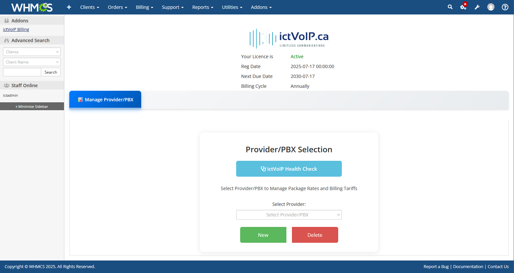
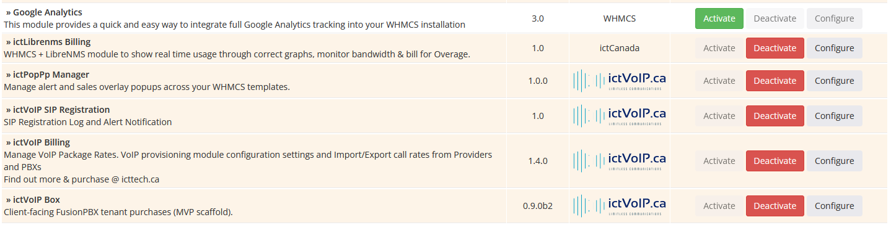
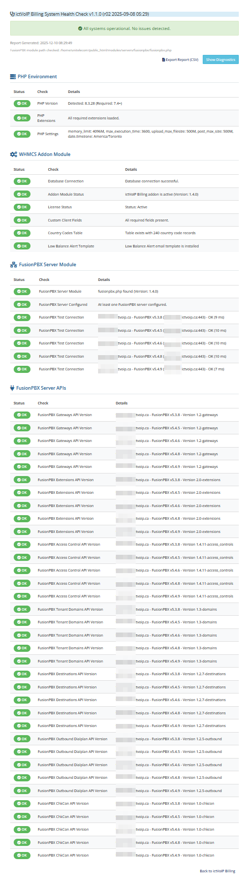

############################
Installing ictVoIP Billing
############################

.. tip::

   **Upgrading an existing installation?** See :doc:`/upgrades` for the
   recommended upgrade procedure covering the ictVoIP Billing addon,
   FusionPBX server module, and API files.

**Complete Installation Guide for ictVoIP Billing System**

This guide provides step-by-step instructions for installing and configuring the ictVoIP Billing system on your WHMCS platform.

|

|

System Requirements
------------------

**Supported WHMCS Versions:**
* WHMCS 8.12+

**PHP Requirements:**
* PHP 8.1+

**Web Server:**
* Apache 2.4+
* LiteSpeed
* Nginx (with proper configuration)

**Prerequisites:**
* WHMCS with HTTPS enabled
* Basic understanding of WHMCS administration
* Access to WHMCS admin panel

.. note::
   This guide assumes you have a basic WHMCS installation with HTTPS enabled and understand WHMCS platform administration.

Purchase & Download
------------------

**1. Purchase or start a Trial**

If you haven't already purchased the ictVoIP Billing addon module or wish to request a trial, you can request so here:

`ictVoIP Billing Software Contact Us <https://www.icttech.ca/contact.php>`_

**2. Download the Package**

To purchase or begin a trial setup an account and download the latest release package from your client area:
* **Package:** `ictvoip_billing_release-1.4_PHP8.1-8.3.zip`
* **Location:** Your client area licenses section

Installation Process
-------------------

For a complete step-by-step installation checklist, including environment requirements, package upload, file extraction, and initial verification, see the :doc:`/getting_started/quick_install` guide.

Once the files have been deployed to your WHMCS document root, continue with the steps below to activate and configure the ictVoIP Billing addon.

Database Setup
--------------

When the ictVoIP Billing addon is activated for the first time, it will automatically create and initialize the required database tables, including country codes and configuration tables.

License Activation
-----------------

**Step 1: Access Addon Modules**

Navigate to your WHMCS admin panel:
* **System Settings** → **Apps & Integrations** → **Addon Modules**

**Step 2: Activate the Module**

1. Find "ictVoIP Billing" in the addon modules list
2. Click **Activate**
3. Click **Configure**

**Step 3: Enter License Key**

Enter your ictVoIP Billing license key in the configuration:

.. code-block:: text

   License Key: YOUR-ICTVOIP-LICENSE-KEY

|

|

**Step 4: Configure Access Control**

Set the appropriate access control groups for your administrators and save the configuration.

.. note::

   **Upgrading from v1.3.3:** When upgrading from ictVoIP Billing v1.3.3 (or any 1.3.x build) to v1.4.0 or later, you must re-run the addon activation inside WHMCS after uploading the new files. If the addon is already active, click **Deactivate**, then **Activate** again. This ensures that all new database tables and columns required by the new version are created and updated.

.. seealso::

   For the complete upgrade procedure, including FusionPBX server module and
   API updates, see :doc:`/upgrades`.

System Health Check
-------------------

After installing and activating the ictVoIP Billing addon, you can run the System Health Check to verify proper configuration and setup of the addon and server modules.

|

|

**Manual Verify Checks**

**1. Check Module Status**

Verify the module is properly installed:
* Navigate to **System Settings** → **Apps & Integrations** → **Addon Modules**
* Ensure "ictVoIP Billing" shows as **Active**

**2. Test Admin Access**

* Navigate to **ictVoIP Billing** in your admin menu
* Verify you can access the dashboard
* Check that all menu items are visible

**3. Verify Database Tables**

Confirm the required tables were created:

.. code-block:: sql

   SHOW TABLES LIKE '%ictvoipbilling%';

For day-to-day administration of tenants, extensions, gateways, and
related provisioning tasks, see the :doc:`/admin/client_services`
documentation.

Server Provisioning Settings & Tests
-----------------------------------

Within the ictVoIP Billing admin area, the **Client Services** or **Server Provisioning Settings** screens allow you to configure and validate connections to your PBX servers (for example, FusionPBX hosts) using the standard WHMCS server records.

At a high level, these screens provide:
* Server Credentials Management – Reads and updates the WHMCS ``tblservers`` record for the selected PBX server (username, encrypted password, and API access hash), using WHMCS encryption for password storage and avoiding plaintext passwords in logs.
* Credential Test (FusionPBX Login) – Uses either a username/password combination or an API access hash (depending on your integration pattern) to validate that the configured credentials can successfully log in to the PBX web interface over HTTPS and returns a simple pass/fail result so you can correct credentials before enabling automated provisioning.
* Whitelist / API Reachability Test – Performs a lightweight HTTP check against one or more PBX API endpoints to confirm that the WHMCS server is allowed by the PBX IP whitelist and reports whether the PBX returned a version/status response (whitelist OK) or an access-denied/login page (indicating the WHMCS IP may not be fully whitelisted).

These tools do not change PBX configuration themselves; they are designed to help you verify that the underlying FusionPBX (or other PBX) API access is correctly configured before relying on automated provisioning and billing.

Troubleshooting
--------------

**Common Issues:**

* **Module not appearing:** Check file permissions and ensure all files were copied correctly
* **License activation failed:** Verify the license key is correct and has not expired
* **Database errors:** Ensure the country codes table was imported successfully
* **Access denied:** Check that your admin user has the correct access control group assigned

**Support:**

If you encounter issues during installation, please contact our support team with:
* WHMCS version
* PHP version
* Error messages (if any)
* Steps taken during installation

Next Steps
----------

After successful installation and a clean System Health Check, proceed to:

1. **Server Configuration** - Set up your PBX servers (see :doc:`/admin/servers`)
2. **Provider Setup** - Configure your VoIP providers (see :doc:`/admin/providers`)
3. **Tariff Management** - Set up your pricing structure
4. **Package Configuration** - Create service packages and assign them to clients
5. **Admin Area Overview** - Review the Admin Area guide for a summary of
   configuration options and tools (see :doc:`/admin`)
6. **Client Services Admin Area** - Use the Client Services dashboard
   for day-to-day management of tenants, extensions, gateways, and
   related provisioning tasks (see :doc:`/admin/client_services`)
