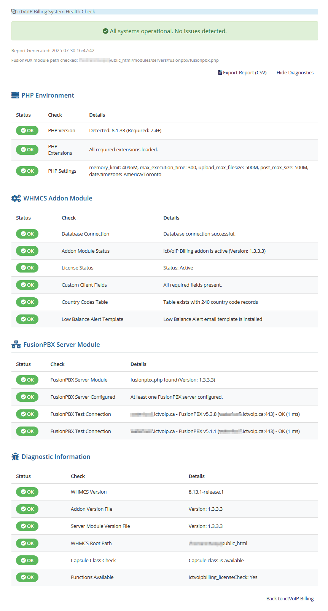

############################
Installing ictVoIP Billing
############################

**Complete Installation Guide for ictVoIP Billing System**

This guide provides step-by-step instructions for installing and configuring the ictVoIP Billing system on your WHMCS platform.

|

|

System Requirements
------------------

**Supported WHMCS Versions:**
* WHMCS 8.12+

**PHP Requirements:**
* PHP 8.1

**Web Server:**
* Apache 2.4+
* LiteSpeed
* Nginx (with proper configuration)

**Prerequisites:**
* WHMCS with HTTPS enabled
* Basic understanding of WHMCS administration
* Access to WHMCS admin panel

.. note::
   This guide assumes you have a basic WHMCS installation with HTTPS enabled and understand WHMCS platform administration.

Purchase & Download
------------------

**1. Purchase or start a Triale**

If you haven't already purchased the ictVoIP Billing addon module or wish to request a trial, you can request so here:

`ictVoIP Billing Software Contact Us <https://www.icttech.ca/contact.php>`_

**2. Download the Package**

To purchase or begin a trial setup an account and download the latest release package from your client area:
* **Package:** `ictvoip_billing_release-1.3.x_PHP8.x.zip`
* **Location:** Your client area licenses section

Installation Process
-------------------

**Step 1: Upload the Package**

Upload the ictVoIP Billing addon module zip file to your server:

.. code-block:: bash

   /home/$user/tmp/ictvoip_billing_release-1.3.x_PHP8.x.zip

**Step 2: Extract and Copy Files**

Uncompress the module and copy the contents to your WHMCS root installation:

.. code-block:: bash

   # Extract the package to a tmp dir
   extract ictvoip_billing_release-1.3.x_PHP8.x.zip
   
   # Copy files to WHMCS directories
   cd /home/$user/tmp/ictvoip_billing_module_v1-3-x_PHP8.x
   cp -r WHMCS/* /home/$user/public_html/
   

Database Setup
--------------

**Import Required Tables**

Country Codes table are now initialized after activating you ictVoIP Billing addone:

License Activation
-----------------

**Step 1: Access Addon Modules**

Navigate to your WHMCS admin panel:
* **System Settings** → **Apps & Integrations** → **Addon Modules**

**Step 2: Activate the Module**

1. Find "ictVoIP Billing" in the addon modules list
2. Click **Activate**
3. Click **Configure**

**Step 3: Enter License Key**

Enter your license key in the configuration:

.. code-block:: text

   License Key: LeasedictVoIP_a3174afbf93b3b8ba8f3

|

.. image:: ../_static/images/admin/addon_lic.png
   :width: 900px
   :align: center
   :alt: Addon License Configuration
|

**Step 4: Configure Access Control**

Set the appropriate access control groups for your administrators and save the configuration.

** NEW System Health Check
-------------------------

Now after installing you modules you can run the System Health Check to verify proper configuration and setup of Addon and Server Modules

|

|

**Manual Verify Checks**

**1. Check Module Status**

Verify the module is properly installed:
* Navigate to **System Settings** → **Apps & Integrations** → **Addon Modules**
* Ensure "ictVoIP Billing" shows as **Active**

**2. Test Admin Access**

* Navigate to **ictVoIP Billing** in your admin menu
* Verify you can access the dashboard
* Check that all menu items are visible

**3. Verify Database Tables**

Confirm the required tables were created:

.. code-block:: sql

   SHOW TABLES LIKE '%ictvoipbilling%';

Troubleshooting
--------------

**Common Issues:**

* **Module not appearing:** Check file permissions and ensure all files were copied correctly
* **License activation failed:** Verify the license key is correct and has not expired
* **Database errors:** Ensure the country codes table was imported successfully
* **Access denied:** Check that your admin user has the correct access control group assigned

**Support:**

If you encounter issues during installation, please contact our support team with:
* WHMCS version
* PHP version
* Error messages (if any)
* Steps taken during installation

Next Steps
----------

After successful installation, proceed to:

1. **Server Configuration** - Set up your PBX servers
2. **Provider Setup** - Configure your VoIP providers
3. **Tariff Management** - Set up your pricing structure
4. **Package Configuration** - Create service packages
