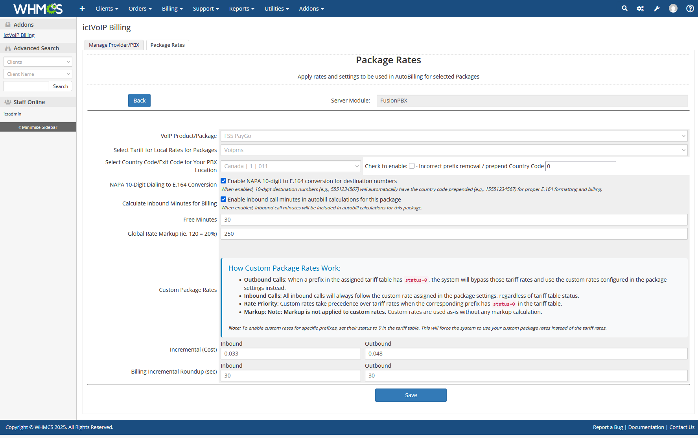
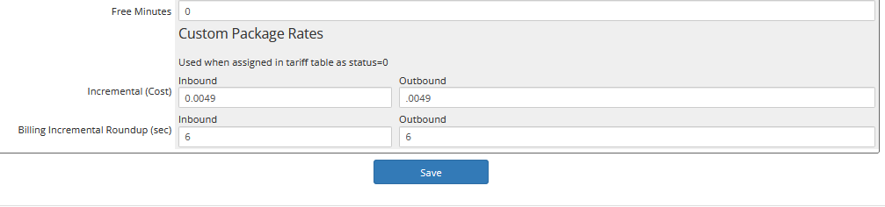

Package Management
==================

**VoIP Service Package Configuration**

Package management allows you to create and configure VoIP service packages with specific rates, features, and billing structures. This system supports both standard and custom rate configurations for flexible service offerings.

|

|

Overview
--------

VoIP packages define the service offerings available to your clients. Each package can include specific rates, features, and billing structures tailored to different market segments and client needs.

**Key Features:**
* Flexible package configuration
* Custom rate structures
* Metered and unlimited options
* Global markup management
* Country-specific pricing

Package Configuration
--------------------

**Step 1: Select VoIP Package**

Navigate to **ictVoIP Billing** → **Packages** and select or create a new VoIP package.

**Step 2: Assign Tariff/Rate Card**

Link the package to a specific tariff or rate card:

.. code-block:: text

   Package: Premium VoIP Service
   Tariff: Telnyx_Outbound_2024_01
   Provider: FusionPBX - Telnyx - Global

**Step 3: Configure Country Settings**

Select the country where your PBX resides. This affects:
* National call billing
* International call routing
* Exit code processing
* Local number formatting

**Step 4: Country Code Configuration**

Configure country code settings for proper CDR processing:

|

.. image:: ../_static/images/admin/prepend_country_code.png
        :scale: 50%
        :align: center
        :alt: Country Code Configuration
|

**Country Code Options:**

* **E.164 Format** - Standard international format (recommended)
* **Local Prefix** - Local dialing without country code
* **Custom Format** - Specific formatting requirements

**Example Configuration:**

For London, England setup:
* **Enable Local Prefix:** Checked
* **Country Code:** 44
* **Local Calls:** Use 0 prefix (e.g., 020 for London)
* **International Calls:** Use 00 prefix

.. note::
   We recommend adjusting your dial plan to produce proper E.164 destination_number format for optimal CDR processing.

**Step 5: Global Markup Configuration**

Set your global markup percentage:

.. code-block:: text

   Base Rate: $0.01 per minute
   Global Markup: 25%
   Final Rate: $0.0125 per minute

**Step 6: Free Minutes Allocation**

Configure free minutes for metered packages:

.. code-block:: text

   Package Type: Metered
   Free Minutes: 1000
   Overage Rate: $0.02 per minute
   
   Package Type: Unlimited
   Free Minutes: 0 (unlimited)
   Overage Rate: N/A

Custom Rate Configuration
------------------------

**Custom Rate Options:**

Create specialized rate structures for specific needs:

|

|

**Custom Rate Examples:**

* **Country-Specific Package:**
  * Destination: Poland
  * Free Minutes: 1000
  * Overage Rate: $0.05 per minute
  * Base Package: 1000 minutes included

* **Flat Rate Package:**
  * All Calls: $0.03 per minute
  * Free Minutes: 0
  * Override Provider Rates: Yes

* **Tiered Rate Package:**
  * 0-500 minutes: $0.02 per minute
  * 501-1000 minutes: $0.015 per minute
  * 1000+ minutes: $0.01 per minute

**Custom Rate Setup:**

To enable custom rates, modify the tariff database:

.. code-block:: sql

   -- Update tariff status to enable custom rates
   UPDATE mod_ictvoipbilling_tariff_[provider_name]_[date]
   SET status = 0
   WHERE prefix = '[target_prefix]';

**Database Location:**

Custom rates are stored in the WHMCS database:
* **Database:** `ictvoip_dev6733`
* **Table:** `mod_ictvoipbilling_tariff_[provider]_[date]`
* **Example:** `mod_ictvoipbilling_tariff_telnyx_outbound_2024_10`

Package Types
------------

**Metered Packages:**

* **Usage-based billing** - Pay per minute
* **Free minute allocation** - Included minutes
* **Overage rates** - Additional minute pricing
* **Usage tracking** - Real-time usage monitoring

**Unlimited Packages:**

* **Unlimited calling** - No minute limits
* **Fixed monthly rate** - Predictable pricing
* **Feature-based billing** - Additional features
* **Fair use policies** - Usage guidelines

**Hybrid Packages:**

* **Combined approach** - Mix of metered and unlimited
* **Feature tiers** - Different feature levels
* **Flexible billing** - Multiple billing options
* **Custom limits** - Specific usage limits

Rate Management
--------------

**Rate Calculation:**

The system calculates rates using the following formula:

.. code-block:: text

   Final Rate = (Base Rate + Custom Rate) × (1 + Global Markup %)
   
   Example:
   Base Rate: $0.01
   Custom Rate: $0.005
   Global Markup: 25%
   Final Rate: ($0.01 + $0.005) × 1.25 = $0.01875

**Rate Priority:**

1. **Custom Rates** - Highest priority
2. **Package Rates** - Medium priority
3. **Provider Rates** - Base priority
4. **Global Markup** - Applied to all rates

**Rate Validation:**

* Verify rate accuracy
* Check for conflicts
* Validate markup calculations
* Test rate application

Best Practices
-------------

**Package Design:**

* **Clear naming** - Descriptive package names
* **Competitive pricing** - Market-appropriate rates
* **Feature differentiation** - Unique value propositions
* **Scalable structure** - Growth-friendly design

**Rate Configuration:**

* **Consistent markup** - Standard markup policies
* **Regular reviews** - Periodic rate updates
* **Market monitoring** - Competitive rate analysis
* **Client feedback** - Rate optimization

**Technical Setup:**

* **E.164 formatting** - Standard number format
* **Proper country codes** - Accurate geographic settings
* **CDR optimization** - Efficient call processing
* **Database maintenance** - Regular cleanup
* **Extension detection** - Inbound calls routed to local extensions are recognized as valid and not flagged for E.164 issues

.. note::
   The CDR E.164 Validator now recognizes inbound calls to local extensions as valid, and does not flag inbound caller IDs from outside the product country as 'Wrong Country'. Review your CDR validation results after package configuration to ensure all settings are correct. See the updated validator documentation and screenshots for details.

Troubleshooting
--------------

**Common Issues:**

* **Rate Calculation Errors** - Check markup and custom rate settings
* **CDR Processing Issues** - Verify country code configuration
* **Package Assignment Problems** - Check provider and tariff linking
* **Billing Inconsistencies** - Review rate priority and calculations

**Debug Steps:**

1. Verify package configuration
2. Check tariff assignments
3. Review country code settings
4. Test rate calculations
5. Monitor CDR processing

**Support Information:**

For package-related issues, provide:
* Package configuration details
* Rate structure information
* Error messages and logs
* Expected vs actual results

Next Steps
----------

After package configuration:

1. **Client Assignment** - Assign packages to clients
2. **Billing Setup** - Configure automated billing
3. **Usage Monitoring** - Set up usage tracking
4. **Performance Testing** - Verify package functionality

Latest Package Rates UI & Functionality Updates
==============================================

**Tariff and Country Code Assignment**

Each package can be linked to a specific provider tariff table. The Package Rates UI allows you to:

* Select the provider tariff for outbound/inbound calls
* Set the country code and prefix for number formatting
* Enable or disable country code enforcement and prefixing
* Enable special handling for North American 10-digit numbers (NAPA)
* Enable tracking and billing of inbound minutes separately

**Custom Tariff Support**

You can enable custom rate tables for a package using the "Enable Custom Tariff" option. This allows for highly granular rate management beyond standard provider tariffs.

**Markup, Free Minutes, and Incremental Billing**

The UI allows you to set:
* Global rate markup (percentage applied to all rates)
* Free minutes allocation (for metered packages)
* Incremental cost and rounding for both inbound and outbound calls

**Note:** Global rate markup is bypassed when using custom rates.

These settings are saved per package and affect how rates are calculated and billed.

**UI Improvements**

When editing a package, all current settings (tariff, country code, markups, free minutes, etc.) are pre-populated in the UI for easy review and update.

*Figure: The updated Package Rates UI with new controls for tariff assignment, country code, markups, and more.*

