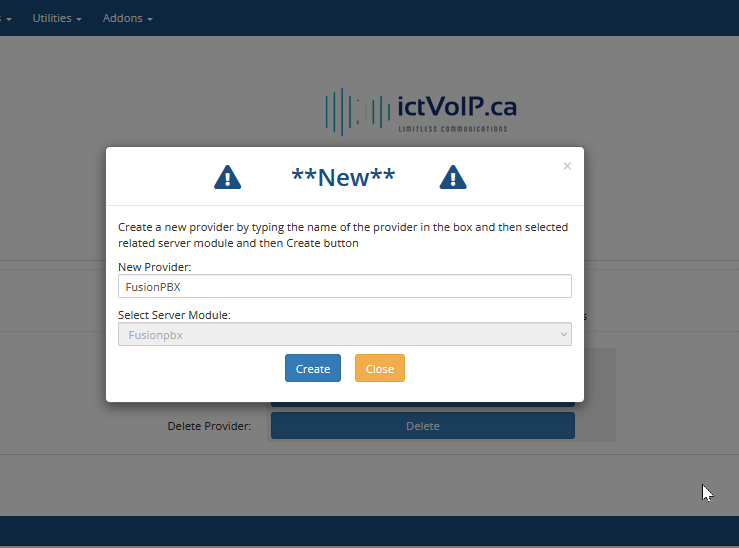

Provider Management
==================

**VoIP Provider & PBX Configuration**

Provider management allows you to configure VoIP providers and PBX systems, linking them to specific tariffs and package rates for automated billing and provisioning.

|

|

Overview
--------

Providers in the ictVoIP Billing system represent VoIP service providers or PBX systems that you integrate with for billing and provisioning. Each provider can be linked to specific tariffs and packages, enabling flexible rate management and automated billing processes.

**Key Features:**
* Multiple provider support
* Custom tariff linking
* Automated provisioning
* Flexible rate management
* Regional pricing support

Provider Configuration
---------------------

**Step 1: Access Provider Management**

Navigate to your WHMCS admin panel:
* **ictVoIP Billing** → **Providers**

**Step 2: Add New Provider**

Click **Add New Provider** to create a new provider configuration.

**Naming Convention:**

Use a clear, descriptive naming convention for your providers:

.. code-block:: text

   Format: [PBX Vendor - Provider - Tariff]
   Example: FusionPBX - Telnyx - Global

**Naming Examples:**

* **FusionPBX - Telnyx - Global** - Standard global rates
* **FusionPBX - Twilio - North America** - Regional pricing
* **Vodia - Bandwidth - International** - International rates
* **Custom PBX - Local Provider - Local** - Local rate structure

Configuration Options
--------------------

**Provider Types:**

1. **VoIP Providers** - External SIP trunk providers
2. **PBX Systems** - Internal PBX platforms
3. **Hybrid Systems** - Combined provider/PBX setups

**Rate Structure Options:**

* **Global Rates** - Standard pricing for all destinations
* **Regional Rates** - Specific pricing for geographic regions
* **Custom Rates** - Tailored pricing for specific needs
* **Tiered Rates** - Volume-based pricing structures

**Integration Features:**

* **API Integration** - Automated provisioning
* **Real-time Billing** - Live usage tracking
* **CDR Processing** - Call detail record management
* **Rate Management** - Dynamic pricing updates

Tariff Linking
-------------

**Linking Providers to Tariffs:**

Each provider can be linked to specific tariffs for automated billing:

.. code-block:: text

   Provider: FusionPBX - Telnyx - Global
   Tariff: Global Standard Rates
   Package: Basic VoIP Package

**Benefits of Tariff Linking:**

* **Automated Billing** - Automatic rate application
* **Consistent Pricing** - Standardized rate structures
* **Easy Management** - Centralized rate control
* **Flexible Configuration** - Multiple tariff options

**Tariff Assignment:**

1. Select the provider during configuration
2. Choose the appropriate tariff from the dropdown
3. Assign package rates if applicable
4. Save the configuration

Package Integration
------------------

**Package Assignment:**

Providers can be linked to specific service packages:

.. code-block:: text

   Package: Premium VoIP Service
   Provider: FusionPBX - Telnyx - Global
   Features: Unlimited local calls, 1000 international minutes

**Package Configuration:**

* **Service Limits** - Call minutes, features, etc.
* **Rate Structure** - Package-specific pricing
* **Billing Cycle** - Monthly, quarterly, annual
* **Auto-renewal** - Automatic package renewal

Regional Configuration
---------------------

**Geographic Rate Management:**

Configure different rates for various regions:

.. code-block:: text

   Region: North America
   Provider: FusionPBX - Telnyx - North America
   Rates: Local $0.01/min, Long Distance $0.05/min

   Region: Europe
   Provider: FusionPBX - Telnyx - Europe
   Rates: Local €0.02/min, International €0.10/min

**Regional Benefits:**

* **Competitive Pricing** - Region-specific rates
* **Local Presence** - Geographic optimization
* **Cost Efficiency** - Optimized provider selection
* **Customer Satisfaction** - Localized service

Best Practices
-------------

**Provider Naming:**

* Use descriptive, consistent names
* Include vendor and tariff information
* Avoid special characters
* Keep names concise but informative

**Configuration Management:**

* Document all provider settings
* Maintain backup configurations
* Regular rate reviews and updates
* Monitor provider performance

**Security Considerations:**

* Secure API credentials
* Regular password updates
* Access control management
* Audit trail maintenance

Troubleshooting
--------------

**Common Issues:**

* **Provider Not Found** - Check naming and configuration
* **Rate Mismatch** - Verify tariff linking
* **API Errors** - Check credentials and connectivity
* **Billing Issues** - Review rate configuration

**Debug Steps:**

1. Verify provider configuration
2. Check tariff assignments
3. Test API connectivity
4. Review error logs

**Support Information:**

For provider-related issues, provide:
* Provider name and configuration
* Error messages and logs
* Tariff and package details
* API credentials (if applicable)

Next Steps
----------

After configuring providers:

1. **Tariff Setup** - Configure rate structures
2. **Package Creation** - Create service packages
3. **Client Assignment** - Assign providers to clients
4. **Billing Configuration** - Set up automated billing
