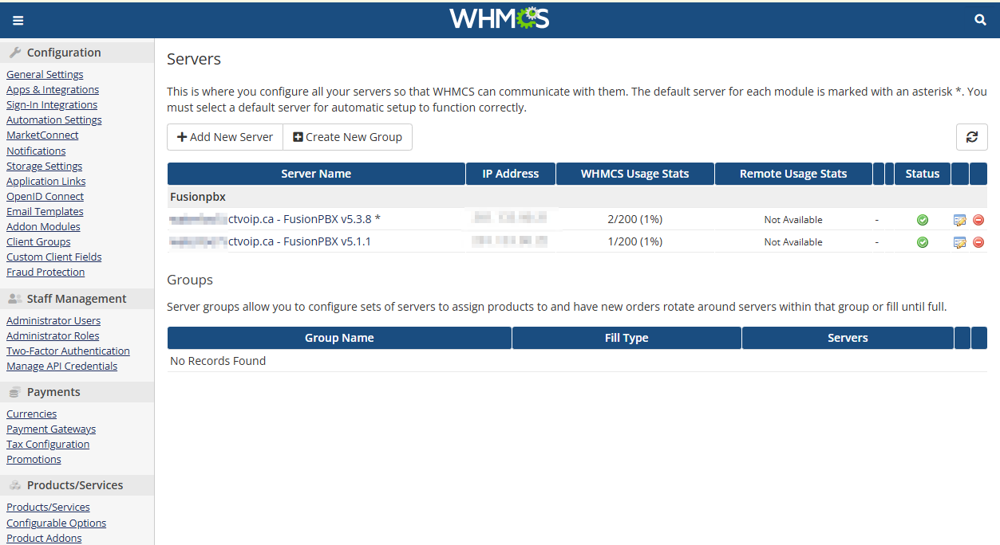
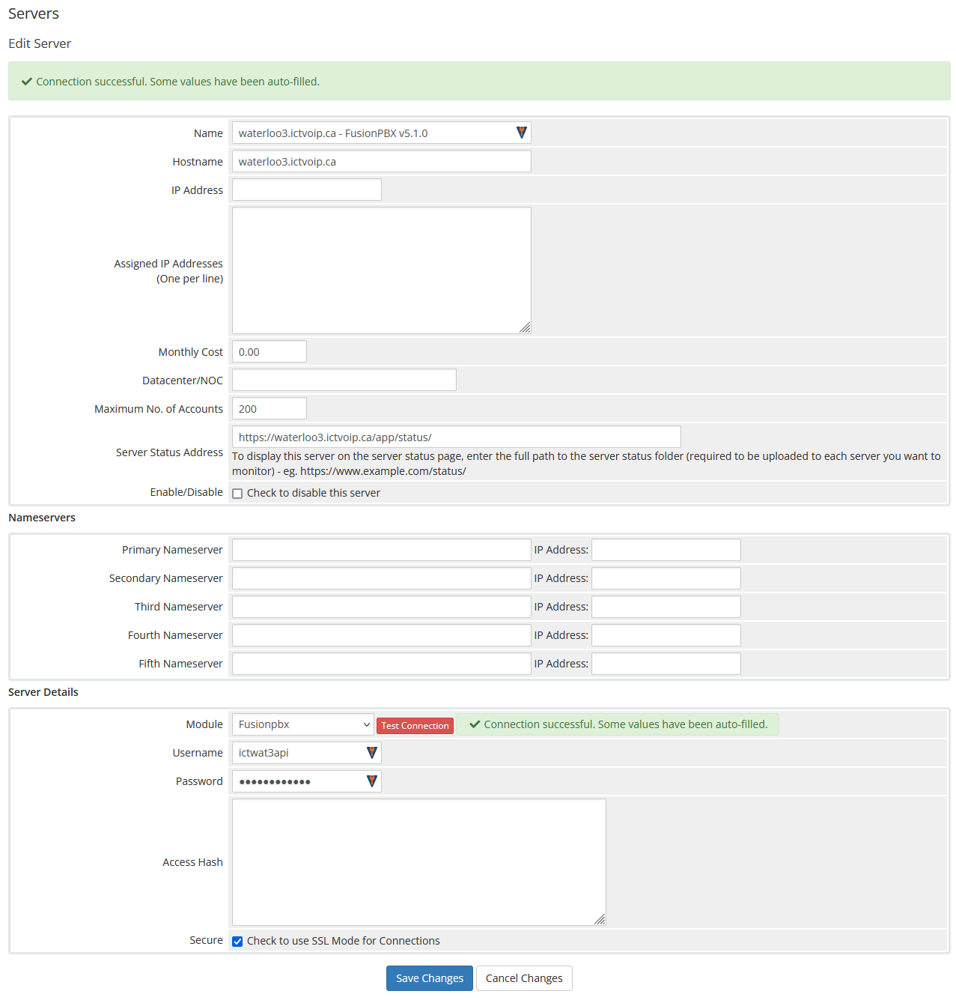

Server Management
=================

**PBX Server Integration & API Configuration**

The Server Management section covers the installation and configuration of PBX server modules, enabling seamless integration between your WHMCS system and various PBX platforms.

|

|

Overview
--------

Server modules allow you to provision and manage PBX servers directly from your WHMCS admin panel. This integration provides automated provisioning, billing, and management capabilities for your PBX infrastructure.

**Supported PBX Platforms:**
* FusionPBX 5.3.x
* Vodia PBX
* Custom PBX integrations

**Key Features:**
* Automated server provisioning
* Real-time server status monitoring
* Integrated billing and management
* API-based communication
* Multi-server support

FusionPBX Integration
--------------------

**Supported Versions:**
* FusionPBX 5.1.x (current)
* FusionPBX 5.2.x (current)
* FusionPBX 5.3.x (current)

.. note::
   For older version support, please contact our support team.

**Package Information:**

You may receive a bundled package containing both FusionPBX and WHMCS modules:
* **Package:** `ictvoip_fusionPBX_module-release-1.3.2_PHP8.1-8.3.zip`
* **Contents:** FusionPBX API scripts + WHMCS Server Module

FusionPBX API Installation
--------------------------

**Step 1: Download and Extract**

Download the FusionPBX API package and extract it to your FusionPBX server:

.. code-block:: bash

   # Extract to FusionPBX root directory
   unzip ictvoip_fusionpbx_5-3-x_apis.zip -d /var/www/fusionpbx/

**Step 2: Upload Files**

Upload the API scripts to your FusionPBX host using WinSCP, FTP, or SCP:

.. code-block:: text

   Required file locations:
   /var/www/fusionpbx/app/xml_cdr/chkcon.php
   /var/www/fusionpbx/app/xml_cdr/export_cdr.php
   /var/www/fusionpbx/app/xml_cdr/import_cdr.php
   /var/www/fusionpbx/app/xml_cdr/img/
   /var/www/fusionpbx/app/xml_cdr/img/loading.gif

.. update::
   The import_cdr script will not overwrite existing CDRs, checks for duplicates. Always backup your host data and DB

**Step 3: Verify Installation**

Check that all files are properly uploaded and have correct permissions:

.. code-block:: bash

   # Check file permissions
   ls -la /var/www/fusionpbx/app/xml_cdr/
   
   # Verify API accessibility
   curl -I https://your-fusionpbx-domain.com/app/xml_cdr/chkcon.php

WHMCS Server Module Installation
-------------------------------

**Step 1: Download Server Module**

Download the WHMCS server module from your client area:

.. code-block:: text

   Package: ictvoip_fusionPBX_module-release-1.3.x_PHP8.x.zip
   Location: /home/$user/tmp/

**Step 2: Extract and Copy Files**

Extract the package and copy the required files:

.. code-block:: bash

   # Extract the package
   unzip ictvoip_fusionPBX_module-release-1.3.x_PHP8.x.zip
   
   # Copy WHMCS files
   cp -r includes/hooks /home/$user/public_html/includes/
   cp -r modules/servers/fusionpbx /home/$user/public_html/modules/servers/

**Step 3: Verify Directory Structure**

Ensure the following structure exists:

.. code-block:: text

   /home/$user/public_html/includes/hooks
   /home/$user/public_html/modules/servers/fusionpbx
   /home/$user/public_html/modules/servers/fusionpbx/img
   /home/$user/public_html/modules/servers/fusionpbx/lib
   /home/$user/public_html/modules/servers/fusionpbx/templates

Server Configuration
-------------------

**Step 1: Access Server Management**

Navigate to your WHMCS admin panel:
* **System Settings** → **Products & Services** → **Servers**

**Step 2: Add New Server**

Click **Add New Server** and configure the following settings:

|

|

**Required Configuration:**

.. code-block:: text

   Server Name: waterloo3.ictvoip.ca - FusionPBX v5.1.1
   Hostname: waterloo3.ictvoip.ca
   IP Address: 102.100.100.20
   Assigned IP addresses: 102.100.100.20
   Maximum No. of Accounts: 100
   Module: Fusionpbx
   Username: ictwat3api
   Password: [YOUR_SECURE_PASSWORD]

**Configuration Details:**

* **Server Name:** Descriptive name for your server
* **Hostname:** FQDN with active SSL certificate
* **IP Address:** Local or public IP address
* **Assigned IP:** IP addresses available for this server
* **Maximum Accounts:** Maximum tenants or extensions
* **Module:** Select "Fusionpbx" from dropdown
* **Username:** FusionPBX API user with superadmin rights
* **Password:** Secure password for API user

**Step 3: Create API User**

On your FusionPBX server, create a new user with superadmin group rights:

.. code-block:: sql

   -- Create API user in FusionPBX database
   INSERT INTO v_users (user_uuid, domain_uuid, username, password, salt, user_enabled)
   VALUES (uuid_generate_v4(), 'your-domain-uuid', 'ictwat3api', 'hashed_password', 'salt', 'true');
   
   INSERT INTO v_group_users (group_user_uuid, domain_uuid, group_name, user_uuid, group_user_enabled)
   VALUES (uuid_generate_v4(), 'your-domain-uuid', 'superadmin', 'user-uuid', 'true');

Connection Verification
----------------------

**Test Server Connection:**

1. In WHMCS, go to **Servers** → **Test Connection**
2. Verify the connection is successful
3. Check for any error messages

**Common Connection Issues:**

* **SSL Certificate:** Ensure valid SSL certificate on FusionPBX
* **Firewall:** Check firewall rules allow API access
* **API User:** Verify API user has correct permissions
* **Network:** Ensure network connectivity between WHMCS and FusionPBX

**API Endpoint Testing:**

Test the API endpoints directly:

.. code-block:: bash

   # Test connection endpoint
   curl -u username:password https://your-fusionpbx-domain.com/app/xml_cdr/chkcon.php
   
   # Test CDR export
   curl -u username:password https://your-fusionpbx-domain.com/app/xml_cdr/export_cdr.php

Security Considerations
----------------------

**Best Practices:**

* Use strong, unique passwords for API users
* Enable SSL/TLS encryption
* Restrict API access to specific IP addresses
* Regularly update API user credentials
* Monitor API access logs

**Firewall Configuration:**

Ensure your firewall allows API communication:

.. code-block:: bash

   # Allow HTTPS traffic to FusionPBX
   ufw allow 443/tcp
   
   # Allow specific IP ranges if needed
   ufw allow from WHMCS_IP to any port 443

Troubleshooting
--------------

**Common Issues:**

* **Connection Failed:** Check hostname, credentials, and network connectivity
* **Permission Denied:** Verify API user has superadmin rights
* **SSL Errors:** Ensure valid SSL certificate is installed
* **Module Not Found:** Verify server module files are properly installed

**Debug Steps:**

1. Check WHMCS error logs
2. Verify FusionPBX API accessibility
3. Test API credentials manually
4. Review firewall and network configuration

**Support:**

For additional support, contact our team with:
* WHMCS version and PHP version
* FusionPBX version
* Error messages and logs
* Network configuration details

Next Steps
----------

After successful server configuration:

1. **Provider Setup** - Configure VoIP providers
2. **Tariff Configuration** - Set up pricing structure
3. **Package Creation** - Create service packages
4. **Client Provisioning** - Set up client accounts

 .. image:: ../_static/images/admin/servers_3.png
   :width: 900px
   :align: center
   :alt: Adding a new Provider or PBX
        
|

 .. image:: ../_static/images/admin/servers_edit2.png
   :width: 900px
   :align: center
   :alt: Adding a new Provider or PBX
        
|

 .. image:: ../_static/images/admin/connection_test2.png
   :width: 900px
   :align: center
   :alt: Adding a new Provider or PBX
        
|

 .. image:: ../_static/images/admin/server_widget3.png
   :width: 900px
   :align: center
   :alt: FusionPBX Server Status
        
|

 .. image:: ../_static/images/admin/server_widget_link2.png
   :width: 900px
   :align: center
   :alt: Server widget link
        
|

 .. image:: ../_static/images/admin/show_widgets.png
    :width: 900px
   :align: center
   :alt: Server widget link
        
|

 .. image:: ../_static/images/admin/servers_edit2.png
   :width: 900px
   :align: center
   :alt: Adding a new Provider or PBX
        
|

Server Module Requirements:
############################

|
Server Name [Just text] could be the FQDN of your hosted FusionPBX.
::

 Name: waterloo3.ictvoip.ca - FusionPBX v5.1.1
|
Hostname must be the FQDN of your hosted FusionPBX with active SSL certificate.
::

 Hostname: voipsrv1.ictvoip.ca

|
IP Address can be the local IP or public
::

 IP Address: 102.100.100.20

|
Assigned IP can be the local IP or public
::

 Assigned IP addresses: 102.100.100.20

|
Maximum Accounts would typically be the maximum allowed tenants or the maximum total extensions for that PBX
::

 Maximum No. of Accounts: 100

|
Module in this case we select the Fusionpbx server module
::

 Module: Fusionpbx

|
This user should be created on the Fusion PBX side with superadmin group rights.
::

 Username: ictvoipsrvapi

|
This would be the password assigned to the FusionPBX API user
::

 Password: [PASSWD] 

|

Add more as required.

|

Server Connection Verification
################################
**
You must have SSL certificate installed on your FusionPBX server host name.
**

After your server details have been entered and saved you can now test your connection to your FusionPBX by clicking on the Test button next to the Server Module "FusionPBX". After clicking you should see "Attempting Connection" then if suscessful your should get "Connection successful." If there is a problem connecting with your FusionPBX server then you will have to further troubleshoot the issue before you continue your setup.

|

 .. image:: ../_static/images/admin/connection_test2.png
   :width: 900px
   :align: center
   :alt: Adding a new Provider or PBX
        
|

.. _widget-section:
Server Widget
*************

|
**This feature is optional**

|

 .. image:: ../_static/images/admin/server_widget3.png
   :width: 900px
   :align: center
   :alt: FusionPBX Server Status
        
|

FusionPBX Status Widget
#######################

Adding a FusionPBX Status Widget for your Servers can be accomplished by the following steps:

 1) Copy from your WHMCS host 
::

 /home/$user/public_html/status/index.php 

|

  to your FusionPBX host. Create the status directory if it does not exist.  
::

 /var/www/fusionpbx/app/status/index.php
   
|   
   Once you have copied the index.php file you should run:
   
::

 chown -R www-data:www-data /var/www/fusionpbx/app/status
 
|

WHMCS Setup
###########

 2) Add the status script location to your WHMCS Fusion PBX Server.
 
 ::

  WHMCS / System Settings / Servers
 
 |
  select edit the server to monitor and enter the URL for "Server Status Address" 

::

   https://myfusionpbx.ca/app/status/

|

 Then save.
 
|

 .. image:: ../_static/images/admin/server_widget_link2.png
   :width: 900px
   :align: center
   :alt: Server widget link
        
|

|

 3) Add the Widget to your WHMCS Admin area by selecting the "Network Status" from the COG settings for Widgets at the top right of the Admin Dashboard.
  
|

 .. image:: ../_static/images/admin/show_widgets.png
   :width: 900px
   :align: center
   :alt: Server widget link
        
|
  
 
