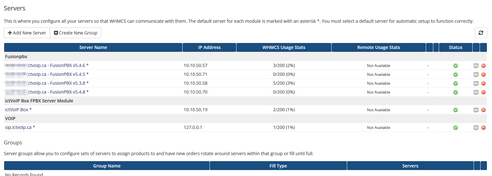
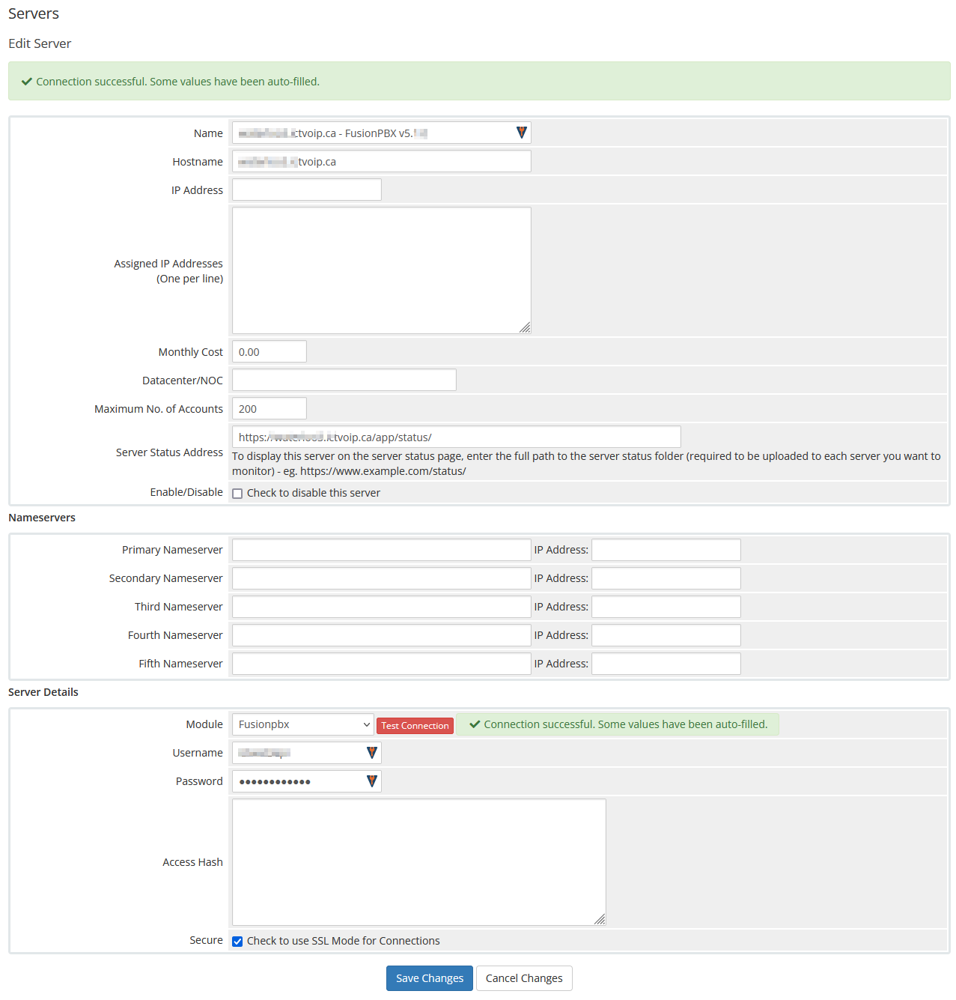
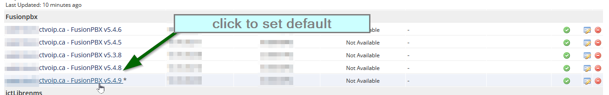
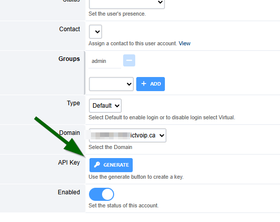
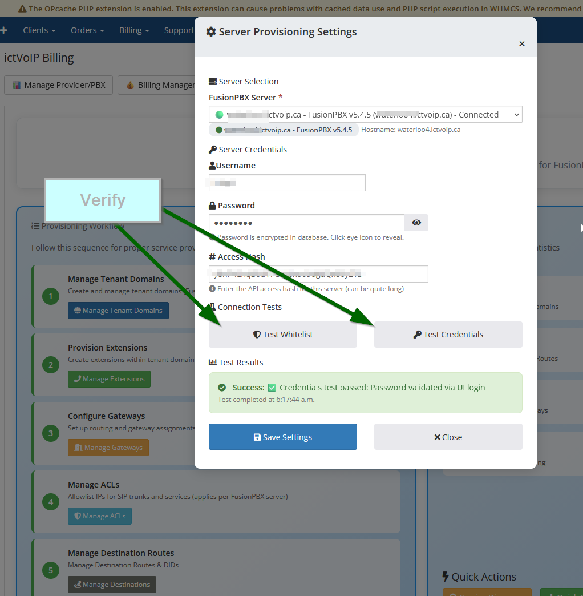

Server Management
=================

**PBX Server Integration & API Configuration**

The Server Management section covers the installation and configuration of PBX server modules, enabling seamless integration between your WHMCS system and various PBX platforms.

|

|

Overview
--------

Server modules allow you to provision and manage PBX servers directly from your WHMCS admin panel. This integration provides automated provisioning, billing, and management capabilities for your PBX infrastructure.

**Supported PBX Platforms:**
* FusionPBX 5.3.x+
* Vodia PBX
* Custom PBX integrations

**Key Features:**

* Automated server provisioning
* Real-time server status monitoring
* Integrated billing and management
* API-based communication
* Multi-server support

For version-specific upgrade steps for the FusionPBX server module and related
APIs, refer to :doc:`/upgrades`.

FusionPBX Integration
--------------------

**Supported Versions:**
* FusionPBX 5.3.x (current)
* FusionPBX 5.4.x (current)

.. note::
   For older version support, please contact our support team.

**Package Information:**

You may receive a bundled package containing both FusionPBX and WHMCS modules:
* **Package:** `ictvoip_fusionPBX_module-v1.4_PHP8.1-8.3.zip`
* **Contents:** FusionPBX API scripts + WHMCS Server Module
* We now offer an install script for our APIs or custom Theme which we recommend

FusionPBX API & Theme Installation
-----------------------------------

**Step 1: Download and Extract Locally**

Download the FusionPBX Server module package from your client area and extract
it on your local machine:

.. code-block:: text

   Package: ictvoip_fusionPBX_module-release-v1.4_PHP8.1-8.3.zip

After extraction, the package structure is:

.. code-block:: text

   ictvoip_fusionPBX_module-release-v1.4_PHP8.1-8.3/
   ├── FusionPBX Host/
   │   └── fpbx_apis-theme/
   │       ├── ictvoip_fpbx5-3_apis/
   │       └── ictvoip_fpbx5-3_theme/
   └── WHMCS/
       └── (WHMCS server module files)

**Step 2: Upload to FusionPBX Server**

Using an SFTP client (such as WinSCP), connect to your FusionPBX server as
root and upload the directories you need:

1. Navigate into ``FusionPBX Host/fpbx_apis-theme/`` on your local machine.
2. Upload ``ictvoip_fpbx5-3_apis/`` to ``/root/`` on your FusionPBX server.
3. Optionally upload ``ictvoip_fpbx5-3_theme/`` to ``/root/`` if you want the
   custom theme.

**Step 3: Run the API Installer Script**

SSH into your FusionPBX server and run:

.. code-block:: bash

   cd /root/ictvoip_fpbx5-3_apis
   chmod +x install_apis.sh
   ./install_apis.sh

**Step 4: (Optional) Run the Theme Installer**

If you uploaded the theme folder:

.. code-block:: bash

   cd /root/ictvoip_fpbx5-3_theme
   chmod +x install_theme.sh
   ./install_theme.sh

**Step 5: Verify Installation**

Review the install log generated by the script and watch for any warnings or
errors. The script handles file placement, permissions, and patching
automatically.

WHMCS Server Module Installation
--------------------------------

**Step 1: Locate WHMCS Files**

From the extracted package on your local machine, navigate to the ``WHMCS/``
folder which contains the server module files.

**Step 2: Upload to WHMCS**

Upload the server module files to your WHMCS installation:

.. code-block:: text

   Destination: /home/$user/public_html/modules/servers/fusionpbx/

You can use SFTP or your hosting file manager to upload the files.

Server Configuration
-------------------

**Step 1: Access Server Management**

Navigate to your WHMCS admin panel:
* **System Settings** → **Products & Services** → **Servers**

**Step 2: Add New Server**

.. note::

   Before adding your server(s) you must have an SSL certificate applied to
   your FusionPBX host. For instructions on obtaining and configuring SSL
   certificates using Let's Encrypt, see :doc:`/getting_started/lets_encrypt`.

Click **Add New Server** and configure the following settings:
|

|

**Required Configuration (WHMCS Server Record):**

.. code-block:: text

   Server Name: voipsrv1.ictvoip.ca - FusionPBX v5.4.9
   Hostname: voipsrv1.ictvoip.ca
   IP Address: 102.100.100.20
   Assigned IP addresses: 102.100.100.20
   Maximum No. of Accounts: 100
   Module: Fusionpbx
   Username: voipsrv1api
   Password: [YOUR_SECURE_PASSWORD]
   Access Hash: [OPTIONAL_API_ACCESS_HASH]

**Configuration Details:**

* **Server Name:** Descriptive name for your server.
* **Hostname:** FQDN with an active SSL certificate that matches the
  PBX web interface.
* **IP Address / Assigned IP:** Local or public IP address used to
  reach the PBX.
* **Maximum Accounts:** Maximum tenants or extensions for this PBX.
* **Module:** Select the relevant PBX module (for example,
  "Fusionpbx").
* **Username / Password:** FusionPBX (or other PBX) admin/API
  credentials.
* **Access Hash (optional):** Long token used by some integrations as
  an alternative or complement to username/password for API access.

Setting a Default FusionPBX Server
~~~~~~~~~~~~~~~~~~~~~~~~~~~~~~~~~~

When you have multiple FusionPBX servers configured in WHMCS, you should
designate one as the **default server**. The default server is used when
provisioning new services that do not have a specific server assignment.

To set a server as default:

1. Navigate to **System Settings** → **Products & Services** → **Servers**.
2. In the server list, click on the server name link you want to set as
   default.
3. The server marked with an asterisk (*) is the current default.

|

|

.. note::

   If you only have one FusionPBX server, it is automatically used as the
   default. Setting a default is only necessary in multi-server environments.

**Step 3: Create API User & Generate Hash Key**

The API user must be assigned to the **FQDN domain** of your FusionPBX server
(for example, ``voipsrv1.ictvoip.ca``). This ensures the user has access to
all tenant domains on that server.

1. Log in to your FusionPBX web interface.
2. Navigate to **Advanced** → **Users**.
3. Create a new user or edit an existing API user.
4. Assign the user to the **superadmin** group.
5. Set the **Domain** to your FusionPBX server's FQDN (e.g., ``voipsrv1.ictvoip.ca``).
6. Click the **Generate** button next to the **API Key** field to create a hash.
7. After saving, view the user again to copy the generated API Key/Hash.
8. Add this hash to your WHMCS server configuration in the **Access Hash** field.

|

|

.. important::

   The API user must be on the server's FQDN domain, not a tenant domain.
   This grants the user access to manage all tenants on that FusionPBX server.

API Credential/Whitelist Verification
-------------------------------------

**Recommended: Client Services / Server Provisioning Settings**

Navigate to the **Client Services** area within the ictVoIP Billing
admin UI and open the **Settings** or **Server Provisioning
Settings** panel for the provider/PBX you are configuring.

From there you can load the WHMCS server credentials (username,
password, and optional access hash) for a selected server, so that
the addon can use them for connection and provisioning tests.

You can also run a **credential test** to verify that the FusionPBX
(or other PBX) login works over HTTPS using the configured
credentials.

Finally, you can run a **whitelist/API reachability test** to confirm
that the WHMCS server IP is allowed by the PBX IP whitelist and that
the expected version/status endpoints respond.

These tests are read-only from the PBX perspective and are intended
to help you validate server configuration before you rely on
automated provisioning. For additional security guidance on API
whitelisting, see :doc:`/getting_started/security`.

|

|

**Common Connection Issues:**

* **SSL Certificate:** Ensure valid SSL certificate on FusionPBX
* **Firewall:** Check firewall rules allow API access
* **API User:** Verify API user has correct permissions
* **Network:** Ensure network connectivity between WHMCS and FusionPBX

Security Considerations
----------------------

**Best Practices:**

* Use strong, unique passwords for API users
* Enable SSL/TLS encryption
* Restrict API access to specific IP addresses
* Regularly update API user credentials
* Monitor API access logs

**Firewall Configuration:**

Ensure your firewall allows API communication:

.. code-block:: bash

   # Allow HTTPS traffic to FusionPBX
   ufw allow 443/tcp
   
   # Allow specific IP ranges if needed
   ufw allow from WHMCS_IP to any port 443

Troubleshooting
--------------

**Common Issues:**

* **Connection Failed:** Check hostname, credentials, and network connectivity
* **Permission Denied:** Verify API user has superadmin rights
* **SSL Errors:** Ensure valid SSL certificate is installed
* **Module Not Found:** Verify server module files are properly installed

**Debug Steps:**

1. Check WHMCS error logs
2. Verify FusionPBX API accessibility
3. Test API credentials manually
4. Review firewall and network configuration

**Support:**

For additional support, contact our team with:
* WHMCS version and PHP version
* FusionPBX version
* Error messages and logs
* Network configuration details

.. _widget-section:
Server Widget
~~~~~~~~~~~~~
|
**This feature is optional**
|

 .. image:: ../_static/images/admin/server_widget4.png
   :width: 900px
   :align: center
   :alt: FusionPBX Server Status
        
|
FusionPBX Status Widget
~~~~~~~~~~~~~~~~~~~~~~~

Adding a FusionPBX Status Widget for your Servers can be accomplished by the following steps:

 1) Copy from your WHMCS host (must match your current WHMCS version, we ship v8.13)
::

 /home/$user/public_html/status/index.php 

|

  to your FusionPBX host. Create the status directory if it does not exist.  
::

 /var/www/fusionpbx/app/status/index.php
   
|   
   Once you have copied the index.php file you should run:
   
::

 chown -R www-data:www-data /var/www/fusionpbx/app/status
 
|

WHMCS Setup
^^^^^^^^^^^

 2) Add the status script location to your WHMCS Fusion PBX Server.
 
 ::

  WHMCS / System Settings / Servers
 
 |
  select edit the server to monitor and enter the URL for "Server Status Address" 

::

   https://myfusionpbx.ca/app/status/

|

 Then save.
 
|

 .. image:: ../_static/images/admin/server_widget_link3.png
   :width: 600px
   :align: center
   :alt: Server widget link
        
|

|

 3) Add the Widget to your WHMCS Admin area by selecting the "Network Status" from the COG settings for Widgets at the top right of the Admin Dashboard.
  
|

 .. image:: ../_static/images/admin/show_widgets.png
   :width: 300px
   :align: center
   :alt: Server widget link
        
|
  
Next Steps
----------

After successful server configuration:

1. **Provider Setup** - Configure VoIP providers
2. **Tariff Configuration** - Set up pricing structure
3. **Package Creation** - Create service packages
4. **Client Provisioning** - Set up client accounts
 
