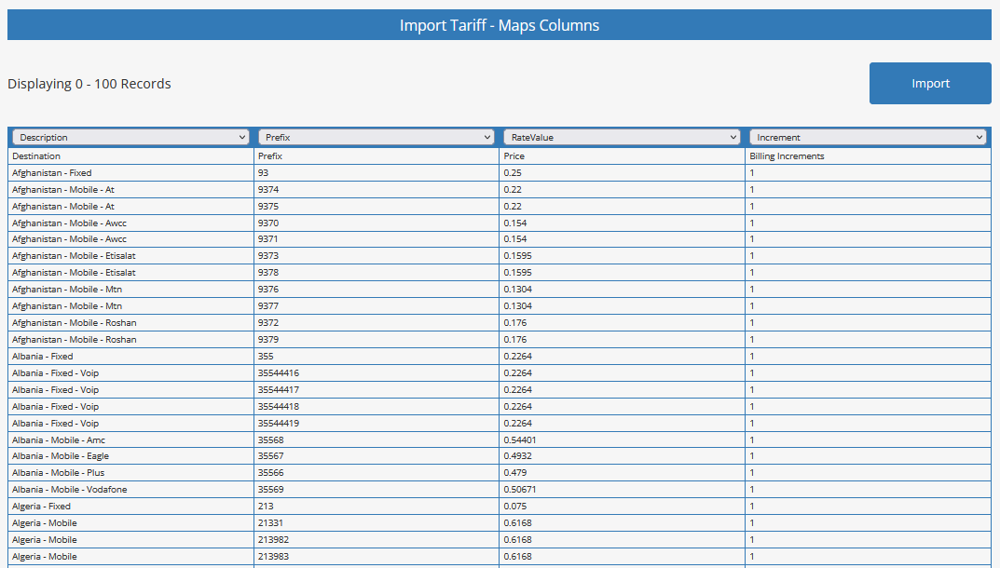
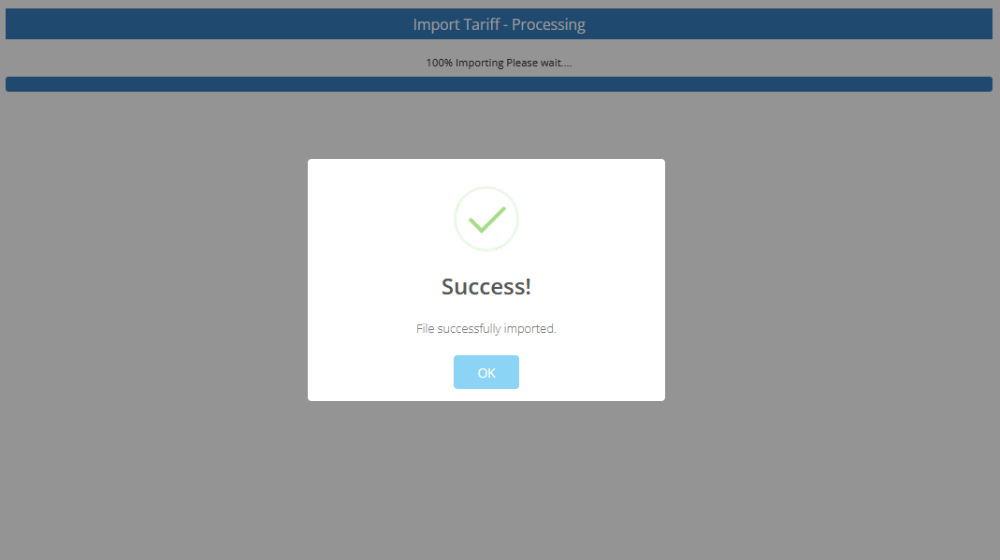

Tariff Management
================

**Rate Configuration & Import Management**

Tariff management allows you to import, configure, and manage rate structures from your VoIP providers. This system supports CSV import functionality and provides flexible rate management for different destinations and services.

|

.. image:: ../_static/images/admin/billing_management.png
        :scale: 40%
        :align: center
        :alt: Tariff Management Interface
|

Overview
--------

Tariffs define the pricing structure for your VoIP services. They can be imported from provider rate cards and customized to meet your specific billing requirements. The system supports multiple tariffs per provider, enabling flexible rate management.

**Key Features:**
* CSV rate card import
* Multiple tariff support
* Custom rate configuration
* Filtering and exclusion rules
* Automated rate updates

Tariff Import Process
--------------------

**Step 1: Prepare Rate Card**

Download your provider's rate card in CSV format. Ensure it contains the required columns for proper import.

**Step 2: Create Tariff**

Navigate to **ictVoIP Billing** → **Tariffs** and click **Add New Tariff**.

**Naming Convention:**

Use a descriptive naming convention for your tariffs:

.. code-block:: text

   Format: ProviderName_Type_Year_Month
   Example: Telnyx_Outbound_2024_01
   Example: Twilio_International_2024_Q1

**Naming Examples:**

* **Telnyx_Outbound_2024_01** - Monthly outbound rates
* **Twilio_International_2024_Q1** - Quarterly international rates
* **Bandwidth_Local_2024_Annual** - Annual local rates
* **Provider_Custom_2024_Special** - Custom rate structure

**Step 3: Upload CSV File**

1. Enter the tariff name
2. Click **Open** to access the file upload dialog
3. Select your provider's CSV rate card
4. Click **Upload** to import the file

CSV Mapping Requirements
-----------------------

**Required Columns:**

Your CSV file must contain the following minimum columns:

.. code-block:: text

   Description | Prefix | RateValue | Increment
   ------------|--------|-----------|----------
   Local Call  | 1      | 0.01      | 60
   Long Distance| 1      | 0.05      | 60
   International| 011    | 0.15      | 60

|

|

**Column Descriptions:**

* **Description** - Human-readable description of the rate
* **Prefix** - Dialing prefix or country code
* **RateValue** - Rate per minute or unit
* **Increment** - Billing increment in seconds

**Optional Columns:**

Additional columns may be supported depending on your provider:
* **Setup Fee** - Connection charges
* **Minimum Duration** - Minimum call duration
* **Grace Period** - Grace period for short calls
* **Effective Date** - Rate effective date

Import Process
-------------

**Step 1: File Validation**

The system validates your CSV file for:
* Required column presence
* Data format consistency
* Rate value validation
* Duplicate entry detection

**Step 2: Mapping Configuration**

Map your CSV columns to the system requirements:
* Select the appropriate column for each field
* Verify data types and formats
* Set default values if needed

**Step 3: Import Execution**

Execute the import process:
* Review import summary
* Confirm rate calculations
* Process the import

**Step 4: Import Completion**

|

|

**Post-Import Actions:**

1. **Review imported rates** - Verify accuracy
2. **Configure filtering** - Set up exclusions
3. **Assign to providers** - Link to provider accounts
4. **Test billing** - Verify rate application

Rate Filtering
-------------

**Filter Configuration:**

After import, configure filtering rules to exclude specific numbers or destinations:

.. code-block:: text

   Filter Type: Toll Free Numbers
   Action: Exclude from billing
   Pattern: 1-800-*, 1-888-*, 1-877-*

**Common Filter Types:**

* **Toll Free Numbers** - 1-800, 1-888, 1-877, etc.
* **Emergency Numbers** - 911, 112, 999, etc.
* **Directory Services** - 411, 118, etc.
* **Premium Numbers** - 1-900, etc.
* **Custom Patterns** - Specific number ranges

**Filter Configuration:**

Navigate to `Billing Management <../admin/billing_management.html>`_ for detailed filtering options and configuration.

Tariff Management
----------------

**Updating Tariffs:**

To update an existing tariff:

1. Select the existing tariff name
2. Upload the new CSV file
3. The system will replace existing rates
4. Verify the updated rates

**Tariff Versioning:**

* Maintain historical rate data
* Track rate changes over time
* Support rollback to previous versions
* Audit trail for rate modifications

**Rate Validation:**

* Verify rate accuracy
* Check for duplicate entries
* Validate rate ranges
* Confirm currency formatting

Best Practices
-------------

**CSV Preparation:**

* Use consistent formatting
* Include all required columns
* Validate data accuracy
* Test with sample data

**Naming Conventions:**

* Use descriptive names
* Include date information
* Maintain consistency
* Avoid special characters

**Import Process:**

* Test with small datasets
* Verify mapping accuracy
* Review import results
* Document changes

**Rate Management:**

* Regular rate reviews
* Monitor provider changes
* Update tariffs promptly
* Maintain backup copies

Troubleshooting
--------------

**Common Import Issues:**

* **Missing Columns** - Ensure all required columns are present
* **Format Errors** - Check CSV formatting and encoding
* **Rate Validation** - Verify rate values are numeric
* **Duplicate Entries** - Check for duplicate prefixes

**Import Errors:**

* **File Size** - Large files may timeout
* **Encoding Issues** - Use UTF-8 encoding
* **Special Characters** - Avoid special characters in data
* **Date Formats** - Use consistent date formatting

**Support Information:**

For tariff-related issues, provide:
* CSV file sample
* Error messages
* Import configuration
* Expected vs actual results

Next Steps
----------

After tariff configuration:

1. **Provider Assignment** - Link tariffs to providers
2. **Package Configuration** - Create service packages
3. **Billing Setup** - Configure automated billing
4. **Testing** - Verify rate application

