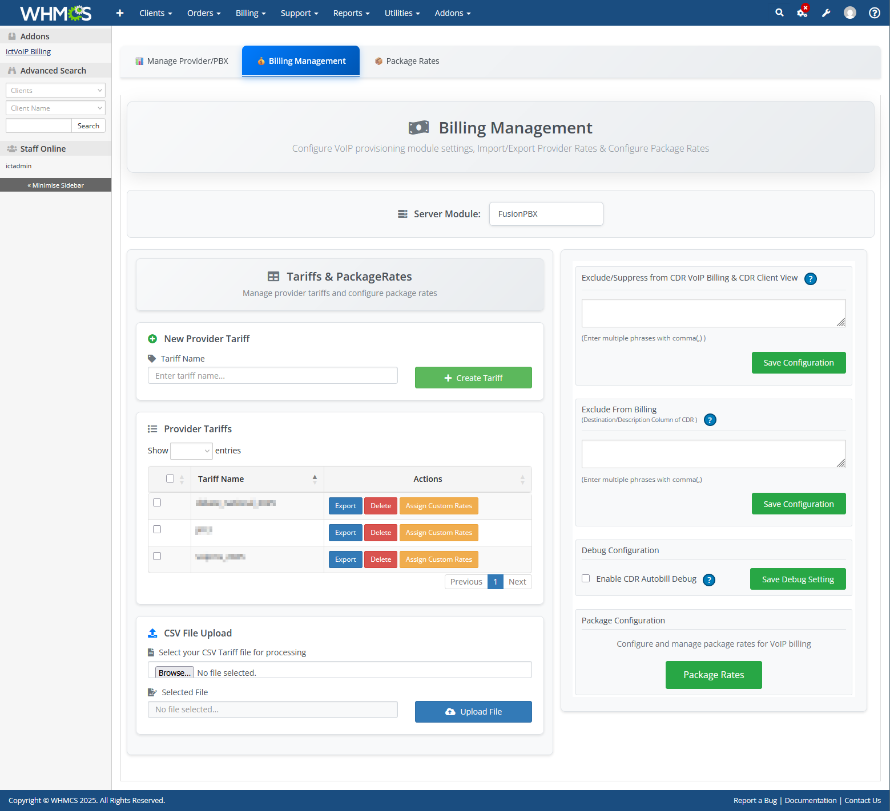
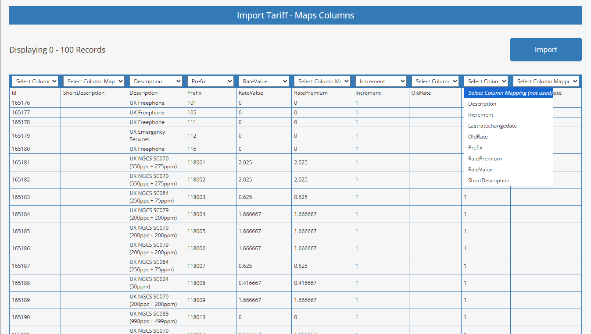
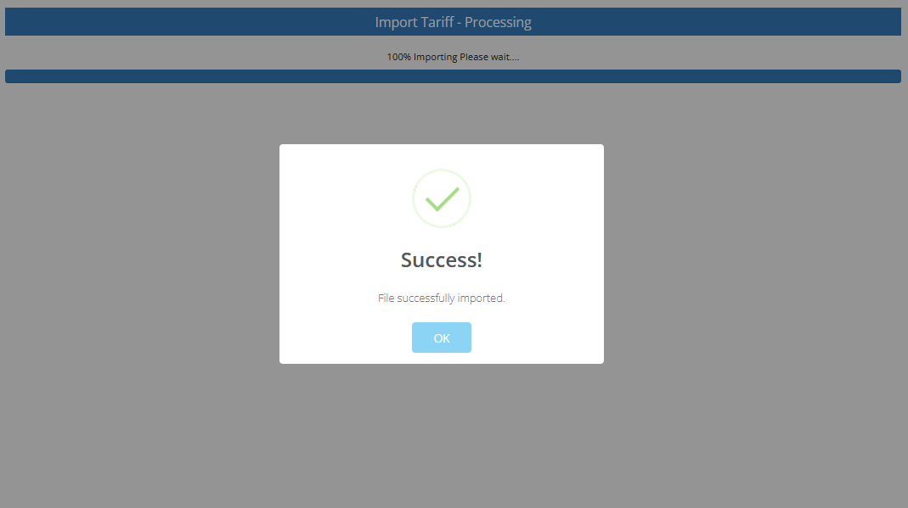
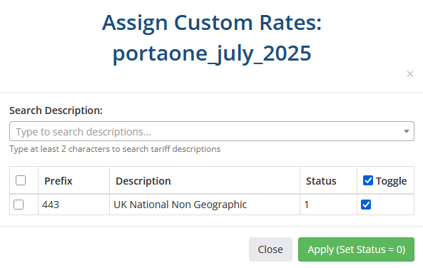

Tariff Management
================

.. important::

   Before working with tariffs, ensure:

   * A provider is configured in ictVoIP Billing.
   * You have a current provider rate card in CSV format.
   * You know the country code and currency for the tariff.
   * The CSV uses a single header row; extra header rows must be
     removed before import.

**Rate Configuration & Import Management**

Tariff management allows you to import, configure, and manage rate structures from your VoIP providers. This system supports CSV import functionality and provides flexible rate management for different destinations and services.

|

|
Overview
--------

Tariffs define the pricing structure for your VoIP services. They can be imported from provider rate cards and customized to meet your specific billing requirements. The system supports multiple tariffs per provider, enabling flexible rate management.

**Key Features:**
* CSV rate card import
* Multiple tariff support
* Custom rate configuration
* Filtering and exclusion rules
* Automated rate updates

Tariff Import Process
--------------------

**Step 1: Prepare Rate Card**

Download your provider's rate card in CSV format. Ensure it contains the required columns for proper import. **Only the first row may contain the header column names** as mapping only checks the first row as header. If you have 2 rows before the actual rate mapping will not be suitable.

**Step 2: Create Tariff**

Navigate to **ictVoIP Billing** → **Tariffs** and click **Add New Tariff**.

**Naming Convention:**

Use a descriptive naming convention for your tariffs:

.. code-block:: text

   Format: ProviderName_Type_Year_Month
   Example: Telnyx_Outbound_2024_01
   Example: Twilio_International_2024_Q1

**Naming Examples:**

* **Telnyx_Outbound_2024_01** - Monthly outbound rates
* **Twilio_International_2024_Q1** - Quarterly international rates
* **Bandwidth_Local_2024_Annual** - Annual local rates
* **Provider_Custom_2024_Special** - Custom rate structure

**Step 3: Upload CSV File**

1. Highlight the tariff name
2. Click **Open** to access the file upload dialog
3. Select your provider's CSV rate card tariff
4. Click **Upload** to begin the processing

CSV Mapping Requirements
-----------------------

**Required Columns:**

Your CSV file must contain the following minimum columns:

.. code-block:: text

   Description                | Prefix | RateValue | Increment
   ---------------------------|--------|-----------|----------
   Canada - 204 Manitoba      | 1204   | 0.01      | 6
   Canada - 226 Ontario       | 1226   | 0.01      | 6
   Canada - 416 Metro Toronto | 1416   | 0.01      | 6

|

|

**Column Descriptions:**

* **ShortDescription** - If available Human-readable short description
* **Description** - REQ-Human-readable description of the rate
* **Prefix** - REQ-Dialing prefix & or country code
* **RateValue** - REQ-Base Rate per minute or unit
* **Increment** - REQ-Billing increment in seconds
* **Lastratechangedate** - If available last known rate change date
* **Oldrate** - If available the old rate
* **RatePremium** - If available the Premium rate
* **Select Column Mapping (not used)** - DEFAULT-When set to this it will not be mapped & imported

**Optional Columns:**

Additional columns may be supported depending on your provider but mapping is not recommended and should be left as DEFAULT **Select Column Mapping (not used)**
* **Setup Fee** - Connection charges
* **Minimum Duration** - Minimum call duration
* **Grace Period** - Grace period for short calls
* **Effective Date** - Rate effective date

Import Process
-------------

**Step 1: File Validation**

The system validates your CSV file for:
* Required column presence
* Data format consistency
* Rate value validation
* Duplicate entry detection

**Step 2: Mapping Configuration**

Map your CSV columns to the system requirements:
* Select the appropriate column for each field
* Verify data types and formats
* Set default values if needed
Once your mapping has been saved you can then highlight the tariff and upload the latest rates from your provider and the mapped fields will already be saved.

**Step 3: Import Execution**

Execute the import process:
* Review import summary
* Confirm rate calculations
* Process the import

**Step 4: Import Completion**

|

|

**Post-Import Actions:**

1. **Review imported rates** - Verify accuracy
2. **Configure filtering** - Set up exclusions if required
3. **Assign to providers** - Link to provider accounts and packages
4. **Test billing** - Verify rate application autobill against CDRs

Assigning Custom Rates
----------------------

.. _assigning-custom-rates:

Custom rates let you override the tariff rate for specific prefixes with the per-minute rates configured in a product/package. When a tariff row is set to ``status = 0``, calls matching that prefix use the package custom rate; when it is ``status = 1``, the standard tariff rate is used.

**When to use custom rates:**

* You want to resell a provider tariff with different per-minute rates for specific destinations.
* You need to create product-specific pricing that does not follow the default tariff.

**Open the Assign Custom Rates modal:**

1. Navigate to **ictVoIP Billing → Tariffs**.
2. In the Provider Tariffs table, find the tariff you want to configure.
3. Click **Assign Custom Rates** in the Actions column for that tariff.

**Use the modal:**

1. The modal loads any existing rows already set to ``status = 0``.
2. Use the **Search Description** dropdown to find a description. Type at least two characters, then select a result to load all matching prefixes.
3. For each prefix you want to override with the package custom rate, check the **Toggle** checkbox. This sets ``status = 0``.
4. Leave the **Toggle** checkbox unchecked for prefixes that should keep using the tariff rate (``status = 1``).
5. Use the row select checkboxes and the **Select All** / **Toggle All** headers for bulk selection.
6. Click **Apply** to save. The button text changes based on the selected states:

   * **Apply (Set Status = 0)** — all toggled rows will be set to ``status = 0``.
   * **Apply (Set Status = 1)** — all untoggled rows will be set to ``status = 1``.
   * **Apply (Mixed Status Changes)** — some rows will be set to ``0`` and others to ``1``.

.. warning::
   **Apply writes a status to every row in the current results** — checked rows are set to ``status = 0`` (custom) and unchecked rows are set to ``status = 1`` (tariff). Unchecked does **not** mean "leave unchanged." If the loaded results include rows you do not intend to modify, narrow the result set with **Search Description** before clicking Apply, or those rows will be reverted to ``status = 1``.

**Status meanings:**

* ``status = 0`` — Custom rate active. The package custom rate (inbound and/or outbound) is used for this prefix.
* ``status = 1`` — Tariff rate active. The standard imported tariff rate is used for this prefix.

.. note::
   Markup is not applied to custom rates. The package custom rates are used as-is.

For the package-level custom rate configuration (per-minute inbound/outbound rates, increments, and inbound billing), see `Custom Rate Configuration <https://docs.ictvoip.ca/en/latest/admin/packages.html#custom-rate-configuration>`_.

Special Number Billing
----------------------

For product-level custom billing rules for special number patterns (for example, Australian Smartnumbers 1300*, 1800*, 13*, short codes, or custom internal codes), see :ref:`Special Number Billing <special-number-billing>`.

This is different from tariff custom rates. Use tariff custom rates for standard prefixes, and use Special Number Billing when the product must bypass the tariff entirely and bill only matched special-rate patterns.

Tariff Management
----------------

**Updating Tariffs:**

To update an existing tariff:

1. Select the existing tariff name
2. Upload the new CSV file
3. The system will replace existing rates
4. Verify the updated rates

**Tariff Versioning:**

* Maintain historical rate data
* Track rate changes over time
* Support rollback to previous versions
* Audit trail for rate modifications

**Rate Validation:**

* Verify rate accuracy
* Check for duplicate entries
* Validate rate ranges
* Confirm currency formatting

Best Practices
-------------

**CSV Preparation:**

* Use consistent formatting
* Include all required columns
* Validate data accuracy
* Test with sample data
* Only the first row allowed as header for columns

**Naming Conventions:**

* Use descriptive names
* Include date information
* Maintain consistency
* Avoid special characters

**Import Process:**

* Test with small datasets
* Verify mapping accuracy
* Review import results
* Document changes

**Rate Management:**

* Regular rate reviews
* Monitor provider changes
* Update tariffs promptly
* Maintain backup copies

Troubleshooting
--------------

**Common Import Issues:**

* **Missing Columns** - Ensure all required columns are present
* **Format Errors** - Check CSV formatting and encoding
* **Rate Validation** - Verify rate values are numeric
* **Duplicate Entries** - Check for duplicate prefixes
* check import_debug Logs

**Import Errors:**

* **File Size** - Large files may timeout over 100MB
* **Encoding Issues** - Use UTF-8 encoding
* **Special Characters** - Avoid special characters in data
* **Date Formats** - Use consistent date formatting

**Support Information:**

For tariff-related issues, provide:
* CSV file sample
* Error messages
* Import configuration
* Expected vs actual results
* All debug logs within the LOGS dir of the ictVoIP Billing addon.
Next Steps
----------

After tariff configuration:

1. **Provider Assignment** - Link tariffs to providers
2. **Custom Rate Assignment** - Use the :ref:`assigning-custom-rates` action to mark prefixes that should use package-level custom rates
3. **Package Configuration** - Create service packages
4. **Billing Setup** - Configure automated billing
5. **Testing** - Verify rate application with autobill

