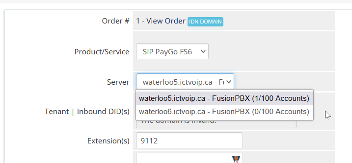

******************
Client Admin Area
******************
|

Product Assignment
********************

Administration of server modules and billing would be setup with client products.  After you have your Addon and Server module installed and have created a VoIP product either metered or not you can add the product to the WHMCS client products. This example shows that you already have knowledge of adding products to your client accounts. Further information can be located with the WHMCS supported documentation here: WHMCS Docs

|

 .. image:: ../_static/images/clientadmin/client_product1.png
        :scale: 50%
        :align: center
        :alt: Adding a new Provider or PBX
        
|

Formatting to API
*******************

Once your VoIP product has been assigned there are fields which must follow the following formats.

|
 1) Assign your FusionPBX server from the drop down. If only one server has been assigned it will appear and be selected. 

        
|
 2) Assign the Domain/Tenant with Main DID attached to Domain 
::
 
  mcon.wat5.ictvoip.ca | 5192229000
  
|
 3) Assign the extension you wish to have within the clients billing. Multi extension should use the | as the seperator.
  
::
  
   2112 | 2113 | 2114 | 2115 | 2216
   
|
 4) Save and then test your API connectivity to your FusionPBX account by then going to the Client's account view.
 
Special Considerations: 
#########################
 
Our API pulls the CDR outbound details from the Destination column within FusionPBX and the inbound from the Caller Destination column. 

It is best to try and match your formatting outbound to include your Country code. This will elliminate the requirement for the use of the filter used within setting your package rates.

"Check to Enable" if your PBX CDRs use a prefix for local/regional calls as where you do not use your country code. For further information about this setting please refer to the `VoIP Package Rates <../admin/packages.html>`_ section.
