************
ictVoIP Box
************

|

 .. image:: ../_static/images/admin/ictvoipbox_dashboard3.png
        :width: 600px
        :align: center
        :alt: ictVoIP Box dashboard
        
|

.. contents:: Table of Contents
   :local:
   :depth: 3

Overview
========

The **ictVoIP Box** addon is a WHMCS addon module that extends the ictVoIP Billing platform to provide client-facing purchasing of FusionPBX products with backend admin provisioning workflows.

ictVoIP Box integrates with the core **ictvoipbilling** addon and the
FusionPBX server modules so that the PBX side (tenants, extensions,
gateways, routes) and the billing side (services, CDRs, packages) stay
aligned.

Architecture
------------

The platform consists of three integrated components:

**1. ictVoIP Billing Addon** (Required Dependency)
   * Core billing and provisioning engine
   * FusionPBX server management
   * Provider integration
   * Client services tracking
   * Extension and gateway management
   * Tenant domain management

**2. ictVoIP Box Addon** (This Module)
   * Client-facing shopping cart integration
   * Product ordering interface
   * Regulatory data collection
   * Admin provisioning queue
   * Order workflow management

**3. FusionPBX Server Modules** (Required Dependency)
   * Backend PBX infrastructure
   * Multi-tenant hosting
   * SIP gateway configuration
   * Extension and routing management
   * Call processing and CDR

Integration Flow
----------------

The complete integration flow follows this sequence::

   Client Orders → Custom ictVoIP Box Order Cart → ictVoIP Box → 
   Admin Queue → Admin Provisions → FusionPBX + Provider

1. **Client** orders FusionPBX products through custom ictVoIP Box checkout cart
2. **ictVoIP Box** captures order and regulatory data
3. **Admin Queue** displays pending orders for review
4. **Admin** provisions to FusionPBX and provider
5. **System** sends welcome email with FusionPBX credentials to client

.. important::
   The custom ictVoIP Box order cart must be assigned to products or bundles using the **Product Group Checkout Template** selection in WHMCS product configuration.

|

 .. image:: ../_static/images/admin/ictvoipbox_dashboard3.png
        :width: 600px
        :align: center
        :alt: ictVoIP Box dashboard
        
|
System Requirements
===================

.. contents::
   :local:
   :depth: 2

WHMCS Platform
--------------

* **WHMCS Version**: v9.0.3 or lower
* **PHP Version**: 8.3 (preferred)
* **Database**: MySQL 5.7+ or MariaDB 10.3+
* **Web Server**: Apache or Nginx with mod_rewrite
* **SSL Certificate**: Required for secure API communication

Required Addons
---------------

* **ictVoIP Billing Addon**: Core dependency (must be installed first)
* **ictVoIP Box Addon**: This module (requires valid license)

Required Server Modules
-----------------------

* **FusionPBX Server Module**: For FusionPBX server management in WHMCS

FusionPBX Servers
-----------------

* **FusionPBX Version**: 4.5+ recommended
* **API Access**: Enabled with valid credentials
* **Multi-Tenant**: Enabled
* **SIP Ports**: 5060 (UDP), 5061 (TLS)
* **RTP Ports**: 10000-20000

Provider Accounts
-----------------

* **Provider 1 Account**: API credentials configured in ictVoIP Billing
* **Provider 2 Account**: API key configured in ictVoIP Billing

.. note::
   Provider 1 supports both sandbox and production modes. Provider 2 should remain in sandbox mode during alpha testing.

High-Level Capabilities
=======================

At a high level, ictVoIP Box provides:

* **Automated PBX Onboarding** – Creates a FusionPBX tenant/domain,
  admin user, and a starter set of extensions as part of checkout.
* **Provider-Driven SIP Trunk Setup** – Uses provider credentials and
  templates to create a SIP trunk and map it to the new tenant.
* **Template-Based Routing** – Applies inbound and outbound route
  templates so that the main DID and basic outbound calling work out of
  the box.
* **Tight Integration with ictVoIP Billing** – Uses the same provider,
  gateway, and destination concepts as the Client Services Admin Area,
  so later administration can be done from the standard tools.

Installation & Configuration
============================

.. contents::
   :local:
   :depth: 2

Installing ictVoIP Box
----------------------

The ictVoIP Box addon includes the following components:

**1. Addon Module**
   * Core addon logic and admin interface
   * Provisioning actions and queue management
   * AJAX handlers for real-time updates

**2. Shopping Cart Hooks**
   * Checkout processing integration
   * Regulatory information collection
   * Email template merge fields

**3. Custom Order Form Template**
   * Custom checkout cart for ictVoIP Box products
   * DID selection interface
   * Regulatory information forms (Provider 2)

**4. Provider API Integration**
   * Provider API integration for DID ordering
   * Account management functions
   * Rate and inventory retrieval

Installation Steps
------------------

**Step 1: Install ictVoIP Box Package**

1. Upload the ictVoIP Box installation package provided by ictVoIP Canada
2. Follow the installation wizard or manual installation instructions provided
3. Ensure all required components are installed:

   * Addon module
   * Shopping cart hooks
   * Custom order form template
   * Provider API integration

**Step 2: Assign Template to Product Groups**

1. Navigate to **Setup → Products/Services → Product Groups**
2. Edit the product group containing ictVoIP Box products
3. In **Order Form Template** dropdown, select ``ictvoipbox_cart``
4. Click **Save Changes**
5. All products in this group will now use the custom checkout cart

**Step 3: Activate ictVoIP Box Addon**

1. Navigate to **Setup → Addon Modules** in WHMCS admin
2. Locate **ictVoIP Box** in the addon list
3. Click **Activate**
4. Enter your license key
5. Configure access control:

   * Select admin roles that can access ictVoIP Box
   * Recommended: Full Administrator, ictVoIP Admin

6. Click **Save Changes**

|

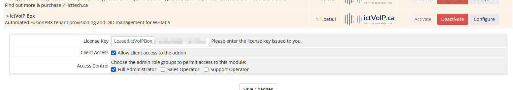

|

Initial Configuration
---------------------

Configure Provider Credentials
^^^^^^^^^^^^^^^^^^^^^^^^^^^^^^

Navigate to **Addons → ictVoIP Box → Provider Settings** tab

Each provider has different configuration fields for API authentication:

**Provider 1 Configuration:**
   * **API Username**: Your Provider 1 API username
   * **API Password**: Your Provider 1 API password
   * **Account Number**: Your Provider 1 main account number
   * **Sandbox Mode**: Optional (Provider 1 supports both sandbox and production)
   * **Status**: Production-ready (can be used for live orders)

**Provider 2 Configuration:**
   * **API Key**: Your Provider 2 API key
   * **Sandbox Mode**: ⚠️ **MUST be enabled** (sandbox only until fully tested)
   * **Portal URL**: Provider 2 portal URL for document uploads (sandbox URL)
   * **Status**: Alpha testing only - do not use production API key

.. warning::
   Use **sandbox mode for Provider 2** until production testing is complete. Provider 1 can be configured for production use.

.. important::
   * Each provider's settings are independent
   * API credentials are encrypted in database
   * Test connectivity after saving credentials

|

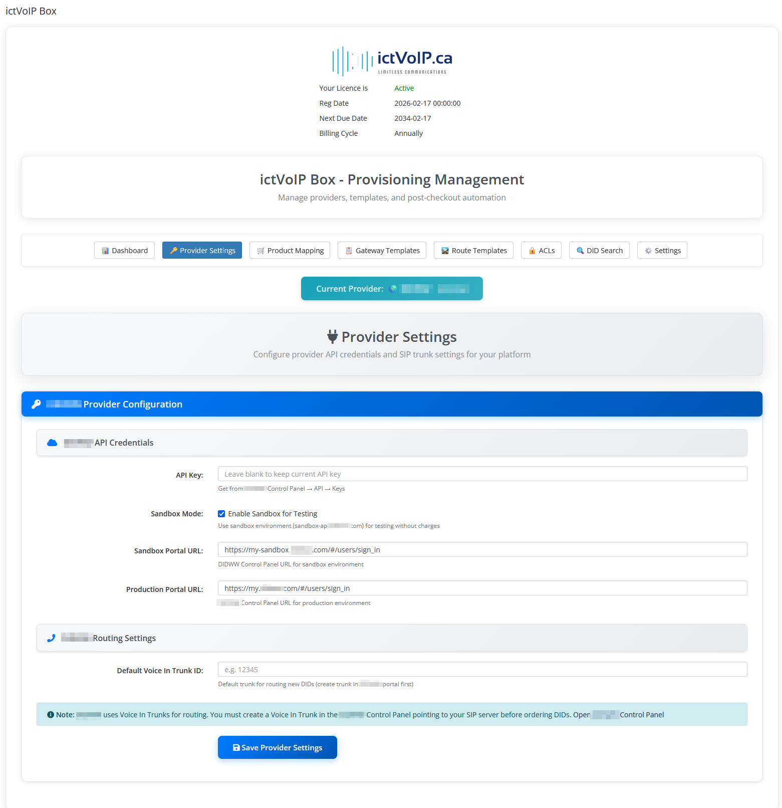

|

Create WHMCS Products
^^^^^^^^^^^^^^^^^^^^^

Navigate to **Setup → Products/Services → Products/Services**

Create products for:

* **Provider 1 DIDs**: Link to Provider 1
* **Provider 2 DIDs**: Link to Provider 2
* **Extension Packages**: Additional extensions (seats)
* **Feature Add-ons**: Call recording, etc.

**Product Configuration:**
   * Module: ``ictvoipbox``
   * Product Type: ``Other``
   * Number of Seats: based on per product config

Product Mapping Configuration
=============================

.. contents::
   :local:
   :depth: 2

Overview
--------

Navigate to **Addons → ictVoIP Box → Product Mappings** tab

Product mapping links WHMCS products and bundles to providers (Provider 1 or Provider 2). This determines which provider's API and settings are used during checkout and provisioning.

**How Product Mapping Works:**

When a customer orders a product:

1. System checks product mapping to determine provider
2. Checkout uses provider-specific settings (DID countries, rates, regulatory requirements)
3. Order is queued for provisioning with correct provider
4. Admin provisions using provider's API

**Mapping Priority (Highest to Lowest):**

1. **Product Group Mapping** - All standalone products in group assigned to same provider
2. **Individual Product Mapping** - Specific product assigned to provider
3. **Bundle Mapping** - Bundle and all constituent products assigned to provider

|

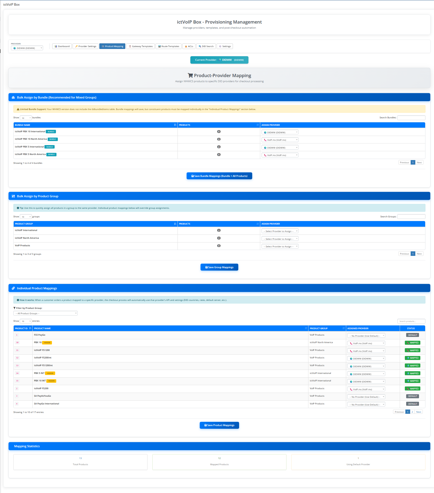

|

Three Mapping Methods
---------------------

Method 1: Bulk Assign by Bundle
^^^^^^^^^^^^^^^^^^^^^^^^^^^^^^^^

**Recommended for Mixed Groups**

Use this to assign a bundle and ALL its constituent products to the same provider, even if products are spread across multiple product groups.

**Steps:**

1. Locate bundle in "Bulk Assign by Bundle" section
2. Select provider from dropdown (Provider 1 or Provider 2)
3. Click "Save Bundle Mappings"
4. System maps bundle + all products within bundle

**When to Use:**

* Bundle contains products from multiple product groups
* Want all bundle products to use same provider
* Simplifies management of complex bundles

**Example:**

* Bundle: "Complete PBX Package"
* Contains: US DID (Group A) + Extensions (Group B) + Features (Group C)
* Map bundle to Provider 1 → All 3 products use Provider 1

Method 2: Bulk Assign by Product Group
^^^^^^^^^^^^^^^^^^^^^^^^^^^^^^^^^^^^^^^

Use this to quickly assign all standalone products in a product group to the same provider.

**Steps:**

1. Locate product group in "Bulk Assign by Product Group" section
2. Select provider from dropdown (Provider 1 or Provider 2)
3. Click "Save Group Mappings"
4. System maps all standalone products in group (excludes bundle products)

**When to Use:**

* All products in group should use same provider
* Products are not part of bundles
* Quick bulk assignment needed

.. note::
   Only affects standalone products (not products within bundles). Bundle products must be mapped via bundle or individual mapping.

**Example:**

* Product Group: "Domestic DIDs"
* Contains: US DID, CA DID, UK DID (all standalone)
* Map group to Provider 1 → All 3 DIDs use Provider 1

Method 3: Individual Product Mappings
^^^^^^^^^^^^^^^^^^^^^^^^^^^^^^^^^^^^^^

Use this for granular control over individual products and bundles.

**Steps:**

1. Use filter dropdown to select product group or "Bundles"
2. Locate product/bundle in DataTable
3. Select provider from dropdown in "Assigned Provider" column
4. Click "Save Product Mappings"

**DataTable Columns:**

* **Product ID**: WHMCS product ID or ``bundle_X`` for bundles
* **Product Name**: Product/bundle name with indicators (HIDDEN, BUNDLE)
* **Product Group**: Product group name or "Bundles"
* **Assigned Provider**: Dropdown to select Provider 1, Provider 2, or "No Provider (Use Default)"
* **Status**: Badge showing mapping status (Default, Mapped, Invalid)

**Status Badges:**

* **Default** (gray): No provider assigned
* **Mapped** (green): Assigned to Provider 1
* **Mapped** (green): Assigned to Provider 2
* **Invalid** (yellow): Provider ID invalid (provider deleted)

**When to Use:**

* Override group mapping for specific product
* Map individual products not in groups
* Fine-tune provider assignments
* Map bundles individually

|

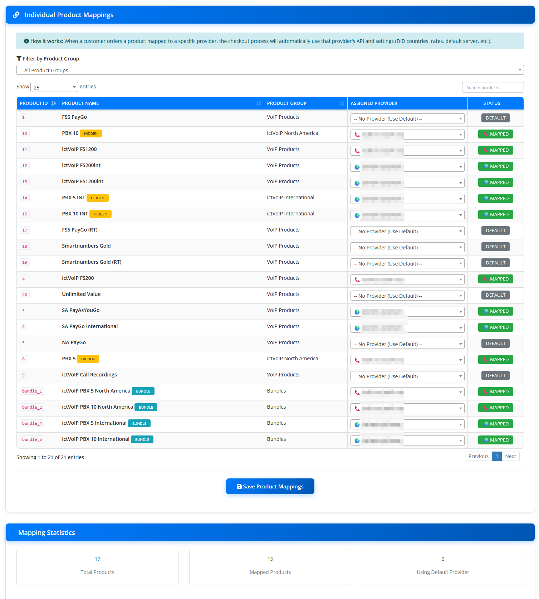

|

Critical Requirements
---------------------

.. danger::
   **IMPORTANT: Products without mapping will NOT function within the ictVoIP Box framework:**
   
   * **Will NOT be recognized** by the ictVoIP Box system
   * **Will NOT be part of checkout process** for provisioning
   * **Will NOT trigger** DID selection or regulatory forms
   * **Will FAIL** order validation and provisioning
   * **Only select products created specifically for ictVoIP Box use**

Every product intended for ictVoIP Box MUST be mapped to a provider (Provider 1 or Provider 2). Products without provider mapping are invisible to the ictVoIP Box framework and cannot be provisioned.

Best Practices
--------------

✅ **Recommended Practices:**

* Use bundle mapping for bundles with products across multiple groups
* Use group mapping for simple product groups
* Use individual mapping for exceptions and overrides
* Verify mappings after bulk operations
* Test checkout after mapping changes

**Provider Selection Guidelines:**

**Provider 1 Products:**
   * US and Canadian DIDs
   * Non-regulatory countries
   * Production-ready (sandbox or live)

**Provider 2 Products:**
   * International DIDs (South Africa, EU, UK, etc.)
   * Regulatory countries requiring verification
   * ⚠️ **Sandbox mode only** during alpha testing
   * Do not use production API key yet

Client Checkout Experience
===========================

.. contents::
   :local:
   :depth: 2

Provisioning Methods
--------------------

ictVoIP Box supports **three provisioning methods**, all controlled by administrators or client checkout:

**1. Client Portal Orders**

Clients place orders through the WHMCS client area using the 4-step checkout wizard. Orders enter pending state and await admin approval before provisioning.

* **Access**: Client area shopping cart
* **Flow**: Complete 4-step wizard → Order placed → Admin reviews → Admin provisions
* **Use Case**: Standard customer self-service ordering

**2. Admin Order Placement**

Administrators can place orders directly from the WHMCS admin area on behalf of clients, with immediate access to provisioning controls.

* **Access**: WHMCS Admin → Orders → Add New Order
* **Flow**: Select client → Add product → Complete wizard → Immediate provisioning access
* **Use Case**: White-glove onboarding, enterprise clients, pre-configured deployments

**3. Admin Impersonation**

Administrators can impersonate a client account to place orders with the client's context, useful for quick turnaround provisioning or assisted onboarding.

* **Access**: WHMCS Admin → Clients → Login as Client
* **Flow**: Impersonate client → Place order via client portal → Return to admin → Provision
* **Use Case**: Support-assisted ordering, troubleshooting checkout issues, client training

All three methods result in the same automated provisioning sequence once the administrator confirms the order.

Checkout Wizard Flow
--------------------

The ictVoIP Box checkout wizard guides clients (or administrators placing orders) through a streamlined 4-step process to configure their new PBX service. The wizard dynamically adapts based on the selected provider and regulatory requirements.

Step 1: Company Details
^^^^^^^^^^^^^^^^^^^^^^^^

**Purpose**: Collect tenant identification and contact information

The first step captures essential company information that will be used to create the FusionPBX tenant domain and admin user account.

**Fields Collected:**

* **Company Name**: Used to generate tenant domain (e.g., ``acmecorp.pbx.example.com``)
* **Contact Name**: Primary contact for the PBX service
* **Contact Email**: Admin user email for credentials and notifications
* **Contact Phone**: Support contact number

**Validation:**

* All fields are required
* Company name must be unique (no duplicate tenant domains)
* Email must be valid format
* Phone number must be valid format

|

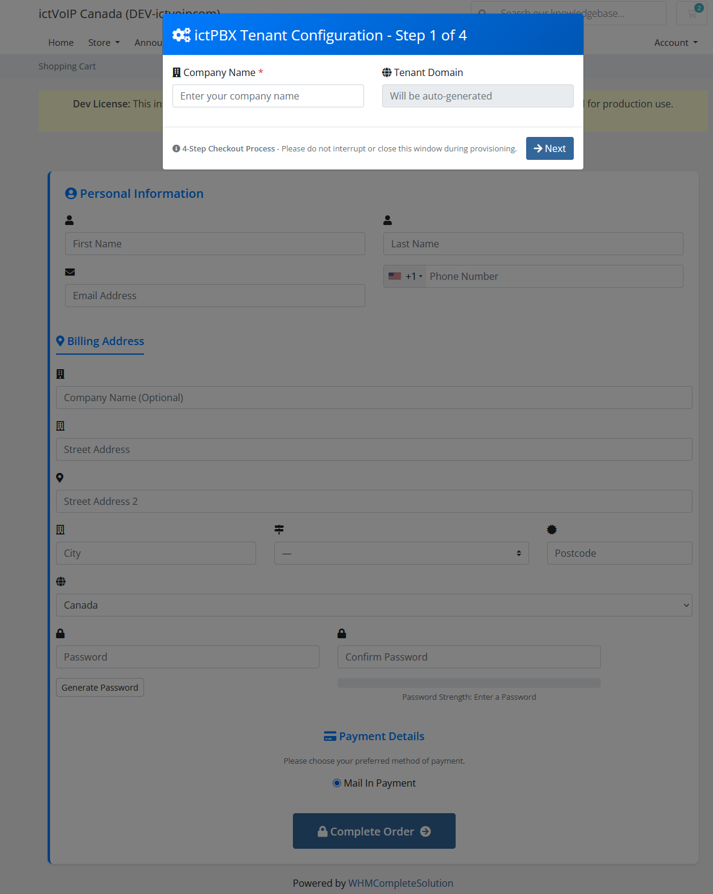

|

Step 2: DID Selection
^^^^^^^^^^^^^^^^^^^^^^

**Purpose**: Select primary phone number for the PBX service

The second step presents available DIDs based on the product's mapped provider (Provider 1 or Provider 2). Clients can search and filter by country, region, rate center, and specific number patterns.

**Search Filters:**

* **Country**: Select from available countries
* **Province/State**: Filter by province or state (if applicable)
* **Rate Center**: Filter by rate center or city
* **Number Pattern**: Search for specific number patterns (e.g., ``*555*``)

**DID Display:**

* **Number**: Full E.164 formatted number
* **Location**: City, state/province, country
* **Monthly Rate**: Recurring monthly cost
* **Setup Fee**: One-time activation fee (if applicable)

**Actions:**

* Click **"Select"** to choose DID and proceed
* Search and filter to find desired number
* View pricing before selection

|

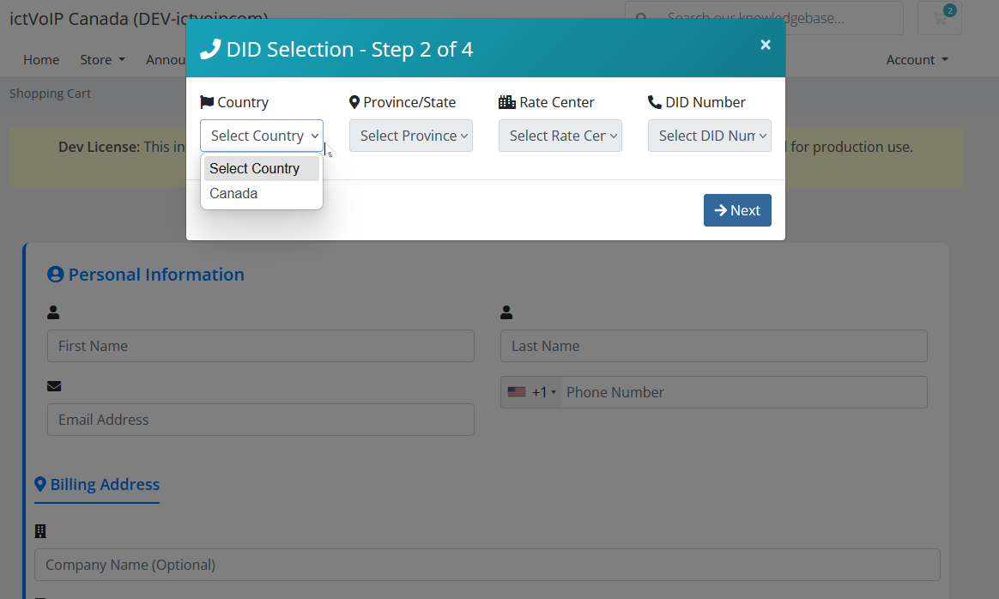

|

Step 2.5: Regulatory Compliance
^^^^^^^^^^^^^^^^^^^^^^^^^^^^^^^^

**Purpose**: Collect regulatory information for Providers

.. important::
   **This step only appears for Provider products** that require regulatory compliance (e.g., South Africa, EU countries, UK). if normal DID ordering we skip directly to Step 3.

When a Provider DID is selected, the wizard presents a regulatory compliance form to collect identity, address, and business information required by the provider.

**Identity Information:**

* **Full Name**: Legal name matching government-issued ID
* **Date of Birth**: Format: YYYY-MM-DD
* **Phone Number**: Contact phone number
* **Email Address**: Contact email address

**Address Information:**

* **Country**: Select from regulatory countries
* **City**: City name (used to auto-match regulatory area)
* **Postal Code**: ZIP or postal code
* **Street Address**: Complete street address

**Business Information (For Business DIDs):**

* **Company Name**: Legal business name
* **Registration Number**: Business registration number
* **Tax ID**: Tax identification number or VAT number

**Document Upload Requirements:**

The form displays required documents that must be uploaded during admin review:

* **Proof of Identity**: Passport, national ID, or driver's license
* **Proof of Address**: Utility bill, bank statement (within 3 months)
* **Business Proof**: Company registration, tax certificate (for business DIDs)

.. warning::
   **Document Upload Timing:**
   
   Documents are NOT uploaded during client checkout. The client provides regulatory information in this step, and the administrator uploads proof documents during the admin review process (see :ref:`document-upload-phase`).

**Validation:**

* All required fields must be completed
* Date of birth must be valid date
* City name must match Provider 2 regulatory areas
* Business fields required only for business DID types

|

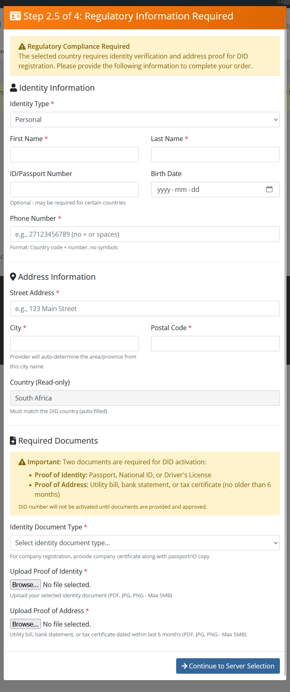

|

Step 3: Tenant & Extensions Preview
^^^^^^^^^^^^^^^^^^^^^^^^^^^^^^^^^^^^

**Purpose**: Review tenant configuration and extension allocation

The third step displays a summary of the PBX tenant that will be created, including the tenant domain, FusionPBX server assignment, and the number of extensions (seats) included with the selected product.

**Tenant Configuration:**

* **Tenant Domain**: Auto-generated from company name (e.g., ``acmecorp.pbx.example.com``)
* **FusionPBX Server**: Assigned server from product mapping
* **Max Seats**: Number of extensions included in the product bundle

**Extension Preview:**

* **Included Extensions**: Number of seats from product bundle quantity
* **Extension Range**: Preview of extension numbers (e.g., ``1001-1010`` for 10 seats)
* **Billing**: Monthly recurring cost per seat (if applicable)

**Editable Fields:**

* **Tenant Domain**: Can be customized if desired (must remain unique)

**Actions:**

* Review configuration
* Edit tenant domain if needed
* Proceed to admin user creation

|

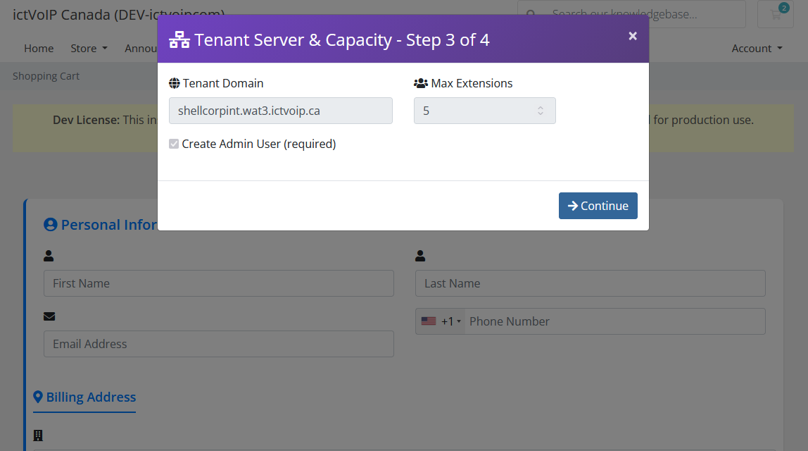

|

Step 4: Create Admin User
^^^^^^^^^^^^^^^^^^^^^^^^^^

**Purpose**: Configure admin user credentials for FusionPBX access

The final step collects admin user details that will be used to create the primary administrator account on the FusionPBX tenant.

**Admin User Configuration:**

* **Username**: Admin login username (default: ``admin``, can be customized)
* **Password**: Strong password for admin account
* **Confirm Password**: Password confirmation
* **Email**: Admin email for notifications (pre-filled from Step 1)
* **Timezone**: Tenant timezone for call logs and scheduling
* **Language**: Interface language (default: English)
* **Group**: User group assignment (default: ``superadmin``)

**Password Requirements:**

* Minimum 8 characters
* Must contain uppercase and lowercase letters
* Must contain at least one number
* Special characters recommended

**Server Assignment Display:**

* **FusionPBX Server**: Displays assigned server from product mapping
* **Tenant Domain**: Displays final tenant domain from Step 3

**Actions:**

* Click **"Create User & Complete Order"** to submit order
* Order is placed in pending state for admin review
* Client receives order confirmation email

|

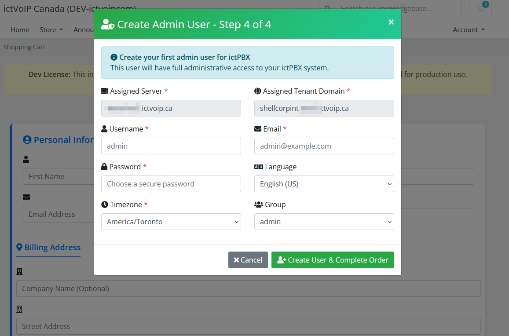

|

Post-Checkout Order Status
---------------------------

After completing the checkout wizard, the order is placed in a **pending provisioning** state. The client receives an order confirmation email and can view the order status in their client area.

**Client View:**

* Order appears in **My Orders** with status ``Pending``
* Order details show selected DID, tenant domain, and product information
* Client cannot modify order after submission

**Admin View:**

* Order appears in **Provisioning Queue** (see :ref:`admin-queue-management`)
* Admin can review order details and regulatory information
* Admin controls when provisioning begins

**Next Steps:**

1. Administrator reviews order in provisioning queue
2. For Provider 2 orders, administrator completes regulatory workflow
3. Administrator triggers provisioning when ready
4. Client receives welcome email with credentials upon completion

Provisioning Workflows
======================

.. contents::
   :local:
   :depth: 2

Provisioning (Standard)
-----------------------

**Timeline: Admin-initiated (typically 5-15 minutes)**

1. **Client Orders** Provider DID through shopping cart
2. **Order Created** in provisioning database
3. **Admin Queue** displays order with status ``Pending``
4. **Admin Reviews** order in provisioning queue
5. **Admin Clicks "Provision"** button
6. **System Executes**:

   * Creates/verifies FusionPBX tenant domain
   * Creates admin user with credentials
   * Provisions extensions
   * Configures Provider SIP gateway
   * Creates inbound route for DID
   * Creates outbound route
   * Sends welcome email with credentials

7. **Status Updated** to ``Completed``

**Admin Actions Required:**

* Review order details
* Click "Provision" button
* Verify provisioning success

**Gateway Configuration:**

* SIP username from Provider credentials
* SIP password from Provider credentials
* Proxy: ``{location}.provider1.example`` (e.g., ``toronto.provider1.example``)
* Port: 5060 (UDP) or 5061 (TLS)

|

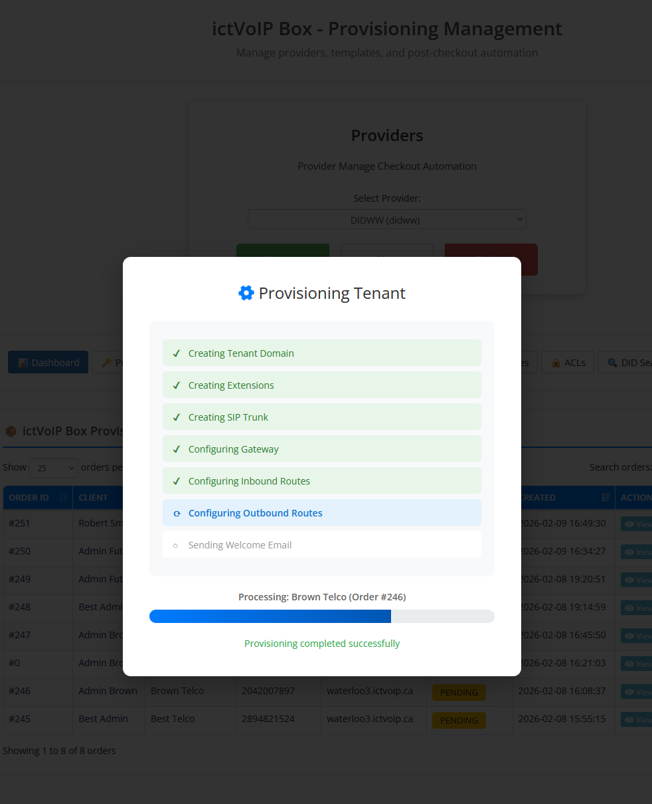

|

Provider Provisioning (Regulatory)
----------------------------------

**Timeline: 1-5 business days (due to Provider 2 verification)**

Provider requires regulatory compliance for certain countries. The provisioning process includes identity verification and document upload.

Phase 1: Order Review
^^^^^^^^^^^^^^^^^^^^^

* **Client Orders** Provider DID with regulatory information
* **Order Created** in pending orders database
* **Status**: ``pending_review``
* **Queue Display**: Purple/lavender highlight with ⚠️ badge

**Admin Actions:**

1. Click **"View"** to review regulatory details
2. Verify client-provided information (identity, address, business)
3. Proceed to Phase 2

|

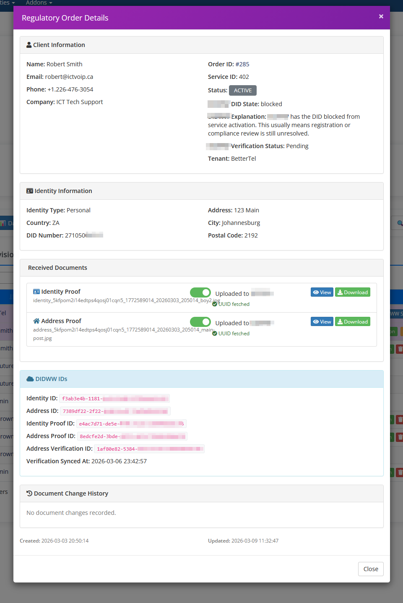

|

Phase 2: Submit Identity to Provider
^^^^^^^^^^^^^^^^^^^^^^^^^^^^^^^^^^^^

* **Admin Clicks** "Submit to Provider" button
* **System Executes**:

  * Creates Provider Identity resource via API
  * Creates Provider Address resource via API
  * Links address to identity
  * Stores ``provider2_identity_id`` and ``provider2_address_id``

* **Status**: ``identity_address_confirmed``
* **Queue Display**: ✅ badge "Identity Confirmed - Upload Proofs"

**Admin Actions:**

1. Click "Submit to Provider"
2. Wait for API response
3. Proceed to Phase 3

Phase 3: Upload Proof Documents
^^^^^^^^^^^^^^^^^^^^^^^^^^^^^^^^

* **Admin Clicks** "Upload Proofs to Provider" button
* **System Opens** Provider portal in new tab
* **Admin Uploads** documents in Provider portal:

  * Proof of Identity (passport, ID, driver's license)
  * Proof of Address (utility bill, bank statement within 3 months)
  * Business Proof (company registration, tax certificate)

* **Admin Returns** to ictVoIP Box and clicks "Mark Docs Uploaded"
* **Status**: ``documents_uploaded``
* **Queue Display**: 📤 badge "Docs Uploaded to Provider"

**Admin Actions:**

1. Click "Upload Proofs to Provider"
2. Upload documents in Provider portal
3. Return to ictVoIP Box
4. Click "Mark Docs Uploaded"
5. Proceed to Phase 4

|

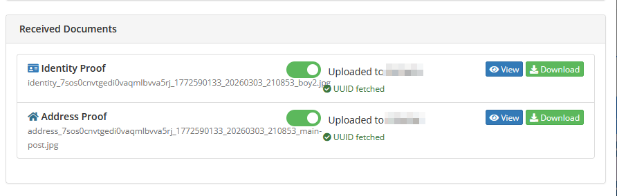

|

Phase 4: Place DID Order
^^^^^^^^^^^^^^^^^^^^^^^^

**Admin Clicks** "Place Order" button and the **DID Ordering Modal** appears.

DID Ordering Modal
""""""""""""""""""

The DID ordering modal provides a final opportunity to verify or change the selected DID before submitting the order to the provider. This is critical because the originally selected DID may no longer be available.

**Modal Sections:**

**1. Original DID Availability Check**

* System checks if originally selected DID is still available
* If unavailable, displays warning: "Original DID No Longer Available"
* Shows original DID number and message to select alternative

**2. Select Alternative DID**

* **Available DIDs** dropdown displays DIDs from same location
* Format: ``[DID Number] - Setup: $X.XX, Monthly: $X.XX``
* Select from dropdown to choose alternative DID
* DID information updates automatically when selection changes

**3. DID Information Display**

* **DID Number**: Selected number with clickable link
* **City**: Location/rate center
* **Country**: Country code (e.g., ZA for South Africa)
* **Rate**: Per-minute rate for calls (e.g., $0.01/min)

**4. Capacity Type Selection**

* **Select Capacity** dropdown
* Options:
  
  * Pay per minute (default) - Metered billing
  * Unlimited - Flat-rate unlimited calling (if available)
  * Custom capacity plans (provider-specific)

* Billing type determines how DID usage is charged

**5. Pricing Breakdown**

* **Monthly**: Recurring monthly DID fee
* **Setup**: One-time activation fee
* **Subtotal**: Monthly + Setup
* **VAT**: Tax amount (if applicable)
* **Total for DID(s)**: Final total cost

**Modal Actions:**

* **Cancel**: Close modal without ordering
* **Place Order**: Submit order to provider API

|

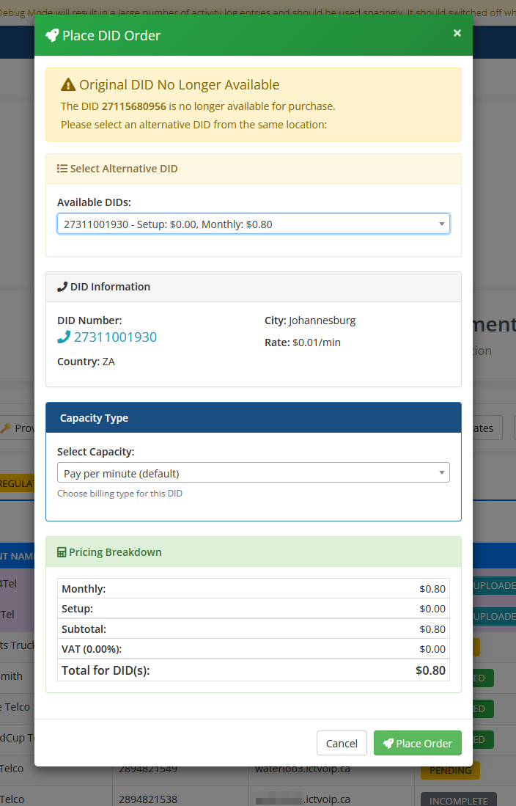

|

**After Clicking "Place Order":**

* **System Executes**:

  * Creates Provider Proof resource
  * Creates Provider DID Order via API
  * Links order to verified identity and address
  * Stores ``provider2_order_id``

* **Status**: ``order_placed``
* **Queue Display**: ⏳ badge "Awaiting Provider"

**Admin Actions:**

1. Click "Place Order" to open modal
2. Verify DID availability or select alternative
3. Choose capacity type (pay per minute or unlimited)
4. Review pricing breakdown
5. Click "Place Order" in modal to submit
6. Wait for API response
7. Proceed to Phase 5 (monitoring)

Phase 5: Monitor Provider 2 Order Status
^^^^^^^^^^^^^^^^^^^^^^^^^^^^^^^^^^^^^^^^^

* **Admin Periodically Clicks** "Check Provider Status" button
* **System Polls** Provider API for order status
* **Possible Statuses**:

  * ``awaiting_registration``: Provider processing (⏳ badge)
  * ``blocked``: Order blocked (⛔ badge - contact Provider support)
  * ``terminated``: Order terminated (🛑 badge - contact Provider support)
  * ``active``: Order approved (✅ badge "Provider Active - Ready to Sync")

**Admin Actions:**

1. Check status daily during business hours
2. If blocked/terminated, contact Provider support
3. When status is ``active``, proceed to Phase 6

Phase 6: Sync DID and Provision to FusionPBX
^^^^^^^^^^^^^^^^^^^^^^^^^^^^^^^^^^^^^^^^^^^^^

* **Admin Clicks** "Provision to FusionPBX" button
* **System Executes**:

  * Retrieves Provider trunk credentials
  * Creates FusionPBX tenant domain
  * Creates admin user
  * Provisions extensions
  * Configures Provider SIP gateway
  * Creates inbound route for DID
  * Creates outbound route
  * Sends welcome email with credentials

* **Status**: ``completed``
* **Queue Display**: ✅ badge "Completed"

**Gateway Configuration:**

* SIP username from Provider trunk credentials
* SIP password from Provider trunk credentials
* Proxy: ``out.provider2.example`` (default, can be overridden in template)
* Port: 5060 (UDP) or 5061 (TLS)

|

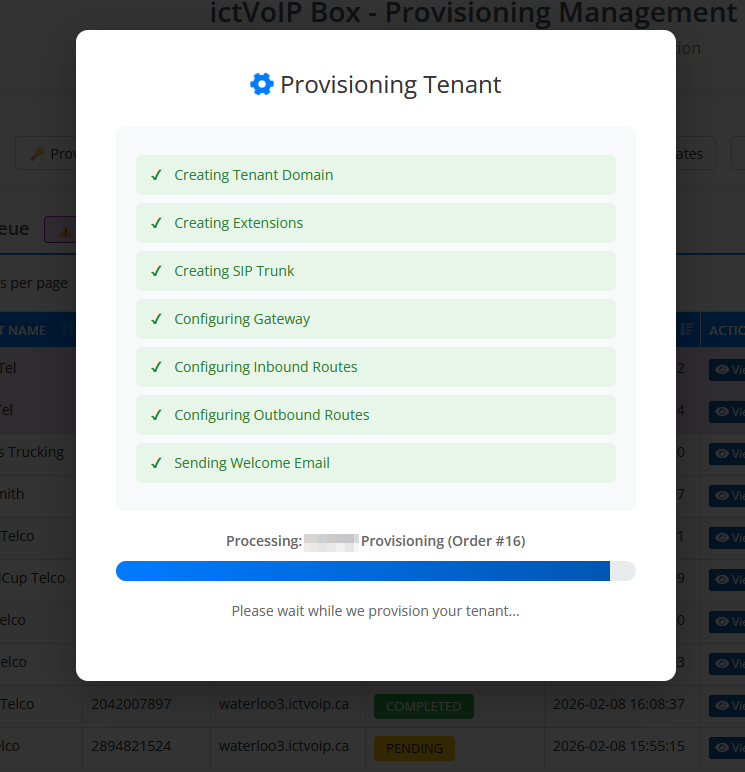

|

Admin Queue Management
======================

.. contents::
   :local:
   :depth: 2

Provisioning Queue Interface
-----------------------------

Navigate to **Addons → ictVoIP Box → Provisioning Queue**

The provisioning queue displays all pending, in-progress, and completed orders. Administrators can review order details, manage provisioning workflows, and monitor status.

**Queue Columns:**

* **Order ID**: WHMCS order identifier
* **Client**: Client name and contact information
* **Product**: Product/bundle ordered
* **Provider**: Provider 1 or Provider 2
* **DID**: Selected phone number
* **Status**: Current provisioning status with badge
* **Actions**: Available admin actions based on status

**Status Badges:**

* **Pending** (blue): Awaiting admin review
* **In Progress** (yellow): Provisioning in progress
* **Identity Confirmed** (green): Provider identity submitted
* **Docs Uploaded** (purple): Documents uploaded to Provider
* **Awaiting Provider** (orange): Waiting for Provider verification
* **Active** (green): Provider order approved, ready to provision
* **Completed** (green): Fully provisioned
* **Failed** (red): Provisioning error

|

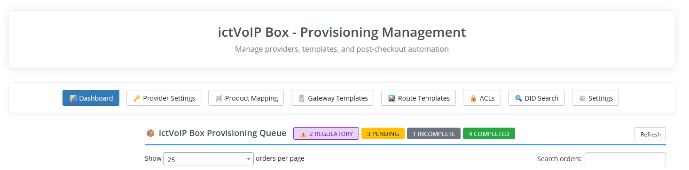

|

Regulatory Data Review
----------------------

For Provider 2 orders, administrators must review regulatory information before submission.

**Regulatory Details Modal:**

1. Click **"View"** button for Provider order
2. Review sections:

   * **Identity Information**: Name, date of birth, phone, email
   * **Address Information**: Country, city, postal code, street address
   * **Business Information**: Company name, registration number, tax ID

3. Verify information is complete and accurate
4. Check for common issues:

   * Missing required fields
   * Invalid date formats
   * Incomplete addresses
   * Mismatched business information

**If Information is Incomplete:**

* Contact client via support ticket
* Request corrected information
* Update order notes with issue details
* Do not proceed to Provider 2 submission until corrected

**If Information is Complete:**

* Proceed to submit identity to Provider

|

|

Document Upload Requirements
-----------------------------

Provider 2 requires proof documents for regulatory compliance.

**Required Documents:**

**1. Proof of Identity (One of the following):**

* Government-issued passport (photo page)
* National ID card (front and back)
* Driver's license (front and back)

**Document Requirements:**

* Clear, legible scan or photo
* All corners visible
* No glare or shadows
* Color preferred
* File format: JPG, PNG, or PDF
* Maximum file size: 10MB per document

**2. Proof of Address (One of the following, dated within 3 months):**

* Utility bill (electricity, water, gas)
* Bank statement
* Lease agreement or rental contract
* Government-issued document with address

**Document Requirements:**

* Must show full name matching identity document
* Must show complete address matching order
* Must be dated within last 3 months
* Clear, legible scan or photo
* File format: JPG, PNG, or PDF

**3. Business Proof (For business DIDs):**

* Company registration certificate
* Business license
* Tax registration certificate
* VAT registration document

**Document Requirements:**

* Must show company name matching order
* Must show registration number
* Must be current and valid
* Clear, legible scan or photo
* File format: JPG, PNG, or PDF

.. warning::
   **Common Rejection Reasons:**
   
   * Document expired or too old
   * Text not legible
   * Document corners cut off
   * Address doesn't match order information
   * Name doesn't match identity information
   * Business registration doesn't match company name

Troubleshooting
===============

.. contents::
   :local:
   :depth: 2

Common Issues
-------------

Provider 2 Identity Submission Fails
^^^^^^^^^^^^^^^^^^^^^^^^^^^^^^^^^^^^

**Symptoms:**

* API returns 400 Bad Request error during identity submission
* Error message displayed in provisioning queue

**Solution:**

* Contact **ictVoIP Canada support** with the following information:

  * Order ID
  * Client name
  * Error message displayed
  * Screenshot of error (if available)

* Support will investigate and resolve the issue

Provider 2 Order Stuck in Awaiting Registration
^^^^^^^^^^^^^^^^^^^^^^^^^^^^^^^^^^^^^^^^^^^^^^^^

**Symptoms:**

* Order status doesn't change after several days
* No error messages

**Solution:**

* Wait 1-3 business days for Provider 2 manual review
* Check Provider 2 portal for verification status
* Contact Provider 2 support if > 5 business days

Provider 2 Order Shows Blocked or Terminated
^^^^^^^^^^^^^^^^^^^^^^^^^^^^^^^^^^^^^^^^^^^^^

**Symptoms:**

* Order status changes to blocked or terminated
* Cannot proceed with provisioning

**Solution:**

* Check Provider 2 portal for rejection reason
* Contact Provider 2 support with order details
* May need to re-submit with corrected information
* Use "Reset Purchase" button to restart from document upload phase

Gateway UUID Not Syncing
^^^^^^^^^^^^^^^^^^^^^^^^^

**Symptoms:**

* Gateway created successfully but UUID is NULL
* DataTables shows "NO" in FPBX column

**Solution:**

* Gateway needs time to fully provision on FusionPBX
* Perform manual sync from ictVoIP Billing → Gateways tab
* Select tenant/server and click "Sync from FusionPBX"
* UUID will be fetched and stored

.. note::
   This is a known limitation during checkout provisioning. Manual sync required post-provisioning.

Maintenance Tasks
=================

Daily Tasks
-----------

**1. Review Provisioning Queue**

* Check for pending orders
* Provision Provider 1 orders
* Monitor Provider 2 regulatory orders

**2. Check Provider 2 Order Status**

* Poll orders in ``order_placed`` status
* Follow up on blocked/terminated orders

**3. Verify Welcome Emails**

* Ensure clients receive credentials
* Check email logs for failures

Support & Resources
===================

Documentation
-------------

* **ictVoIP Canada Official Documentation**: https://docs.ictvoip.ca
* **FusionPBX Docs**: https://docs.fusionpbx.com
* **WHMCS Docs**: https://docs.whmcs.com

Getting Help
------------

**For Platform Issues:**

* Check WHMCS activity log for errors
* Review error messages in provisioning queue
* Contact ictVoIP Canada support for assistance

**For Provider Issues:**

* Provider 1 Support: Contact Provider 1 support team
* Provider 2 Support: Contact Provider 2 support team

**For Module Support:**

* Contact ictVoIP development team
* Submit bug reports: https://ictvoip.ca/beta-bug-report.html
* Include logs and screenshots with all bug reports

