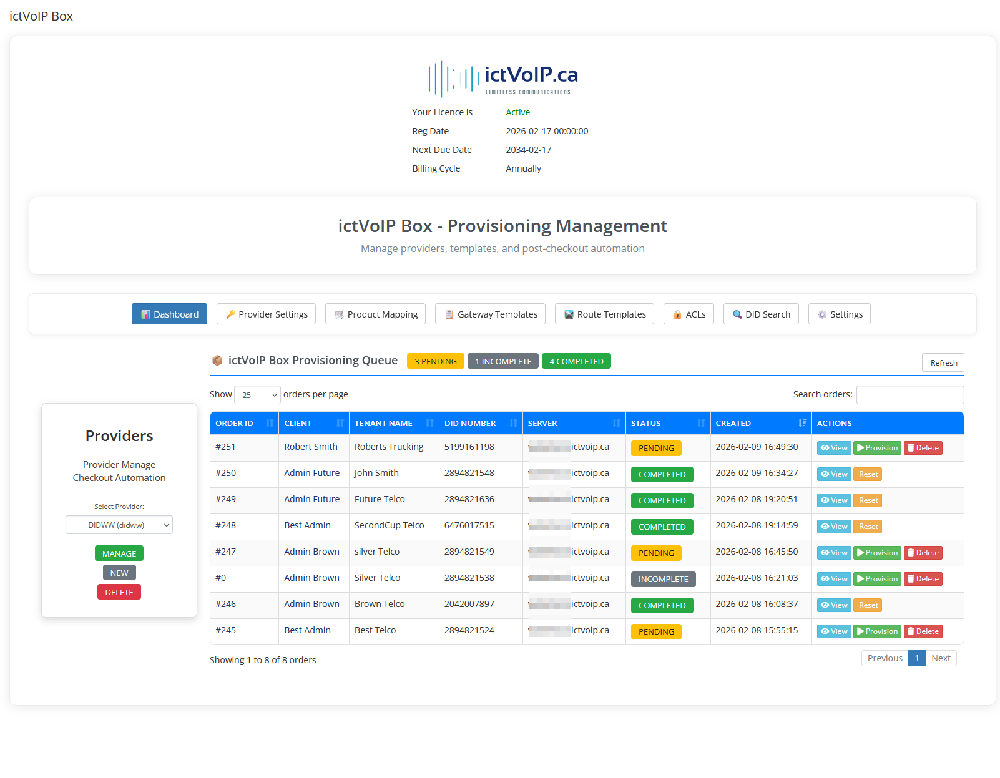
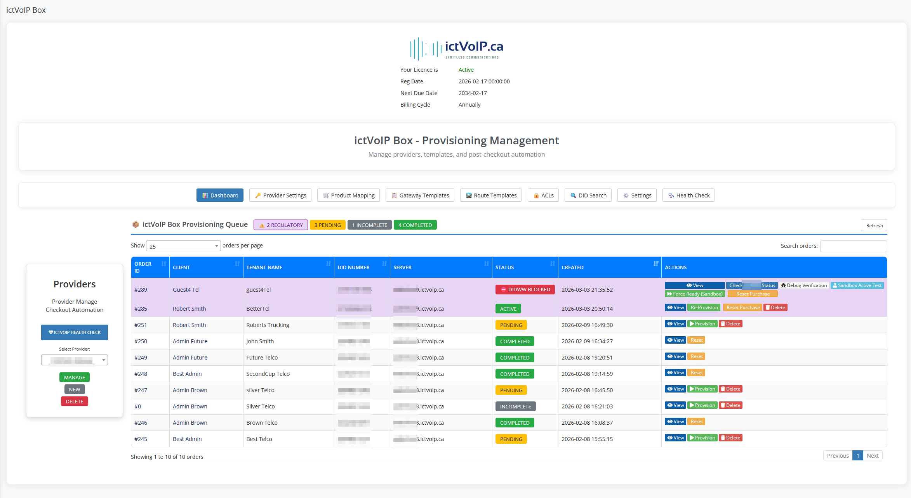

ictVoIP Box Overview
********************

.. contents:: Table of Contents
   :local:
   :depth: 3

Overview
========

The **ictVoIP Box** addon is a WHMCS addon module that extends the ictVoIP Billing platform to provide client-facing purchasing of FusionPBX products with backend admin provisioning workflows.

ictVoIP Box integrates with the core **ictvoipbilling** addon and the
FusionPBX server modules so that the PBX side (tenants, extensions,
gateways, routes) and the billing side (services, CDRs, packages) stay
aligned.

Architecture
------------

The platform consists of three integrated components:

**1. ictVoIP Billing Addon** (Required Dependency)
   * Core billing and provisioning engine
   * FusionPBX server management
   * Provider integration
   * Client services tracking
   * Extension and gateway management
   * Tenant domain management

**2. ictVoIP Box Addon** (This Module)
   * Client-facing shopping cart integration
   * Product ordering interface
   * Regulatory data collection
   * Admin provisioning queue
   * Order workflow management

**3. FusionPBX Server Modules** (Required Dependency)
   * Backend PBX infrastructure
   * Multi-tenant hosting
   * SIP gateway configuration
   * Extension and routing management
   * Call processing and CDR

Integration Flow
----------------

The complete integration flow follows this sequence::

   Client Orders → Custom ictVoIP Box Order Cart → ictVoIP Box → 
   Admin Queue → Admin Provisions → FusionPBX + Provider

1. **Client** orders FusionPBX products through custom ictVoIP Box checkout cart
2. **ictVoIP Box** captures order and regulatory data
3. **Admin Queue** displays pending orders for review
4. **Admin** provisions to FusionPBX and provider
5. **System** sends welcome email with FusionPBX credentials to client

.. important::
   The custom ictVoIP Box order cart must be assigned to products or bundles using the **Product Group Checkout Template** selection in WHMCS product configuration.

System Requirements
===================

.. contents::
   :local:
   :depth: 2

WHMCS Platform
--------------

* **WHMCS Version**: v8.13.x or v9.0.x
* **PHP Version**: 8.3 (preferred)
* **Database**: MySQL 5.7+ or MariaDB 10.3+
* **Web Server**: Apache or Nginx with mod_rewrite
* **SSL Certificate**: Required for secure API communication

Required Addons
---------------

* **ictVoIP Billing Addon**: Core dependency (must be installed first)
* **ictVoIP Box Addon**: This module (requires valid license)

Required Server Modules
-----------------------

* **FusionPBX Server Module**: For FusionPBX server management in WHMCS

FusionPBX Servers
-----------------

* **FusionPBX Version**: 5.4.x or 5.5.x
* **API Access**: Enabled with valid credentials
* **Multi-Tenant**: Enabled
* **SIP Ports**: 5060 (UDP), 5061 (TLS)
* **RTP Ports**: 10000-20000

Provider Accounts
-----------------

* **VoIP.ms Account**: API credentials configured in the :ref:`provider-settings` tab
* **DIDWW Account**: API key configured in the :ref:`provider-settings` tab

.. note::
   VoIP.ms supports both sandbox and production modes. DIDWW should remain in sandbox mode during beta testing.

High-Level Capabilities
=======================

At a high level, ictVoIP Box provides:

* **Automated PBX Onboarding** – Creates a FusionPBX tenant/domain,
  admin user, and a starter set of extensions as part of checkout.
* **Provider-Driven SIP Trunk Setup** – Uses provider credentials and
  templates to create a SIP trunk and map it to the new tenant.
* **Template-Based Routing** – Applies inbound and outbound route
  templates so that the main DID and basic outbound calling work out of
  the box.
* **Tight Integration with ictVoIP Billing** – Uses the same provider,
  gateway, and destination concepts as the Client Services Admin Area,
  so later administration can be done from the standard tools.

