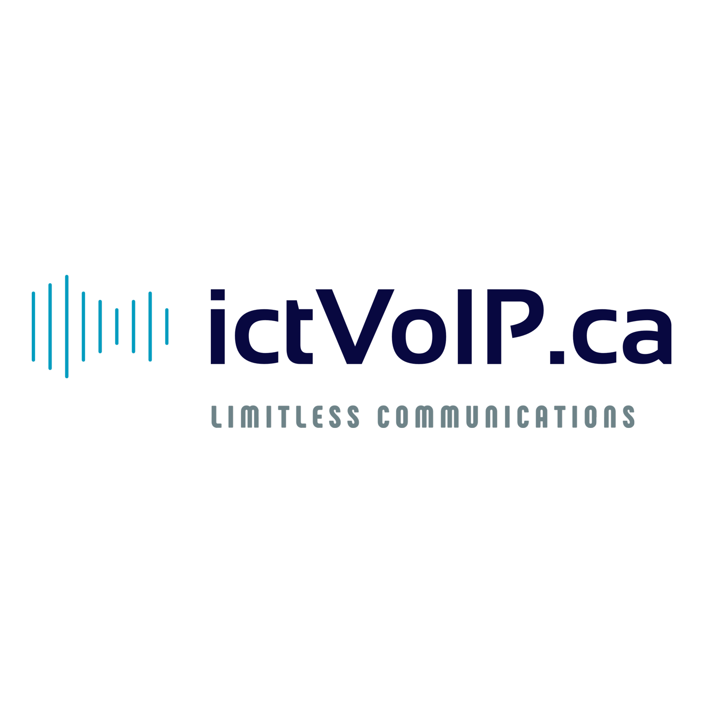

|

Welcome to ictVoIP Billing Docs
===============================

ictVoIP Billing is compatible with WHMCS v8+ and 
PHP-7.4 and PHP-8.1, Apache and LiteSpeed. 

You may select your server module required for your PBX or Provider API.
Purchase your server module here: 
https://www.icttech.ca/index.php?rp=/store/ictvoip-billing-software

Download the ictVoIP Billing Addon along with your 
Server module and extract to /home/$user/tmp.

Archive: /home/$user/tmp/ictvoip_billing-release-x.x.x.zip

Check out the :doc:`usage` section for further information, including
how to :ref:`installation` of ictVoIP Billing and modules.

.. note::

   This project is under active development.

Contents
--------

.. toctree::

   usage
   api
