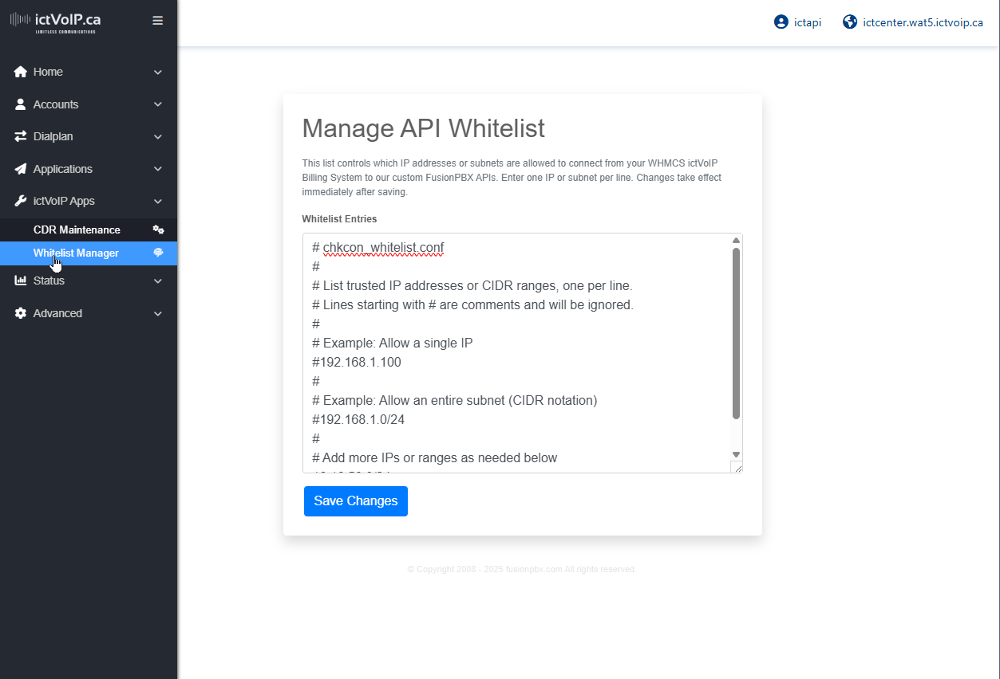

FusionPBX API Endpoints
======================

Overview
--------

This document provides an overview of the API endpoints available for FusionPBX integration. These endpoints enable programmatic access to FusionPBX functionality for external system integration and automation.

In ictVoIP Billing v1.4.0, these APIs are primarily consumed by the
WHMCS server modules and addon features such as the **Client Services
Admin Area** (:doc:`/admin/client_services`) and **Autobill**
(:doc:`/admin/autobill`). Administrators normally interact with those
higher-level tools; this page is intended for advanced integration,
troubleshooting, and staging validation.

For day-to-day administration, **authentication and IP whitelist
checks** for these APIs are exposed through the Client Services
**Settings (Server Provisioning Settings)** screen. From there you can
load and save WHMCS server credentials (including an optional access
hash) for FusionPBX hosts and run credential and whitelist tests before
enabling automated provisioning. Use this when first connecting a PBX
server or when rotating credentials or tightening whitelists. See also
the :doc:`/admin/servers` guide and the security hardening overview in
the :doc:`/getting_started/security` documentation.

.. note::
   All ictVoIP FusionPBX API scripts are distributed as ionCube-
   encoded PHP files and require **ionCube Loader v14+** to be
   installed and active on both the FusionPBX host PHP environment
   and the WHMCS host PHP environment.

API Summary
-----------
The table below summarizes the core ictVoIP FusionPBX APIs used by
ictVoIP Billing and WHMCS. Each API advertises a version string that
can be viewed in the ictVoIP Billing **System Health Check** under
the FusionPBX section.

.. list-table::
   :header-rows: 1
   :widths: 25 35 40

   * - API
     - Endpoint (example path)
     - Primary Use
   * - Status
     - ``/app/status/index.php``
     - Reports FusionPBX health, version, and basic statistics for the
       ictVoIP Billing dashboard.
   * - Registration Status
     - ``/app/registrations/check_registration.php``
     - Checks SIP registration status for a specific extension and
       tenant domain.
   * - Gateway Management
     - ``/app/gateways/manage_gateway.php``
     - Creates, updates, and lists SIP gateways used by tenants.
   * - Gateway Provisioning
     - ``/app/gateways/provision.php``
     - Provisions or refreshes a single SIP gateway on demand.
   * - Gateway List
     - ``/app/gateways/provision_list.php``
     - Returns a list of configured SIP gateways and their status.
   * - Destinations
     - ``/app/destinations/manage_destinations.php``
     - Manages inbound destinations (DIDs) for tenants.
   * - Outbound Dialplans
     - ``/app/dialplan_outbound/manage_outbound.php``
     - Manages outbound dialplans and routing patterns per tenant.
   * - Extensions
     - ``/app/extensions/manage_extension.php``
     - Manages extension CRUD and provisioning aligned to tenant
       domains.
   * - CDR Export
     - ``/app/xml_cdr/export_cdr.php``
     - Exports call detail records for billing and reporting.
   * - CDR Health & Connection
     - ``/app/xml_cdr/chkcon.php``
     - Connectivity / whitelist / API readiness check used by
       **Test Connection** and the System Health Check.
   * - CDR Data Access
     - ``/app/xml_cdr/get_cdr_data.php``
     - Retrieves CDR data for analysis and reporting.
   * - CDR Import
     - ``/app/xml_cdr/import_cdr.php``
     - Imports CDR data from external sources.
   * - Access Control / Whitelist
     - ``/app/xml_cdr/whitelist_manager.php``
     - Manages IP and CIDR entries that are allowed to access the
       APIs.

For parameter details, example requests, and response formats, see
the endpoint sections below.

Authentication
--------------

The endpoint now uses IP/CIDR-based whitelisting for authentication.

**Authentication Requirements:**

* API username / password & whitelisted IPs.
* Requests from non-whitelisted IPs will be denied and logged.
* Whitelist is managed in `chkcon_whitelist.conf` or use out tool Whitelist Manager.

|

|

**Response Examples:**

.. code-block:: json

    {
      "success": 1,
      "message": "API Access Granted: Whitelisted IP"
    }

    {
      "success": 0,
      "message": "API Access Denied: Only whitelisted IPs may access this endpoint."
    }

WHMCS Integration Note
----------------------

When configuring the FusionPBX server in WHMCS, the "Test Connection" button now checks API access based on the IP whitelist. Username and password fields are not required for this endpoint. Ensure your WHMCS server's public IP is included in `chkcon_whitelist.conf` on the FusionPBX server.

API Endpoints
-------------

Status Endpoint
~~~~~~~~~~~~~~~

**Purpose:** System health and status monitoring within WHMCS Admin Dashboard

**Endpoint:** `/app/status/index.php`

**Method:** POST

**Parameters:**
* Username (required): Administrator username
* Password (required): Administrator password
* Whitelisted (required): Whitelist Managed

**Response Format:**

.. code-block:: json

    {
      "status": "success",
      "message": "System operational",
      "timestamp": "2024-01-15T10:30:00Z",
      "version": "5.3.8",
      "uptime": "7 days, 3 hours",
      "active_calls": 5,
      "total_extensions": 150,
      "registered_extensions": 142
    }

**Usage Example:**

.. code-block:: bash

    curl -X POST https://your-fusionpbx.com/app/status/index.php \
      -d "username=admin&password=your-password"

Registration Status Endpoint
~~~~~~~~~~~~~~~~~~~~~~~~~~~

**Purpose:** Check extension registration status

**Endpoint:** `check_registration.php`

**Method:** POST

**Parameters:**
* Username (required): Administrator username
* Password (required): Administrator password
* Extension (required): Extension number to check
* Tenant Domain (required): Domain/tenant identifier

**Response Format:**

.. code-block:: json

    {
      "status": "success",
      "message": "Extension status retrieved",
      "registered": "yes",
      "register_ip": "192.168.1.100",
      "register_port": "5060",
      "register_useragent": "SIP Client/1.0"
    }

**Usage Example:**

.. code-block:: bash

    curl -X POST https://your-fusionpbx.com/app/registrations/check_registration.php \
      -d "username=admin&password=your-password&extension=1001&tenant_domain=yourdomain.com"

Gateway Management Endpoint
~~~~~~~~~~~~~~~~~~~~~~~~~~

**Purpose:** Manage SIP gateway configurations

**Endpoint:** `provision.php`

**Method:** POST

**Parameters:**
* Username (required): Administrator username
* Password (required): Administrator password
* Gateway Name (required): Unique gateway identifier
* Gateway Domain (required): Gateway server address
* Gateway Username (required): Gateway authentication username
* Gateway Password (required): Gateway authentication password

**Response Format:**

.. code-block:: json

    {
      "status": "success",
      "message": "Gateway configured successfully",
      "gateway_uuid": "550e8400-e29b-41d4-a716-446655440000",
      "gateway_name": "primary_gateway",
      "gateway_domain": "sip.provider.com",
      "gateway_enabled": "true"
    }

**Usage Example:**

.. code-block:: bash

    curl -X POST https://your-fusionpbx.com/app/gateways/provision.php \
      -d "username=admin&password=your-password&gateway_name=primary_gateway&gateway_domain=sip.provider.com&gateway_username=account&gateway_password=password"

Gateway List Endpoint
~~~~~~~~~~~~~~~~~~~~

**Purpose:** Retrieve configured gateway information

**Endpoint:** `provision_list.php`

**Method:** POST

**Parameters:**
* Username (required): Administrator username
* Password (required): Administrator password

**Response Format:**

.. code-block:: json

    {
      "status": "success",
      "message": "Gateways retrieved successfully",
      "gateways": [
        {
          "gateway_uuid": "550e8400-e29b-41d4-a716-446655440000",
          "gateway_name": "primary_gateway",
          "gateway_domain": "sip.provider.com",
          "gateway_enabled": "true",
          "gateway_status": "UP"
        }
      ]
    }

**Usage Example:**

.. code-block:: bash

    curl -X POST https://your-fusionpbx.com/app/gateways/provision_list.php \
      -d "username=admin&password=your-password"

CDR Export Endpoint
~~~~~~~~~~~~~~~~~~

**Purpose:** Export call detail records for billing and reporting

**Endpoint:** `export_cdr.php`

**Method:** POST

**Parameters:**
* Username (required): Administrator username
* Password (required): Administrator password
* Date Start (required): Start date for CDR export
* Date End (required): End date for CDR export
* Format (optional): Export format (JSON, CSV, XML)

**Response Format:**

.. code-block:: json

    {
      "status": "success",
      "message": "CDR export completed",
      "total_records": 1250,
      "date_range": "2024-01-01 to 2024-01-31",
      "export_format": "JSON"
    }

**Usage Example:**

.. code-block:: bash

    curl -X POST https://your-fusionpbx.com/app/xml_cdr/export_cdr.php \
      -d "username=admin&password=your-password&date_start=2024-01-01&date_end=2024-01-31&format=JSON"

Error Handling
-------------

All API endpoints return consistent error responses in the following format:

.. code-block:: json

    {
      "status": "error",
      "message": "Descriptive error message",
      "timestamp": "2024-01-15T10:30:00Z"
    }

**Common Error Codes:**

* **Authentication Failed**: Invalid credentials
* **Missing Parameters**: Required parameters not provided
* **Invalid Request**: Malformed request data
* **Server Error**: Internal system error
* **Rate Limited**: Too many requests

Rate Limiting
-------------

API endpoints implement rate limiting to prevent abuse and ensure system stability.

**Rate Limits:**

* **Standard Endpoints**: 100 requests per minute
* **CDR Export**: 10 requests per minute
* **Gateway Operations**: 50 requests per minute

**Rate Limit Headers:**

.. code-block:: text

    X-RateLimit-Limit: 100
    X-RateLimit-Remaining: 95
    X-RateLimit-Reset: 1642234560

Security Considerations
----------------------

**Network Security:**

* Use HTTPS for all API communications
* Implement proper firewall rules
* Consider VPN access for sensitive operations

**Authentication Security:**

* Use strong, unique passwords
* Implement API key rotation
* Monitor authentication attempts

**Data Protection:**

* Encrypt sensitive data in transit
* Implement proper access controls
* Regular security audits

**Monitoring and Logging:**

* Log all API access attempts
* Monitor for suspicious activity
* Regular security assessments 
